# Grove Platform — Technical Diagrams

Modern architecture diagrams for the Grove platform, reflecting the current monorepo structure, Cloudflare infrastructure, and multi-tenant design.

> **Generated:** February 2026 | **Rendered with:** [MermaidVisualizer](https://github.com/AutumnsGrove/MermaidVisualizer)

---

## Table of Contents

### Architecture

1. [Monorepo Package Map](#1-monorepo-package-map)
2. [Request Routing](#2-request-routing)
3. [Cloudflare Infrastructure](#3-cloudflare-infrastructure)
4. [Service Binding Communication](#4-service-binding-communication)

### Authentication & Security

5. [Heartwood Authentication Flow](#5-heartwood-authentication-flow)
6. [Multi-Tenant Data Isolation](#6-multi-tenant-data-isolation)

### Data

7. [Core Database Schema](#7-core-database-schema)
8. [Heartwood Database Schema](#8-heartwood-database-schema)

### Systems

9. [Durable Objects — Loom Pattern](#9-durable-objects--loom-pattern)
10. [Email Infrastructure — Zephyr](#10-email-infrastructure--zephyr)
11. [Engine Export Map](#11-engine-export-map)
12. [Curios & Grafts](#12-curios--grafts)

### Operations

13. [CI/CD & Deployment](#13-cicd--deployment)
14. [Storage & Media Pipeline](#14-storage--media-pipeline)

---

## Architecture

### 1. Monorepo Package Map

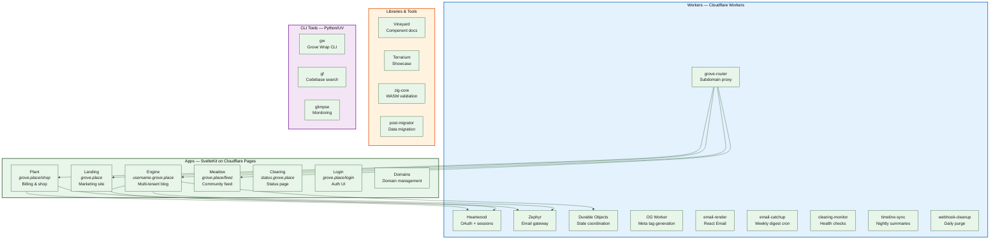

---

### 2. Request Routing

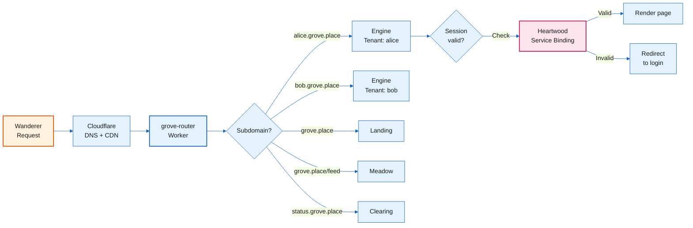

---

### 3. Cloudflare Infrastructure

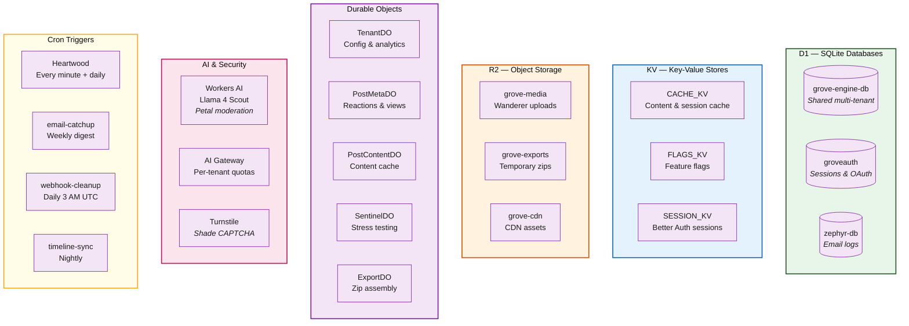

---

### 4. Service Binding Communication

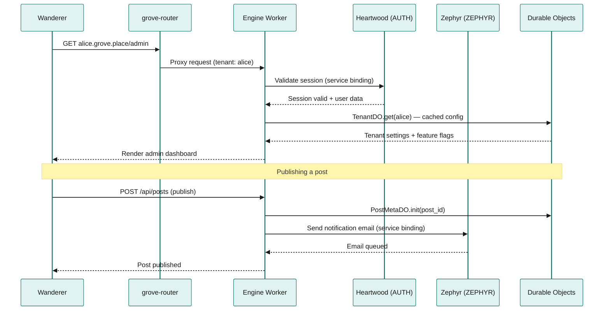

---

## Authentication & Security

### 5. Heartwood Authentication Flow

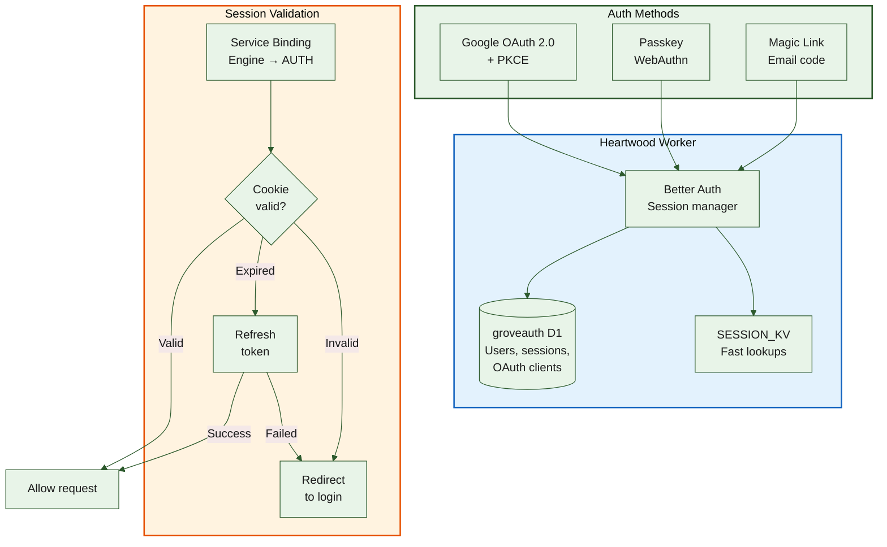

---

### 6. Multi-Tenant Data Isolation

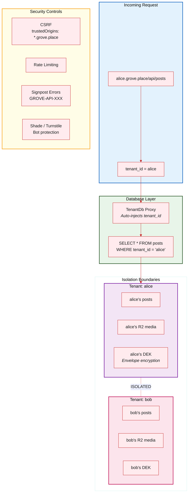

---

## Data

### 7. Core Database Schema

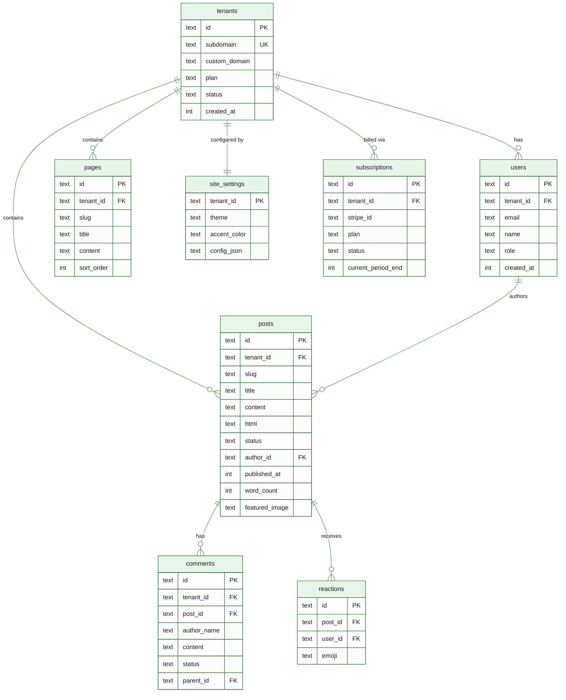

---

### 8. Heartwood Database Schema

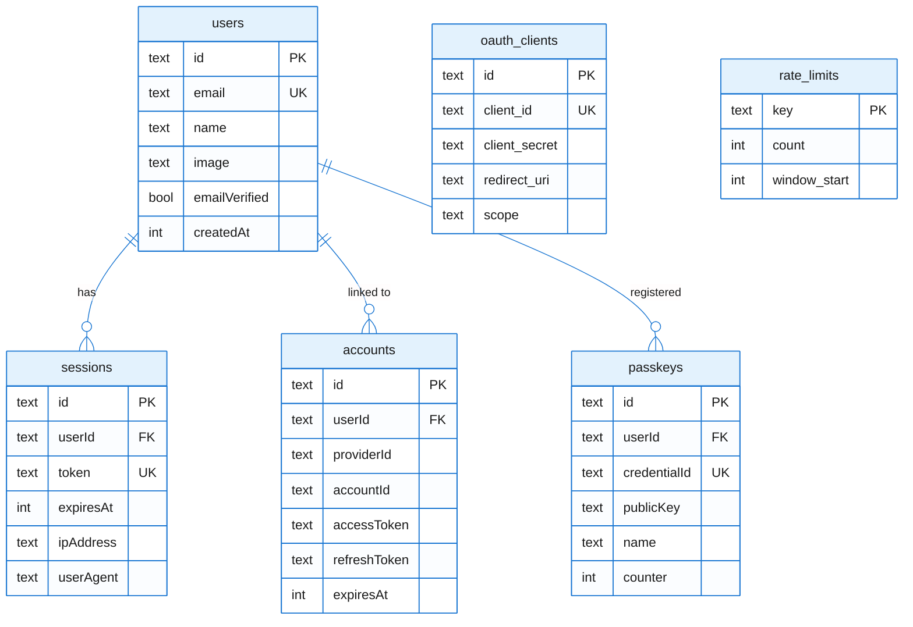

---

## Systems

### 9. Durable Objects — Loom Pattern

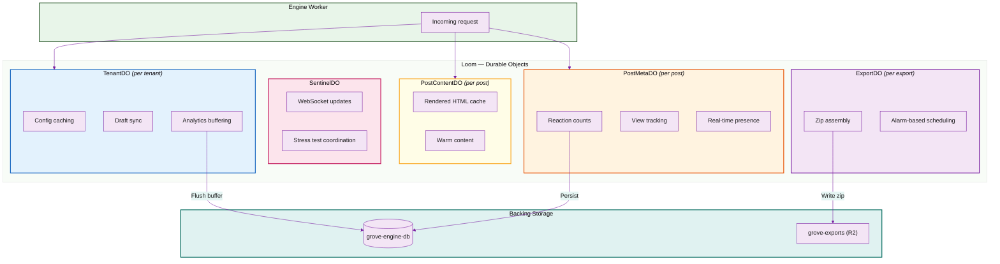

---

### 10. Email Infrastructure — Zephyr

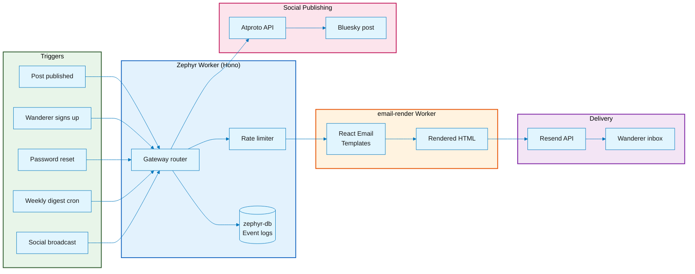

---

### 11. Engine Export Map

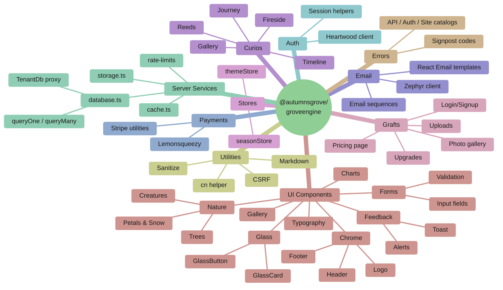

---

### 12. Curios & Grafts

```mermaid
%%{init: {'theme': 'base', 'themeVariables': {'primaryColor': '#fff3e0', 'primaryTextColor': '#1a1a1a', 'primaryBorderColor': '#e65100', 'lineColor': '#e65100', 'background': '#ffffff'}}}%%
flowchart TB
    subgraph curios["Curios — Site Feature Modules"]
        direction LR
        TL["Timeline<br/><i>Blog + gutter annotations<br/>+ daily summaries</i>"]
        GL["Gallery<br/><i>Photo & media<br/>showcase</i>"]
        JR["Journey<br/><i>Step-by-step<br/>guides</i>"]
        RD["Reeds<br/><i>Comment system<br/>nested replies</i>"]
        FS["Fireside<br/><i>Community<br/>conversations</i>"]
        WP["Wisp<br/><i>Dark mode +<br/>settings panel</i>"]
        GH["Greenhouse<br/><i>Content<br/>drafting space</i>"]
        TR["Terrarium<br/><i>Component<br/>showcase</i>"]
    end

    subgraph grafts["Grafts — Reusable Feature Packages"]
        direction LR
        GP["Pricing<br/>page"]
        GN["Login /<br/>Signup"]
        GU["Upgrades /<br/>Billing"]
        GPH["Photo<br/>gallery"]
        GUP["Uploads<br/>manager"]
    end

    subgraph engine["Engine Core"]
        DB[("grove-engine-db")]
        STORE["Svelte stores"]
        COMP["UI components"]
    end

    TL & GL & JR & RD & FS --> DB
    TL & GL & JR --> STORE
    GP & GN & GU & GPH & GUP --> COMP

    style curios fill:#e8f5e9,stroke:#2d5a2d,stroke-width:2px
    style grafts fill:#e3f2fd,stroke:#1565c0,stroke-width:2px
    style engine fill:#f3e5f5,stroke:#7b1fa2,stroke-width:2px
```

---

## Operations

### 13. CI/CD & Deployment

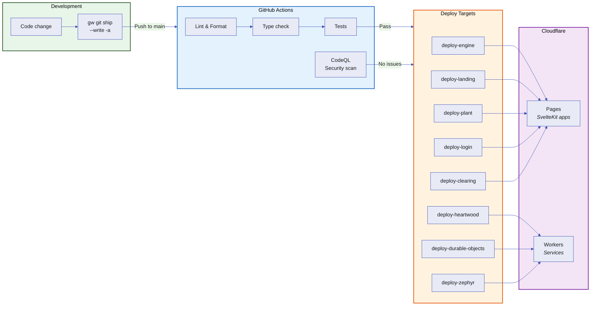

---

### 14. Storage & Media Pipeline

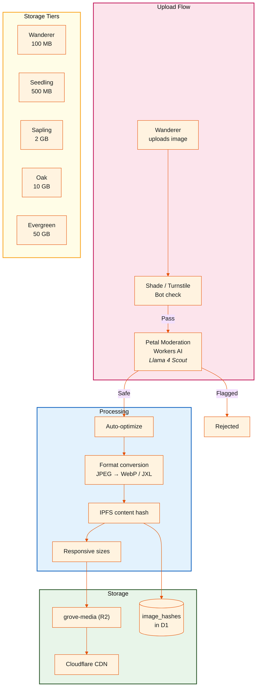

---

_Generated for Grove Platform — February 2026_
