# Grove Platform - Technical Diagrams

This document contains all Mermaid diagrams for the Grove Platform. Use your preferred tool to render these as PNG images.

> **Note:** All diagrams include theme configurations for proper backgrounds and readability.

---

## Table of Contents

### Simple Diagrams
1. [Authentication Flow](#1-authentication-flow)
2. [Post Lifecycle](#2-post-lifecycle)
3. [Billing & Payment Flow](#3-billing--payment-flow)
4. [Support Ticket Workflow](#4-support-ticket-workflow)
5. [Database ERD - Lattice](#5-database-erd---lattice)
6. [Database ERD - Grove Website](#6-database-erd---grove-website)
7. [Database ERD - Meadow](#7-database-erd---meadow)

### Complex Diagrams
8. [Complete Data Flow Across All Projects](#8-complete-data-flow-across-all-projects)
9. [Tenant Provisioning Sequence](#9-tenant-provisioning-sequence)
10. [Social Feed Aggregation](#10-social-feed-aggregation)
11. [Full API Endpoint Map](#11-full-api-endpoint-map)
12. [Security Boundaries & Data Isolation](#12-security-boundaries--data-isolation)

### Visual Breakdowns
13. [Lattice Feature Map](#13-lattice-feature-map)
14. [Theme System Architecture](#14-theme-system-architecture)
15. [Comment System Decision Flow](#15-comment-system-decision-flow)
16. [Voting & Reaction System](#16-voting--reaction-system)
17. [Analytics System Architecture](#17-analytics-system-architecture)

---

## Simple Diagrams

### 1. Authentication Flow

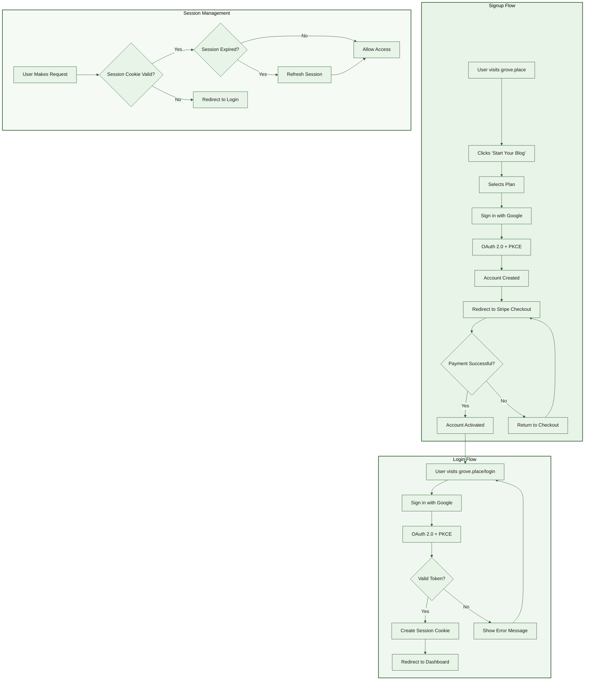
```mermaid
%%{init: {'theme': 'base', 'themeVariables': {'primaryColor': '#e8f4e8', 'primaryTextColor': '#1a1a1a', 'primaryBorderColor': '#2d5a2d', 'lineColor': '#2d5a2d', 'secondaryColor': '#f0f7f0', 'tertiaryColor': '#ffffff', 'background': '#ffffff'}}}%%
flowchart TD
    subgraph signup["Signup Flow"]
        A[User visits grove.place] --> B[Clicks 'Start Your Blog']
        B --> C[Selects Plan]
        C --> D[Sign in with Google]
        D --> E[OAuth 2.0 + PKCE]
        E --> F[Account Created]
        F --> G[Redirect to Stripe Checkout]
        G --> H{Payment Successful?}
        H -->|Yes| I[Account Activated]
        H -->|No| J[Return to Checkout]
        J --> G
    end

    subgraph login["Login Flow"]
        K[User visits grove.place/login] --> L[Sign in with Google]
        L --> M[OAuth 2.0 + PKCE]
        M --> N{Valid Token?}
        N -->|Yes| O[Create Session Cookie]
        N -->|No| P[Show Error Message]
        P --> K
        O --> Q[Redirect to Dashboard]
    end

    subgraph session["Session Management"]
        R[User Makes Request] --> S{Session Cookie Valid?}
        S -->|Yes| T{Session Expired?}
        S -->|No| U[Redirect to Login]
        T -->|No| V[Allow Access]
        T -->|Yes| W[Refresh Session]
        W --> V
    end

    I --> K

    style signup fill:#e8f4e8,stroke:#2d5a2d,stroke-width:2px
    style login fill:#f0f7f0,stroke:#2d5a2d,stroke-width:2px
    style session fill:#f5faf5,stroke:#2d5a2d,stroke-width:2px
```

---

### 2. Post Lifecycle

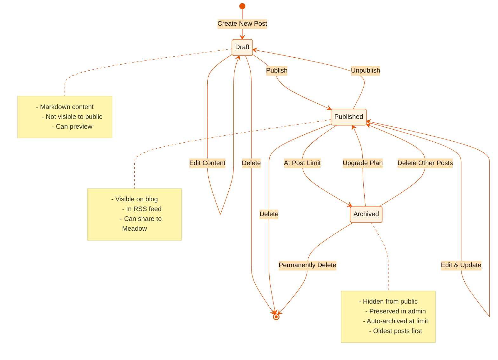
```mermaid
%%{init: {'theme': 'base', 'themeVariables': {'primaryColor': '#fff3e0', 'primaryTextColor': '#1a1a1a', 'primaryBorderColor': '#e65100', 'lineColor': '#e65100', 'secondaryColor': '#ffe0b2', 'tertiaryColor': '#ffffff', 'background': '#ffffff'}}}%%
stateDiagram-v2
    [*] --> Draft: Create New Post

    Draft --> Draft: Auto-save
    Draft --> Draft: Edit Content
    Draft --> Published: Publish
    Draft --> [*]: Delete

    Published --> Published: Edit & Update
    Published --> Draft: Unpublish
    Published --> Archived: At Post Limit
    Published --> [*]: Delete

    Archived --> Published: Upgrade Plan
    Archived --> Published: Delete Other Posts
    Archived --> [*]: Permanently Delete

    note right of Draft
        - Markdown content
        - Not visible to public
        - Can preview
    end note

    note right of Published
        - Visible on blog
        - In RSS feed
        - Can share to Meadow
    end note

    note right of Archived
        - Hidden from public
        - Preserved in admin
        - Auto-archived at limit
        - Oldest posts first
    end note
```

---

### 3. Billing & Payment Flow

```mermaid
%%{init: {'theme': 'base', 'themeVariables': {'primaryColor': '#e3f2fd', 'primaryTextColor': '#1a1a1a', 'primaryBorderColor': '#1565c0', 'lineColor': '#1565c0', 'secondaryColor': '#bbdefb', 'tertiaryColor': '#ffffff', 'background': '#ffffff'}}}%%
flowchart TD
    subgraph initial["Initial Subscription"]
        A[Select Plan] --> B[Create Account]
        B --> C[Stripe Checkout]
        C --> D{Payment Success?}
        D -->|Yes| E[Stripe Webhook Fires]
        D -->|No| F[Retry Payment]
        F --> C
        E --> G[Create Subscription Record]
        G --> H[Provision Blog]
        H --> I[Welcome Email]
    end

    subgraph recurring["Monthly Renewal"]
        J[Stripe Auto-Charges] --> K{Payment Success?}
        K -->|Yes| L[Update Invoice Status]
        K -->|No| M[Send Failed Payment Email]
        L --> N[Send Receipt Email]
        M --> O[Retry in 3 Days]
        O --> P{3 Retries Failed?}
        P -->|No| J
        P -->|Yes| Q[Mark Subscription Past Due]
        Q --> R[7 Day Grace Period]
        R --> S{Payment Received?}
        S -->|Yes| T[Reactivate Subscription]
        S -->|No| U[Suspend Blog Access]
    end

    subgraph changes["Plan Changes"]
        V[User Selects New Plan] --> W{Upgrade or Downgrade?}
        W -->|Upgrade| X[Prorate Immediately]
        W -->|Downgrade| Y[Apply at Period End]
        X --> Z[Update Limits Immediately]
        Y --> AA[Schedule Limit Change]
        Z --> AB[Confirmation Email]
        AA --> AB
    end

    subgraph cancel["Cancellation"]
        AC[User Cancels] --> AD[Cancel at Period End]
        AD --> AE[Send Confirmation]
        AE --> AF[Access Until Period End]
        AF --> AG[Export Data Reminder]
        AG --> AH[Account Deactivated]
        AH --> AI[Data Retained 30 Days]
        AI --> AJ[Permanent Deletion]
    end

    style initial fill:#e3f2fd,stroke:#1565c0,stroke-width:2px
    style recurring fill:#e8eaf6,stroke:#1565c0,stroke-width:2px
    style changes fill:#f3e5f5,stroke:#1565c0,stroke-width:2px
    style cancel fill:#ffebee,stroke:#1565c0,stroke-width:2px
```

---

### 4. Support Ticket Workflow

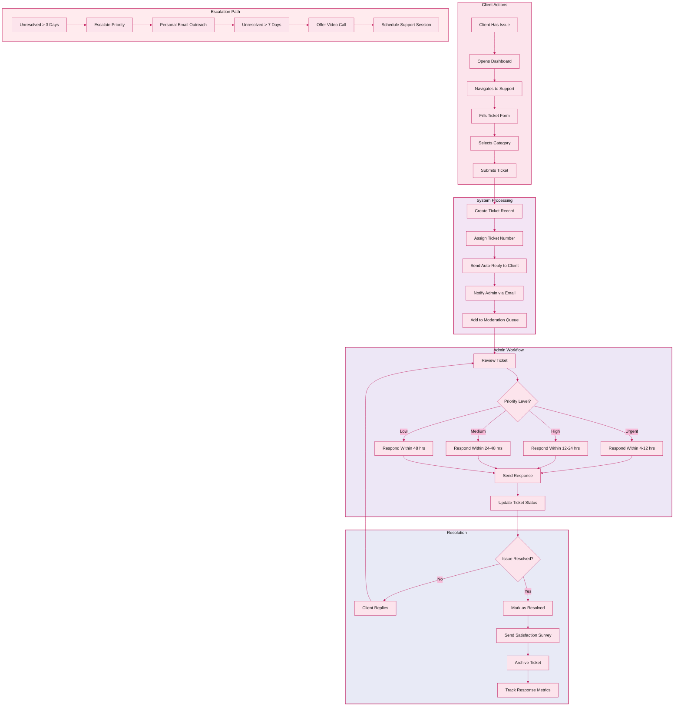
```mermaid
%%{init: {'theme': 'base', 'themeVariables': {'primaryColor': '#fce4ec', 'primaryTextColor': '#1a1a1a', 'primaryBorderColor': '#c2185b', 'lineColor': '#c2185b', 'secondaryColor': '#f8bbd9', 'tertiaryColor': '#ffffff', 'background': '#ffffff'}}}%%
flowchart TD
    subgraph client["Client Actions"]
        A[Client Has Issue] --> B[Opens Dashboard]
        B --> C[Navigates to Support]
        C --> D[Fills Ticket Form]
        D --> E[Selects Category]
        E --> F[Submits Ticket]
    end

    subgraph system["System Processing"]
        F --> G[Create Ticket Record]
        G --> H[Assign Ticket Number]
        H --> I[Send Auto-Reply to Client]
        I --> J[Notify Admin via Email]
        J --> K[Add to Moderation Queue]
    end

    subgraph admin["Admin Workflow"]
        K --> L[Review Ticket]
        L --> M{Priority Level?}
        M -->|Urgent| N[Respond Within 4-12 hrs]
        M -->|High| O[Respond Within 12-24 hrs]
        M -->|Medium| P[Respond Within 24-48 hrs]
        M -->|Low| Q[Respond Within 48 hrs]
        N & O & P & Q --> R[Send Response]
        R --> S[Update Ticket Status]
    end

    subgraph resolution["Resolution"]
        S --> T{Issue Resolved?}
        T -->|No| U[Client Replies]
        U --> L
        T -->|Yes| V[Mark as Resolved]
        V --> W[Send Satisfaction Survey]
        W --> X[Archive Ticket]
        X --> Y[Track Response Metrics]
    end

    subgraph escalation["Escalation Path"]
        Z[Unresolved > 3 Days] --> AA[Escalate Priority]
        AA --> AB[Personal Email Outreach]
        AB --> AC[Unresolved > 7 Days]
        AC --> AD[Offer Video Call]
        AD --> AE[Schedule Support Session]
    end

    style client fill:#fce4ec,stroke:#c2185b,stroke-width:2px
    style system fill:#f3e5f5,stroke:#c2185b,stroke-width:2px
    style admin fill:#ede7f6,stroke:#c2185b,stroke-width:2px
    style resolution fill:#e8eaf6,stroke:#c2185b,stroke-width:2px
    style escalation fill:#ffebee,stroke:#c2185b,stroke-width:2px
```

---

### 5. Database ERD - Lattice

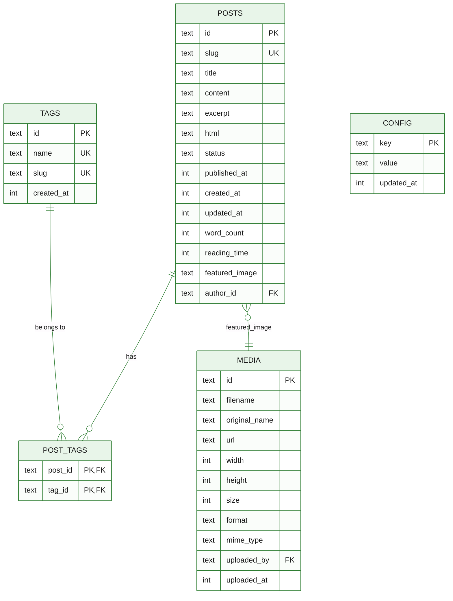
```mermaid
%%{init: {'theme': 'base', 'themeVariables': {'primaryColor': '#e8f5e9', 'primaryTextColor': '#1a1a1a', 'primaryBorderColor': '#2e7d32', 'lineColor': '#2e7d32', 'background': '#ffffff'}}}%%
erDiagram
    POSTS {
        text id PK
        text slug UK
        text title
        text content
        text excerpt
        text html
        text status
        int published_at
        int created_at
        int updated_at
        int word_count
        int reading_time
        text featured_image
        text author_id FK
    }

    TAGS {
        text id PK
        text name UK
        text slug UK
        int created_at
    }

    POST_TAGS {
        text post_id PK,FK
        text tag_id PK,FK
    }

    MEDIA {
        text id PK
        text filename
        text original_name
        text url
        int width
        int height
        int size
        text format
        text mime_type
        text uploaded_by FK
        int uploaded_at
    }

    CONFIG {
        text key PK
        text value
        int updated_at
    }

    POSTS ||--o{ POST_TAGS : "has"
    TAGS ||--o{ POST_TAGS : "belongs to"
    POSTS }o--|| MEDIA : "featured_image"
```

---

### 6. Database ERD - Grove Website

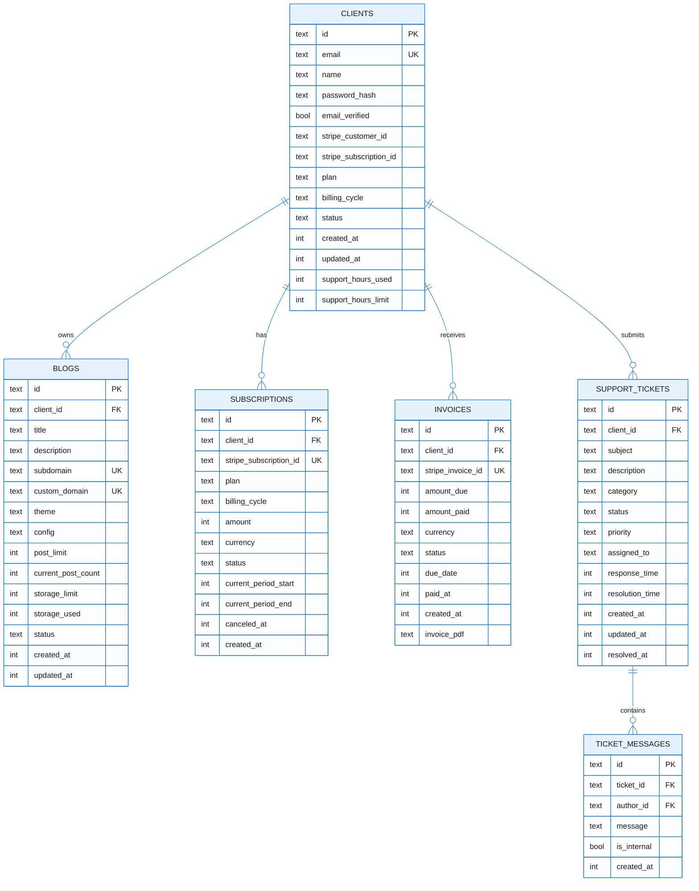
```mermaid
%%{init: {'theme': 'base', 'themeVariables': {'primaryColor': '#e3f2fd', 'primaryTextColor': '#1a1a1a', 'primaryBorderColor': '#1976d2', 'lineColor': '#1976d2', 'background': '#ffffff'}}}%%
erDiagram
    CLIENTS {
        text id PK
        text email UK
        text name
        text password_hash
        bool email_verified
        text stripe_customer_id
        text stripe_subscription_id
        text plan
        text billing_cycle
        text status
        int created_at
        int updated_at
        int support_hours_used
        int support_hours_limit
    }

    BLOGS {
        text id PK
        text client_id FK
        text title
        text description
        text subdomain UK
        text custom_domain UK
        text theme
        text config
        int post_limit
        int current_post_count
        int storage_limit
        int storage_used
        text status
        int created_at
        int updated_at
    }

    SUBSCRIPTIONS {
        text id PK
        text client_id FK
        text stripe_subscription_id UK
        text plan
        text billing_cycle
        int amount
        text currency
        text status
        int current_period_start
        int current_period_end
        int canceled_at
        int created_at
    }

    INVOICES {
        text id PK
        text client_id FK
        text stripe_invoice_id UK
        int amount_due
        int amount_paid
        text currency
        text status
        int due_date
        int paid_at
        int created_at
        text invoice_pdf
    }

    SUPPORT_TICKETS {
        text id PK
        text client_id FK
        text subject
        text description
        text category
        text status
        text priority
        text assigned_to
        int response_time
        int resolution_time
        int created_at
        int updated_at
        int resolved_at
    }

    TICKET_MESSAGES {
        text id PK
        text ticket_id FK
        text author_id FK
        text message
        bool is_internal
        int created_at
    }

    CLIENTS ||--o{ BLOGS : "owns"
    CLIENTS ||--o{ SUBSCRIPTIONS : "has"
    CLIENTS ||--o{ INVOICES : "receives"
    CLIENTS ||--o{ SUPPORT_TICKETS : "submits"
    SUPPORT_TICKETS ||--o{ TICKET_MESSAGES : "contains"
```

---

### 7. Database ERD - Meadow

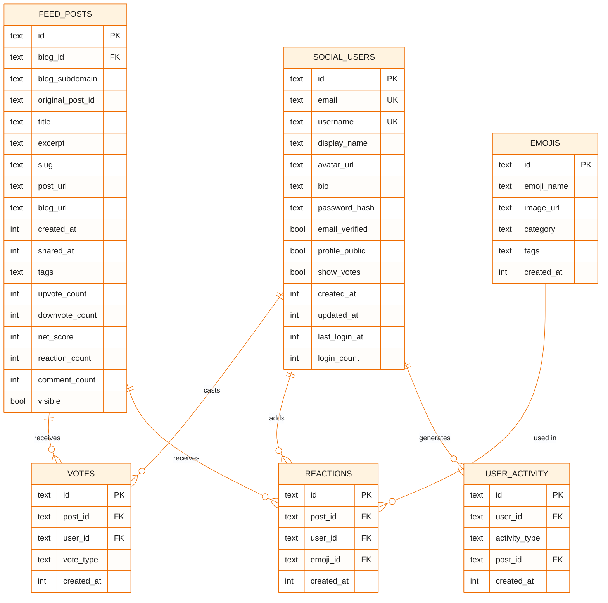
```mermaid
%%{init: {'theme': 'base', 'themeVariables': {'primaryColor': '#fff3e0', 'primaryTextColor': '#1a1a1a', 'primaryBorderColor': '#ef6c00', 'lineColor': '#ef6c00', 'background': '#ffffff'}}}%%
erDiagram
    SOCIAL_USERS {
        text id PK
        text email UK
        text username UK
        text display_name
        text avatar_url
        text bio
        text password_hash
        bool email_verified
        bool profile_public
        bool show_votes
        int created_at
        int updated_at
        int last_login_at
        int login_count
    }

    FEED_POSTS {
        text id PK
        text blog_id FK
        text blog_subdomain
        text original_post_id
        text title
        text excerpt
        text slug
        text post_url
        text blog_url
        int created_at
        int shared_at
        text tags
        int upvote_count
        int downvote_count
        int net_score
        int reaction_count
        int comment_count
        bool visible
    }

    VOTES {
        text id PK
        text post_id FK
        text user_id FK
        text vote_type
        int created_at
    }

    REACTIONS {
        text id PK
        text post_id FK
        text user_id FK
        text emoji_id FK
        int created_at
    }

    EMOJIS {
        text id PK
        text emoji_name
        text image_url
        text category
        text tags
        int created_at
    }

    USER_ACTIVITY {
        text id PK
        text user_id FK
        text activity_type
        text post_id FK
        int created_at
    }

    SOCIAL_USERS ||--o{ VOTES : "casts"
    SOCIAL_USERS ||--o{ REACTIONS : "adds"
    SOCIAL_USERS ||--o{ USER_ACTIVITY : "generates"
    FEED_POSTS ||--o{ VOTES : "receives"
    FEED_POSTS ||--o{ REACTIONS : "receives"
    EMOJIS ||--o{ REACTIONS : "used in"
```

---

## Complex Diagrams

### 8. Complete Data Flow Across All Projects

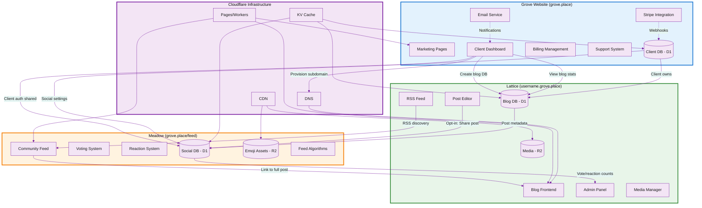
```mermaid
%%{init: {'theme': 'base', 'themeVariables': {'primaryColor': '#f3e5f5', 'primaryTextColor': '#1a1a1a', 'primaryBorderColor': '#7b1fa2', 'lineColor': '#7b1fa2', 'background': '#ffffff'}}}%%
flowchart TB
    subgraph website["Grove Website (grove.place)"]
        W1[Marketing Pages]
        W2[Client Dashboard]
        W3[Billing Management]
        W4[Support System]
        W5[(Client DB - D1)]
        W6[Stripe Integration]
        W7[Email Service]
    end

    subgraph engine["Lattice (username.grove.place)"]
        E1[Blog Frontend]
        E2[Admin Panel]
        E3[Post Editor]
        E4[Media Manager]
        E5[(Blog DB - D1)]
        E6[(Media - R2)]
        E7[RSS Feed]
    end

    subgraph social["Meadow (grove.place/feed)"]
        S1[Community Feed]
        S2[Voting System]
        S3[Reaction System]
        S4[(Social DB - D1)]
        S5[(Emoji Assets - R2)]
        S6[Feed Algorithms]
    end

    subgraph cloudflare["Cloudflare Infrastructure"]
        CF1[Pages/Workers]
        CF2[KV Cache]
        CF3[CDN]
        CF4[DNS]
    end

    %% Website to Engine flows
    W2 -->|"Provision subdomain"| CF4
    W2 -->|"Create blog DB"| E5
    W2 -->|"View blog stats"| E5
    W5 -->|"Client owns"| E5

    %% Engine to Social flows
    E3 -->|"Opt-in: Share post"| S4
    E5 -->|"Post metadata"| S4
    E7 -->|"RSS discovery"| S1

    %% Social to Engine flows
    S1 -->|"Link to full post"| E1
    S4 -->|"Vote/reaction counts"| E2

    %% Website to Social flows
    W5 -->|"Client auth shared"| S4
    W2 -->|"Social settings"| S4

    %% Infrastructure connections
    CF1 --> W1 & E1 & S1
    CF2 --> W5 & E5 & S4
    CF3 --> E6 & S5
    CF4 --> E1

    %% External services
    W6 -.->|"Webhooks"| W5
    W7 -.->|"Notifications"| W2

    style website fill:#e3f2fd,stroke:#1976d2,stroke-width:3px
    style engine fill:#e8f5e9,stroke:#388e3c,stroke-width:3px
    style social fill:#fff3e0,stroke:#f57c00,stroke-width:3px
    style cloudflare fill:#f3e5f5,stroke:#7b1fa2,stroke-width:3px
```

---

### 9. Tenant Provisioning Sequence

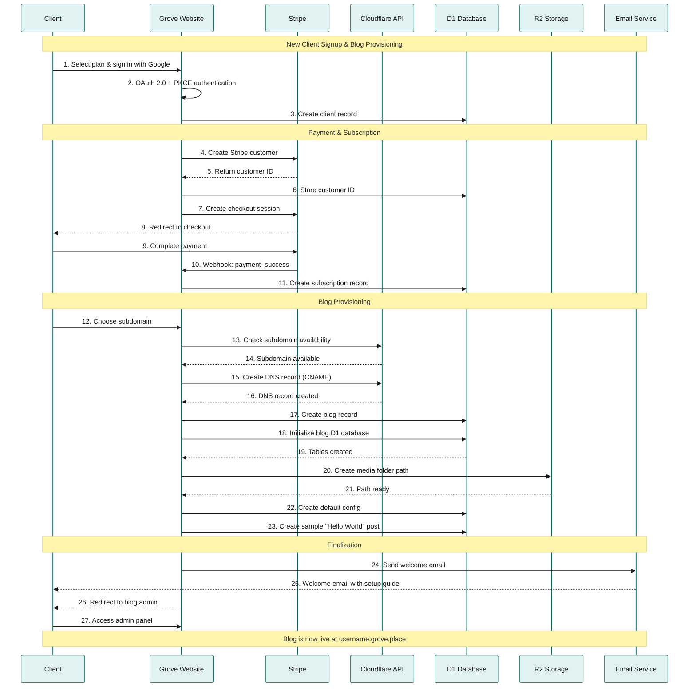
```mermaid
%%{init: {'theme': 'base', 'themeVariables': {'primaryColor': '#e0f2f1', 'primaryTextColor': '#1a1a1a', 'primaryBorderColor': '#00695c', 'lineColor': '#00695c', 'background': '#ffffff'}}}%%
sequenceDiagram
    participant C as Client
    participant W as Grove Website
    participant S as Stripe
    participant CF as Cloudflare API
    participant D1 as D1 Database
    participant R2 as R2 Storage
    participant E as Email Service

    Note over C,E: New Client Signup & Blog Provisioning

    C->>W: 1. Select plan & sign in with Google
    W->>W: 2. OAuth 2.0 + PKCE authentication
    W->>D1: 3. Create client record

    Note over C,E: Payment & Subscription

    W->>S: 4. Create Stripe customer
    S-->>W: 5. Return customer ID
    W->>D1: 6. Store customer ID
    W->>S: 7. Create checkout session
    S-->>C: 8. Redirect to checkout
    C->>S: 9. Complete payment
    S->>W: 10. Webhook: payment_success
    W->>D1: 11. Create subscription record

    Note over C,E: Blog Provisioning

    C->>W: 12. Choose subdomain
    W->>CF: 13. Check subdomain availability
    CF-->>W: 14. Subdomain available
    W->>CF: 15. Create DNS record (CNAME)
    CF-->>W: 16. DNS record created
    W->>D1: 17. Create blog record
    W->>D1: 18. Initialize blog D1 database
    D1-->>W: 19. Tables created
    W->>R2: 20. Create media folder path
    R2-->>W: 21. Path ready
    W->>D1: 22. Create default config
    W->>D1: 23. Create sample "Hello World" post

    Note over C,E: Finalization

    W->>E: 24. Send welcome email
    E-->>C: 25. Welcome email with setup guide
    W-->>C: 26. Redirect to blog admin
    C->>W: 27. Access admin panel

    Note over C,E: Blog is now live at username.grove.place
```

---

### 10. Social Feed Aggregation

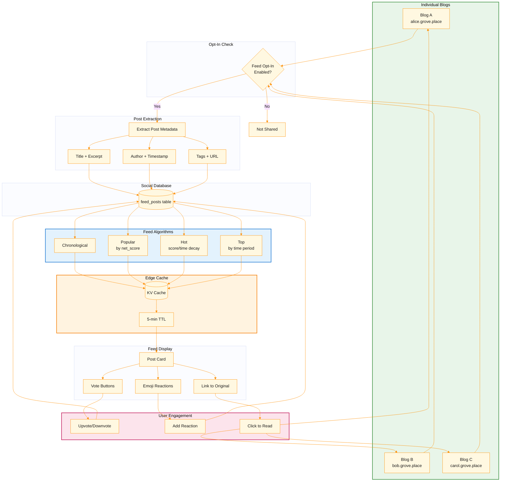
```mermaid
%%{init: {'theme': 'base', 'themeVariables': {'primaryColor': '#fff8e1', 'primaryTextColor': '#1a1a1a', 'primaryBorderColor': '#ff8f00', 'lineColor': '#ff8f00', 'background': '#ffffff'}}}%%
flowchart TD
    subgraph blogs["Individual Blogs"]
        B1[Blog A<br/>alice.grove.place]
        B2[Blog B<br/>bob.grove.place]
        B3[Blog C<br/>carol.grove.place]
    end

    subgraph optin["Opt-In Check"]
        O1{Feed Opt-In<br/>Enabled?}
    end

    subgraph extraction["Post Extraction"]
        EX1[Extract Post Metadata]
        EX2[Title + Excerpt]
        EX3[Author + Timestamp]
        EX4[Tags + URL]
    end

    subgraph storage["Social Database"]
        SD[(feed_posts table)]
    end

    subgraph algorithms["Feed Algorithms"]
        A1[Chronological]
        A2[Popular<br/>by net_score]
        A3[Hot<br/>score/time decay]
        A4[Top<br/>by time period]
    end

    subgraph cache["Edge Cache"]
        C1[(KV Cache)]
        C2[5-min TTL]
    end

    subgraph display["Feed Display"]
        D1[Post Card]
        D2[Vote Buttons]
        D3[Emoji Reactions]
        D4[Link to Original]
    end

    subgraph engagement["User Engagement"]
        E1[Upvote/Downvote]
        E2[Add Reaction]
        E3[Click to Read]
    end

    %% Flow
    B1 & B2 & B3 --> O1
    O1 -->|Yes| EX1
    O1 -->|No| X[Not Shared]
    EX1 --> EX2 & EX3 & EX4
    EX2 & EX3 & EX4 --> SD
    SD --> A1 & A2 & A3 & A4
    A1 & A2 & A3 & A4 --> C1
    C1 --> C2
    C2 --> D1
    D1 --> D2 & D3 & D4
    D2 --> E1
    D3 --> E2
    D4 --> E3
    E1 --> SD
    E2 --> SD
    E3 --> B1 & B2 & B3

    style blogs fill:#e8f5e9,stroke:#388e3c,stroke-width:2px
    style algorithms fill:#e3f2fd,stroke:#1976d2,stroke-width:2px
    style cache fill:#fff3e0,stroke:#f57c00,stroke-width:2px
    style engagement fill:#fce4ec,stroke:#c2185b,stroke-width:2px
```

---

### 11. Full API Endpoint Map

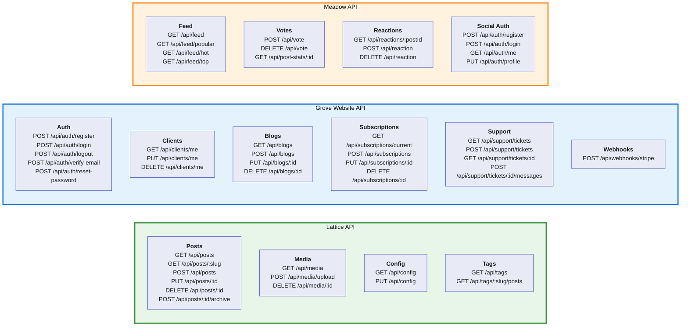
```mermaid
%%{init: {'theme': 'base', 'themeVariables': {'primaryColor': '#e8eaf6', 'primaryTextColor': '#1a1a1a', 'primaryBorderColor': '#3f51b5', 'lineColor': '#3f51b5', 'background': '#ffffff'}}}%%
flowchart LR
    subgraph engine_api["Lattice API"]
        direction TB
        EP1["<b>Posts</b><br/>GET /api/posts<br/>GET /api/posts/:slug<br/>POST /api/posts<br/>PUT /api/posts/:id<br/>DELETE /api/posts/:id<br/>POST /api/posts/:id/archive"]
        EP2["<b>Media</b><br/>GET /api/media<br/>POST /api/media/upload<br/>DELETE /api/media/:id"]
        EP3["<b>Config</b><br/>GET /api/config<br/>PUT /api/config"]
        EP4["<b>Tags</b><br/>GET /api/tags<br/>GET /api/tags/:slug/posts"]
    end

    subgraph website_api["Grove Website API"]
        direction TB
        WP1["<b>Auth</b><br/>POST /api/auth/register<br/>POST /api/auth/login<br/>POST /api/auth/logout<br/>POST /api/auth/verify-email<br/>POST /api/auth/reset-password"]
        WP2["<b>Clients</b><br/>GET /api/clients/me<br/>PUT /api/clients/me<br/>DELETE /api/clients/me"]
        WP3["<b>Blogs</b><br/>GET /api/blogs<br/>POST /api/blogs<br/>PUT /api/blogs/:id<br/>DELETE /api/blogs/:id"]
        WP4["<b>Subscriptions</b><br/>GET /api/subscriptions/current<br/>POST /api/subscriptions<br/>PUT /api/subscriptions/:id<br/>DELETE /api/subscriptions/:id"]
        WP5["<b>Support</b><br/>GET /api/support/tickets<br/>POST /api/support/tickets<br/>GET /api/support/tickets/:id<br/>POST /api/support/tickets/:id/messages"]
        WP6["<b>Webhooks</b><br/>POST /api/webhooks/stripe"]
    end

    subgraph social_api["Meadow API"]
        direction TB
        SP1["<b>Feed</b><br/>GET /api/feed<br/>GET /api/feed/popular<br/>GET /api/feed/hot<br/>GET /api/feed/top"]
        SP2["<b>Votes</b><br/>POST /api/vote<br/>DELETE /api/vote<br/>GET /api/post-stats/:id"]
        SP3["<b>Reactions</b><br/>GET /api/reactions/:postId<br/>POST /api/reaction<br/>DELETE /api/reaction"]
        SP4["<b>Social Auth</b><br/>POST /api/auth/register<br/>POST /api/auth/login<br/>GET /api/auth/me<br/>PUT /api/auth/profile"]
    end

    style engine_api fill:#e8f5e9,stroke:#388e3c,stroke-width:3px
    style website_api fill:#e3f2fd,stroke:#1976d2,stroke-width:3px
    style social_api fill:#fff3e0,stroke:#f57c00,stroke-width:3px
```

---

### 12. Security Boundaries & Data Isolation

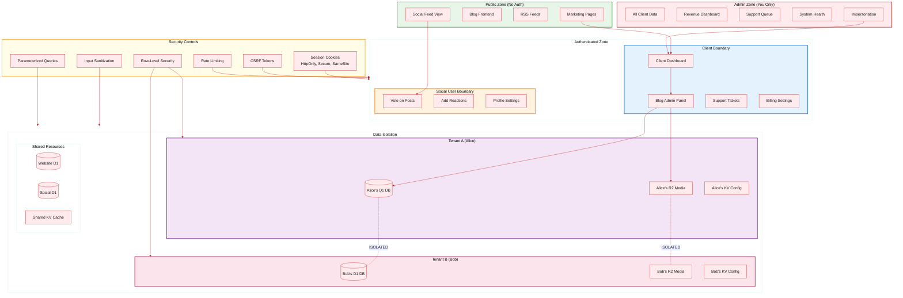
```mermaid
%%{init: {'theme': 'base', 'themeVariables': {'primaryColor': '#ffebee', 'primaryTextColor': '#1a1a1a', 'primaryBorderColor': '#c62828', 'lineColor': '#c62828', 'background': '#ffffff'}}}%%
flowchart TB
    subgraph public["Public Zone (No Auth)"]
        PUB1[Marketing Pages]
        PUB2[Blog Frontend]
        PUB3[RSS Feeds]
        PUB4[Social Feed View]
    end

    subgraph auth["Authenticated Zone"]
        subgraph client_zone["Client Boundary"]
            CL1[Client Dashboard]
            CL2[Blog Admin Panel]
            CL3[Support Tickets]
            CL4[Billing Settings]
        end

        subgraph social_zone["Social User Boundary"]
            SO1[Vote on Posts]
            SO2[Add Reactions]
            SO3[Profile Settings]
        end
    end

    subgraph admin["Admin Zone (You Only)"]
        AD1[All Client Data]
        AD2[Revenue Dashboard]
        AD3[Support Queue]
        AD4[System Health]
        AD5[Impersonation]
    end

    subgraph data["Data Isolation"]
        subgraph tenant_a["Tenant A (Alice)"]
            TA1[(Alice's D1 DB)]
            TA2[Alice's R2 Media]
            TA3[Alice's KV Config]
        end

        subgraph tenant_b["Tenant B (Bob)"]
            TB1[(Bob's D1 DB)]
            TB2[Bob's R2 Media]
            TB3[Bob's KV Config]
        end

        subgraph shared["Shared Resources"]
            SH1[(Website D1)]
            SH2[(Social D1)]
            SH3[Shared KV Cache]
        end
    end

    subgraph security["Security Controls"]
        SEC1[Session Cookies<br/>HttpOnly, Secure, SameSite]
        SEC2[CSRF Tokens]
        SEC3[Rate Limiting]
        SEC4[Input Sanitization]
        SEC5[Parameterized Queries]
        SEC6[Row-Level Security]
    end

    %% Access paths
    PUB1 --> CL1
    PUB4 --> SO1
    CL1 --> CL2
    CL2 --> TA1 & TA2
    AD5 --> CL1

    %% Isolation
    TA1 -.-|"ISOLATED"| TB1
    TA2 -.-|"ISOLATED"| TB2

    %% Security applied
    SEC1 & SEC2 & SEC3 --> auth
    SEC4 & SEC5 --> data
    SEC6 --> tenant_a & tenant_b

    style public fill:#e8f5e9,stroke:#388e3c,stroke-width:2px
    style client_zone fill:#e3f2fd,stroke:#1976d2,stroke-width:2px
    style social_zone fill:#fff3e0,stroke:#f57c00,stroke-width:2px
    style admin fill:#ffebee,stroke:#c62828,stroke-width:2px
    style tenant_a fill:#f3e5f5,stroke:#7b1fa2,stroke-width:2px
    style tenant_b fill:#fce4ec,stroke:#c2185b,stroke-width:2px
    style security fill:#fffde7,stroke:#f9a825,stroke-width:2px
```

---

## Visual Breakdowns

### 13. Lattice Feature Map

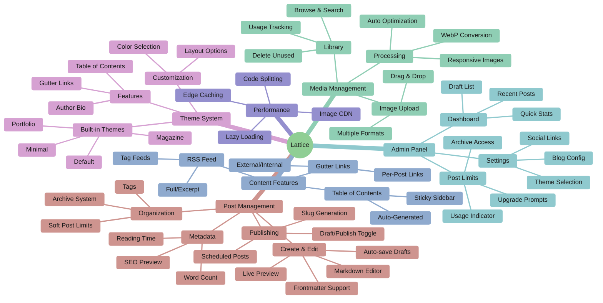
```mermaid
%%{init: {'theme': 'base', 'themeVariables': {'primaryColor': '#e8f5e9', 'primaryTextColor': '#1a1a1a', 'primaryBorderColor': '#2e7d32', 'lineColor': '#2e7d32', 'background': '#ffffff'}}}%%
mindmap
    root((Lattice))
        Post Management
            Create & Edit
                Markdown Editor
                Live Preview
                Auto-save Drafts
                Frontmatter Support
            Publishing
                Draft/Publish Toggle
                Scheduled Posts
                Slug Generation
            Organization
                Tags
                Archive System
                Soft Post Limits
            Metadata
                Word Count
                Reading Time
                SEO Preview

        Theme System
            Built-in Themes
                Default
                Minimal
                Magazine
                Portfolio
            Customization
                Color Selection
                Layout Options
            Features
                Gutter Links
                Table of Contents
                Author Bio

        Media Management
            Image Upload
                Drag & Drop
                Multiple Formats
            Processing
                Auto Optimization
                Responsive Images
                WebP Conversion
            Library
                Browse & Search
                Delete Unused
                Usage Tracking

        Admin Panel
            Dashboard
                Quick Stats
                Recent Posts
                Draft List
            Settings
                Blog Config
                Theme Selection
                Social Links
            Post Limits
                Usage Indicator
                Archive Access
                Upgrade Prompts

        Content Features
            RSS Feed
                Full/Excerpt
                Tag Feeds
            Gutter Links
                Per-Post Links
                External/Internal
            Table of Contents
                Auto-Generated
                Sticky Sidebar

        Performance
            Edge Caching
            Image CDN
            Lazy Loading
            Code Splitting
```

---

### 14. Theme System Architecture

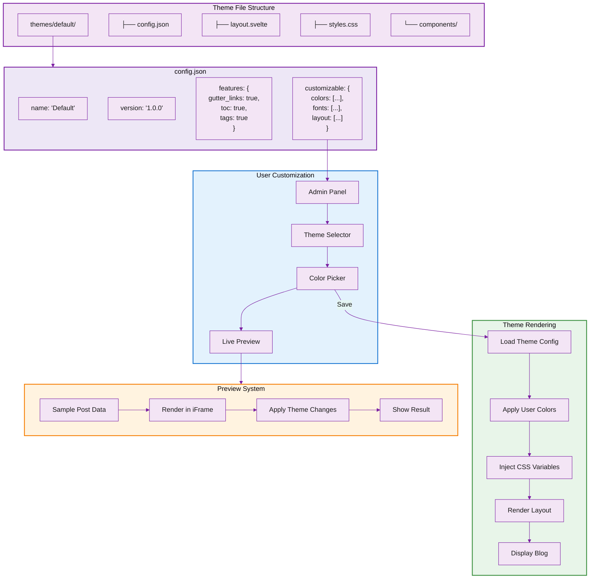
```mermaid
%%{init: {'theme': 'base', 'themeVariables': {'primaryColor': '#f3e5f5', 'primaryTextColor': '#1a1a1a', 'primaryBorderColor': '#7b1fa2', 'lineColor': '#7b1fa2', 'background': '#ffffff'}}}%%
flowchart TB
    subgraph theme_structure["Theme File Structure"]
        TS1["themes/default/"]
        TS2["├── config.json"]
        TS3["├── layout.svelte"]
        TS4["├── styles.css"]
        TS5["└── components/"]
    end

    subgraph config["config.json"]
        CF1["name: 'Default'"]
        CF2["version: '1.0.0'"]
        CF3["features: {<br/>  gutter_links: true,<br/>  toc: true,<br/>  tags: true<br/>}"]
        CF4["customizable: {<br/>  colors: [...],<br/>  fonts: [...],<br/>  layout: [...]<br/>}"]
    end

    subgraph customization["User Customization"]
        CU1[Admin Panel]
        CU2[Theme Selector]
        CU3[Color Picker]
        CU4[Live Preview]
    end

    subgraph rendering["Theme Rendering"]
        R1[Load Theme Config]
        R2[Apply User Colors]
        R3[Inject CSS Variables]
        R4[Render Layout]
        R5[Display Blog]
    end

    subgraph preview["Preview System"]
        P1[Sample Post Data]
        P2[Render in iFrame]
        P3[Apply Theme Changes]
        P4[Show Result]
    end

    %% Flow
    TS1 --> config
    CF4 --> CU1
    CU1 --> CU2 --> CU3 --> CU4
    CU4 --> preview
    P1 --> P2 --> P3 --> P4

    CU3 -->|"Save"| R1
    R1 --> R2 --> R3 --> R4 --> R5

    style theme_structure fill:#f3e5f5,stroke:#7b1fa2,stroke-width:2px
    style config fill:#ede7f6,stroke:#7b1fa2,stroke-width:2px
    style customization fill:#e3f2fd,stroke:#1976d2,stroke-width:2px
    style rendering fill:#e8f5e9,stroke:#388e3c,stroke-width:2px
    style preview fill:#fff3e0,stroke:#f57c00,stroke-width:2px
```

---

### 15. Comment System Decision Flow

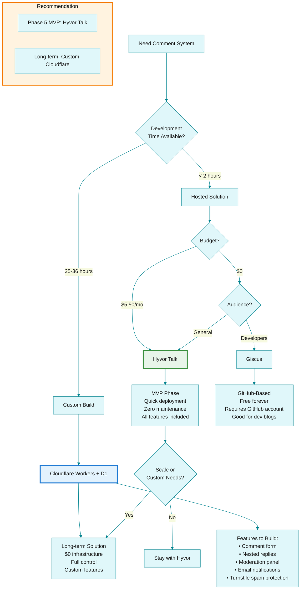
```mermaid
%%{init: {'theme': 'base', 'themeVariables': {'primaryColor': '#e0f7fa', 'primaryTextColor': '#1a1a1a', 'primaryBorderColor': '#00838f', 'lineColor': '#00838f', 'background': '#ffffff'}}}%%
flowchart TD
    START[Need Comment System] --> Q1{Development<br/>Time Available?}

    Q1 -->|"< 2 hours"| HOSTED[Hosted Solution]
    Q1 -->|"25-36 hours"| CUSTOM[Custom Build]

    HOSTED --> Q2{Budget?}
    Q2 -->|"$5.50/mo"| HYVOR[Hyvor Talk]
    Q2 -->|"$0"| Q3{Audience?}
    Q3 -->|"Developers"| GISCUS[Giscus]
    Q3 -->|"General"| HYVOR

    CUSTOM --> CF[Cloudflare Workers + D1]
    CF --> FEATURES["Features to Build:<br/>• Comment form<br/>• Nested replies<br/>• Moderation panel<br/>• Email notifications<br/>• Turnstile spam protection"]

    HYVOR --> MVP["MVP Phase<br/>Quick deployment<br/>Zero maintenance<br/>All features included"]

    GISCUS --> GITHUB["GitHub-Based<br/>Free forever<br/>Requires GitHub account<br/>Good for dev blogs"]

    CF --> LONGTERM["Long-term Solution<br/>$0 infrastructure<br/>Full control<br/>Custom features"]

    MVP --> MIGRATE{Scale or<br/>Custom Needs?}
    MIGRATE -->|"Yes"| LONGTERM
    MIGRATE -->|"No"| STAY[Stay with Hyvor]

    subgraph recommendation["Recommendation"]
        REC1["Phase 5 MVP: Hyvor Talk"]
        REC2["Long-term: Custom Cloudflare"]
    end

    style HYVOR fill:#e8f5e9,stroke:#388e3c,stroke-width:3px
    style CF fill:#e3f2fd,stroke:#1976d2,stroke-width:3px
    style recommendation fill:#fff3e0,stroke:#f57c00,stroke-width:2px
```

---

### 16. Voting & Reaction System

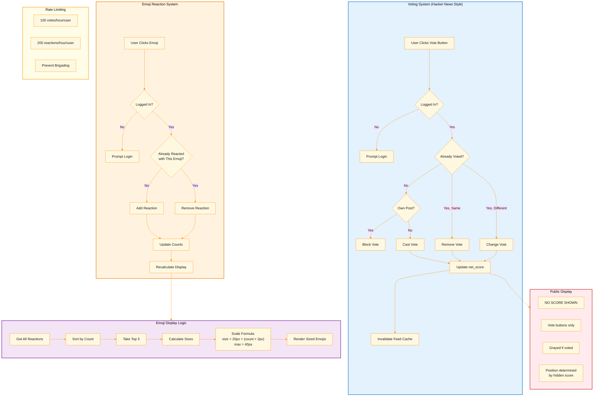
```mermaid
%%{init: {'theme': 'base', 'themeVariables': {'primaryColor': '#fff8e1', 'primaryTextColor': '#1a1a1a', 'primaryBorderColor': '#ff8f00', 'lineColor': '#ff8f00', 'background': '#ffffff'}}}%%
flowchart TD
    subgraph voting["Voting System (Hacker News Style)"]
        V1[User Clicks Vote Button]
        V2{Logged In?}
        V3{Already Voted?}
        V4{Own Post?}
        V5[Cast Vote]
        V6[Change Vote]
        V7[Remove Vote]
        V8[Update net_score]
        V9[Invalidate Feed Cache]

        V1 --> V2
        V2 -->|No| V10[Prompt Login]
        V2 -->|Yes| V3
        V3 -->|No| V4
        V4 -->|Yes| V11[Block Vote]
        V4 -->|No| V5
        V3 -->|Yes, Same| V7
        V3 -->|Yes, Different| V6
        V5 & V6 & V7 --> V8 --> V9
    end

    subgraph display["Public Display"]
        D1["NO SCORE SHOWN"]
        D2[Vote buttons only]
        D3[Grayed if voted]
        D4[Position determined<br/>by hidden score]
    end

    subgraph reactions["Emoji Reaction System"]
        R1[User Clicks Emoji]
        R2{Logged In?}
        R3{Already Reacted<br/>with This Emoji?}
        R4[Add Reaction]
        R5[Remove Reaction]
        R6[Update Counts]
        R7[Recalculate Display]

        R1 --> R2
        R2 -->|No| R8[Prompt Login]
        R2 -->|Yes| R3
        R3 -->|No| R4
        R3 -->|Yes| R5
        R4 & R5 --> R6 --> R7
    end

    subgraph emoji_display["Emoji Display Logic"]
        E1[Get All Reactions]
        E2[Sort by Count]
        E3[Take Top 5]
        E4[Calculate Sizes]
        E5["Scale Formula:<br/>size = 20px + (count × 2px)<br/>max = 40px"]
        E6[Render Sized Emojis]

        E1 --> E2 --> E3 --> E4 --> E5 --> E6
    end

    subgraph rate_limit["Rate Limiting"]
        RL1[100 votes/hour/user]
        RL2[200 reactions/hour/user]
        RL3[Prevent Brigading]
    end

    V8 --> display
    R7 --> emoji_display

    style voting fill:#e3f2fd,stroke:#1976d2,stroke-width:2px
    style display fill:#ffebee,stroke:#c62828,stroke-width:2px
    style reactions fill:#fff3e0,stroke:#f57c00,stroke-width:2px
    style emoji_display fill:#f3e5f5,stroke:#7b1fa2,stroke-width:2px
    style rate_limit fill:#fffde7,stroke:#f9a825,stroke-width:2px
```

---

### 17. Analytics System Architecture

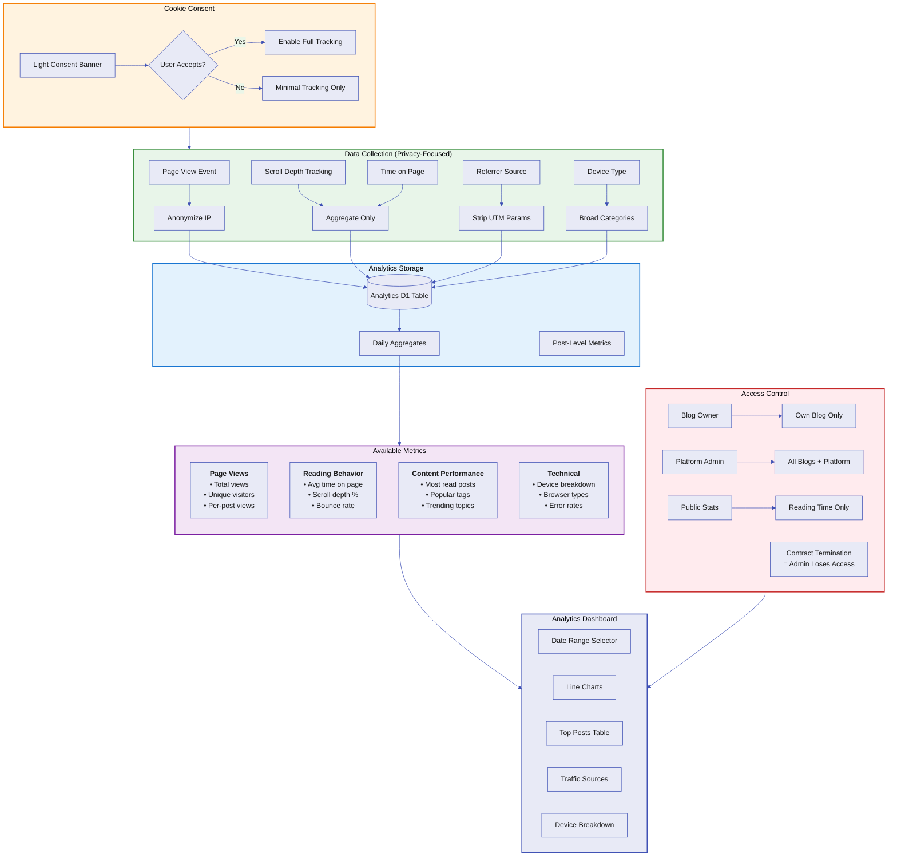
```mermaid
%%{init: {'theme': 'base', 'themeVariables': {'primaryColor': '#e8eaf6', 'primaryTextColor': '#1a1a1a', 'primaryBorderColor': '#3f51b5', 'lineColor': '#3f51b5', 'background': '#ffffff'}}}%%
flowchart TB
    subgraph collection["Data Collection (Privacy-Focused)"]
        C1[Page View Event]
        C2[Scroll Depth Tracking]
        C3[Time on Page]
        C4[Referrer Source]
        C5[Device Type]

        C1 --> C6[Anonymize IP]
        C2 & C3 --> C7[Aggregate Only]
        C4 --> C8[Strip UTM Params]
        C5 --> C9[Broad Categories]
    end

    subgraph consent["Cookie Consent"]
        CO1[Light Consent Banner]
        CO2{User Accepts?}
        CO3[Enable Full Tracking]
        CO4[Minimal Tracking Only]

        CO1 --> CO2
        CO2 -->|Yes| CO3
        CO2 -->|No| CO4
    end

    subgraph storage["Analytics Storage"]
        S1[(Analytics D1 Table)]
        S2[Daily Aggregates]
        S3[Post-Level Metrics]
    end

    subgraph metrics["Available Metrics"]
        direction TB
        M1["<b>Page Views</b><br/>• Total views<br/>• Unique visitors<br/>• Per-post views"]
        M2["<b>Reading Behavior</b><br/>• Avg time on page<br/>• Scroll depth %<br/>• Bounce rate"]
        M3["<b>Content Performance</b><br/>• Most read posts<br/>• Popular tags<br/>• Trending topics"]
        M4["<b>Technical</b><br/>• Device breakdown<br/>• Browser types<br/>• Error rates"]
    end

    subgraph access["Access Control"]
        A1[Blog Owner]
        A2[Platform Admin]
        A3[Public Stats]

        A1 --> A4[Own Blog Only]
        A2 --> A5[All Blogs + Platform]
        A3 --> A6[Reading Time Only]

        A7["Contract Termination<br/>= Admin Loses Access"]
    end

    subgraph dashboard["Analytics Dashboard"]
        D1[Date Range Selector]
        D2[Line Charts]
        D3[Top Posts Table]
        D4[Traffic Sources]
        D5[Device Breakdown]
    end

    %% Flow
    C6 & C7 & C8 & C9 --> S1
    S1 --> S2 --> metrics
    metrics --> dashboard
    consent --> collection
    access --> dashboard

    style collection fill:#e8f5e9,stroke:#388e3c,stroke-width:2px
    style consent fill:#fff3e0,stroke:#f57c00,stroke-width:2px
    style storage fill:#e3f2fd,stroke:#1976d2,stroke-width:2px
    style metrics fill:#f3e5f5,stroke:#7b1fa2,stroke-width:2px
    style access fill:#ffebee,stroke:#c62828,stroke-width:2px
    style dashboard fill:#e8eaf6,stroke:#3f51b5,stroke-width:2px
```

---

## Additional Utility Diagrams

### 18. Client Onboarding Email Sequence

```mermaid
%%{init: {'theme': 'base', 'themeVariables': {'primaryColor': '#e1f5fe', 'primaryTextColor': '#1a1a1a', 'primaryBorderColor': '#0277bd', 'lineColor': '#0277bd', 'background': '#ffffff'}}}%%
gantt
    title Client Onboarding Email Sequence
    dateFormat X
    axisFormat Day %s

    section Welcome
    Welcome Email (credentials + links)     :done, 0, 1

    section Education
    Admin Panel Walkthrough Video           :1, 2
    First Post Tutorial                     :3, 4
    Tips for Growing Your Blog              :7, 8

    section Check-in
    14-Day Check-in + Support Offer         :14, 15

    section Upsell
    30-Day Upgrade Prompt (if Starter)      :30, 31
```

---

### 19. Development Phase Timeline

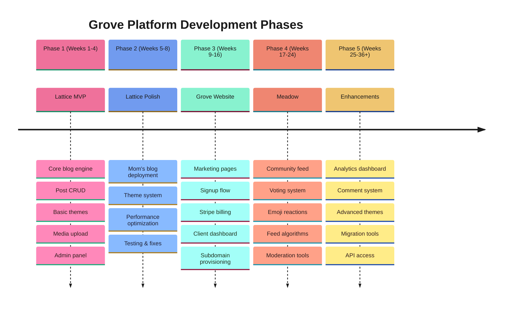
```mermaid
%%{init: {'theme': 'base', 'themeVariables': {'primaryColor': '#fce4ec', 'primaryTextColor': '#1a1a1a', 'primaryBorderColor': '#c2185b', 'lineColor': '#c2185b', 'background': '#ffffff'}}}%%
timeline
    title Grove Platform Development Phases

    section Phase 1 (Weeks 1-4)
        Lattice MVP : Core blog engine
                   : Post CRUD
                   : Basic themes
                   : Media upload
                   : Admin panel

    section Phase 2 (Weeks 5-8)
        Lattice Polish : Mom's blog deployment
                      : Theme system
                      : Performance optimization
                      : Testing & fixes

    section Phase 3 (Weeks 9-16)
        Grove Website : Marketing pages
                     : Signup flow
                     : Stripe billing
                     : Client dashboard
                     : Subdomain provisioning

    section Phase 4 (Weeks 17-24)
        Meadow : Community feed
              : Voting system
              : Emoji reactions
              : Feed algorithms
              : Moderation tools

    section Phase 5 (Weeks 25-36+)
        Enhancements : Analytics dashboard
                    : Comment system
                    : Advanced themes
                    : Migration tools
                    : API access
```

---

### 20. Pricing Tier Comparison

```mermaid
%%{init: {'theme': 'base', 'themeVariables': {'primaryColor': '#f1f8e9', 'primaryTextColor': '#1a1a1a', 'primaryBorderColor': '#558b2f', 'lineColor': '#558b2f', 'background': '#ffffff'}}}%%
flowchart LR
    subgraph free["Free - $0/mo"]
        F1["Meadow Access"]
        F2["20 Public Comments/week"]
        F3["No Blog"]
        F4["Community Support"]
    end

    subgraph seedling["Seedling - $8/mo"]
        S1["Subdomain<br/>username.grove.place"]
        S2["50 Blog Posts"]
        S3["1GB Storage"]
        S4["3 Themes + Accent"]
        S5["Unlimited Comments"]
        S6["Community Support"]
    end

    subgraph sapling["Sapling - $12/mo"]
        SP1["Subdomain<br/>username.grove.place"]
        SP2["250 Blog Posts"]
        SP3["5GB Storage"]
        SP4["10 Themes + Accent"]
        SP5["Email Forwarding"]
        SP6["Email Support"]
    end

    subgraph oak["Oak - $25/mo"]
        O1["Bring Your Own Domain"]
        O2["Unlimited Posts"]
        O3["20GB Storage"]
        O4["Theme Customizer"]
        O5["Community Themes"]
        O6["Full Email"]
        O7["Priority Support"]
    end

    subgraph evergreen["Evergreen - $35/mo"]
        E1["Custom Domain Included"]
        E2["Unlimited Posts"]
        E3["100GB Storage"]
        E4["Custom Fonts"]
        E5["Community Themes"]
        E6["Full Email"]
        E7["8hrs Support + Priority"]
    end

    free -.->|"Upgrade"| seedling
    seedling -.->|"Upgrade"| sapling
    sapling -.->|"Upgrade"| oak
    oak -.->|"Upgrade"| evergreen

    style free fill:#f5f5f5,stroke:#9e9e9e,stroke-width:2px
    style seedling fill:#e8f5e9,stroke:#388e3c,stroke-width:2px
    style sapling fill:#e3f2fd,stroke:#1976d2,stroke-width:2px
    style oak fill:#fff3e0,stroke:#f57c00,stroke-width:2px
    style evergreen fill:#f3e5f5,stroke:#7b1fa2,stroke-width:2px
```

---

*Generated for Grove Platform - November 2025*
