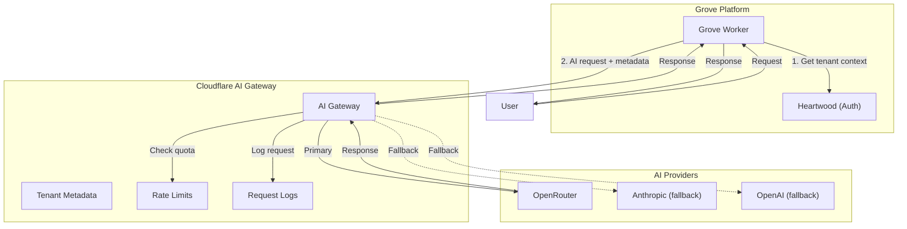

# Grove AI Gateway Integration Guide

> Central observability and per-tenant quota management for all AI features in Grove.

## Table of Contents

- [Overview](#overview)
- [Architecture](#architecture)
- [Setup](#setup)
- [Usage Patterns](#usage-patterns)
- [Per-Tenant Quotas](#per-tenant-quotas)
- [Pricing Tier Integration](#pricing-tier-integration)
- [Observability](#observability)
- [Error Handling & Fallbacks](#error-handling--fallbacks)
- [Best Practices](#best-practices)

---

## Overview

All AI features in Grove route through Cloudflare AI Gateway. This gives us:

- **Central observability** — One dashboard for all AI usage across the platform
- **Per-tenant quotas** — Enforce usage limits based on pricing tiers
- **Cost attribution** — Know exactly which tenants consume what
- **Fallback routing** — Resilience when upstream providers fail
- **Guardrails** — Content filtering before requests hit providers

We proxy through OpenRouter for model access (unified billing, wide model selection) but wrap it with CF AI Gateway for the control plane.

---

## Architecture



---

## Setup

### 1. Create the AI Gateway

In Cloudflare Dashboard:

1. Navigate to **AI** → **AI Gateway**
2. Click **Create Gateway**
3. Name it: `grove-production` (or `grove-staging` for non-prod)
4. Note your `gateway_id` and `account_id`

### 2. Enable Authentication

In Gateway Settings:

1. Enable **Authentication**
2. Generate a **CF AIG Token** (this is separate from your account API token)
3. Store in your secrets: `CF_AIG_TOKEN`

### 3. Configure BYOK (Bring Your Own Keys)

Store your provider API keys in CF AI Gateway:

1. Go to **Settings** → **Keys**
2. Add keys for each provider:
   - `openrouter` → Your OpenRouter API key
   - `anthropic` → Direct Anthropic key (for fallback)
   - `openai` → Direct OpenAI key (for fallback)

### 4. Environment Variables

```toml
# wrangler.toml
[vars]
CF_ACCOUNT_ID = "your-account-id"
CF_GATEWAY_ID = "grove-production"

# In secrets (wrangler secret put)
# CF_AIG_TOKEN = "your-aig-token"
```

---

## Usage Patterns

### The Core AI Client

Create a reusable AI client that all Grove services use:

```typescript
// packages/grove-ai/src/client.ts

import { TenantContext } from '@grove/heartwood';

interface AIClientConfig {
  accountId: string;
  gatewayId: string;
  aigToken: string;
}

interface AIRequestOptions {
  tenant: TenantContext;
  feature: string;  // e.g., 'post-summary', 'alt-text', 'recommendations'
  userId?: string;
}

interface ChatMessage {
  role: 'system' | 'user' | 'assistant';
  content: string;
}

export function createAIClient(config: AIClientConfig) {
  const baseUrl = `https://gateway.ai.cloudflare.com/v1/${config.accountId}/${config.gatewayId}`;

  return {
    async chat(
      messages: ChatMessage[],
      model: string,
      options: AIRequestOptions
    ): Promise<string> {
      const metadata = buildMetadata(options);

      const response = await fetch(`${baseUrl}/compat/chat/completions`, {
        method: 'POST',
        headers: {
          'Content-Type': 'application/json',
          'cf-aig-authorization': `Bearer ${config.aigToken}`,
          'cf-aig-metadata': JSON.stringify(metadata),
        },
        body: JSON.stringify({
          model: `openrouter/${model}`,
          messages,
          max_tokens: 4096,
        }),
      });

      if (!response.ok) {
        const error = await response.text();
        throw new AIError(response.status, error, options.tenant.id);
      }

      const data = await response.json() as ChatCompletionResponse;
      return data.choices[0]?.message?.content ?? '';
    },
  };
}

function buildMetadata(options: AIRequestOptions) {
  return {
    tenant_id: options.tenant.id,
    tenant_tier: options.tenant.pricingTier,
    feature: options.feature,
    user_id: options.userId ?? 'system',
    timestamp: new Date().toISOString(),
  };
}

class AIError extends Error {
  constructor(
    public status: number,
    public details: string,
    public tenantId: string
  ) {
    super(`AI request failed for tenant ${tenantId}: ${status}`);
  }
}
```

### Using the Client in a Worker

```typescript
// apps/grove-api/src/routes/posts.ts

import { createAIClient } from '@grove/ai';
import { getTenantContext } from '@grove/heartwood';

export async function generatePostSummary(
  request: Request,
  env: Env
): Promise<Response> {
  const tenant = await getTenantContext(request, env);
  
  const ai = createAIClient({
    accountId: env.CF_ACCOUNT_ID,
    gatewayId: env.CF_GATEWAY_ID,
    aigToken: env.CF_AIG_TOKEN,
  });

  const postContent = await request.text();

  const summary = await ai.chat(
    [
      {
        role: 'system',
        content: 'You are a helpful assistant that summarizes blog posts concisely.',
      },
      {
        role: 'user',
        content: `Summarize this post in 2-3 sentences:\n\n${postContent}`,
      },
    ],
    'openai/gpt-4o-mini',  // Cost-effective for summaries
    {
      tenant,
      feature: 'post-summary',
    }
  );

  return Response.json({ summary });
}
```

---

## Per-Tenant Quotas

### Dynamic Routes for Tier Enforcement

Create dynamic routes in CF AI Gateway that check tenant tier metadata.

#### Route: `grove-standard`

For standard tier tenants (default limits):

```json
{
  "name": "grove-standard",
  "conditionals": [
    {
      "field": "cf.metadata.tenant_tier",
      "operator": "equals",
      "value": "standard"
    }
  ],
  "rate_limit": {
    "requests": 100,
    "period": "day"
  },
  "models": [
    {
      "provider": "openrouter",
      "model": "openai/gpt-4o-mini"
    }
  ]
}
```

#### Route: `grove-pro`

For pro tier (4x limits):

```json
{
  "name": "grove-pro",
  "conditionals": [
    {
      "field": "cf.metadata.tenant_tier",
      "operator": "equals",
      "value": "pro"
    }
  ],
  "rate_limit": {
    "requests": 400,
    "period": "day"
  },
  "models": [
    {
      "provider": "openrouter",
      "model": "openai/gpt-4o"
    },
    {
      "provider": "openrouter",
      "model": "anthropic/claude-3.5-sonnet"
    }
  ]
}
```

### Updated Client for Dynamic Routes

```typescript
// packages/grove-ai/src/client.ts

const TIER_ROUTES: Record<string, string> = {
  free: 'dynamic/grove-free',
  standard: 'dynamic/grove-standard',
  pro: 'dynamic/grove-pro',
  enterprise: 'dynamic/grove-enterprise',
};

export function createAIClient(config: AIClientConfig) {
  // ... existing setup ...

  return {
    async chat(
      messages: ChatMessage[],
      options: AIRequestOptions
    ): Promise<string> {
      const metadata = buildMetadata(options);
      const route = TIER_ROUTES[options.tenant.pricingTier] ?? TIER_ROUTES.free;

      const response = await fetch(`${baseUrl}/compat/chat/completions`, {
        method: 'POST',
        headers: {
          'Content-Type': 'application/json',
          'cf-aig-authorization': `Bearer ${config.aigToken}`,
          'cf-aig-metadata': JSON.stringify(metadata),
        },
        body: JSON.stringify({
          model: route,  // Uses dynamic route instead of direct model
          messages,
          max_tokens: 4096,
        }),
      });

      // ... error handling ...
    },
  };
}
```

---

## Pricing Tier Integration

### Tier Definitions

| Tier | Daily AI Requests | Models Available | Features |
|------|-------------------|------------------|----------|
| Free | 10 | gpt-4o-mini | Post summaries only |
| Standard | 100 | gpt-4o-mini, claude-3-haiku | Summaries, alt-text |
| Pro | 400 | gpt-4o, claude-3.5-sonnet | All features |
| Enterprise | 2000 | All models | All features + priority |

### Checking Quota in Application Code

```typescript
// packages/grove-ai/src/quota.ts

import { TenantContext } from '@grove/heartwood';

interface QuotaStatus {
  used: number;
  limit: number;
  remaining: number;
  resetsAt: Date;
}

const TIER_LIMITS: Record<string, number> = {
  free: 10,
  standard: 100,
  pro: 400,
  enterprise: 2000,
};

export async function checkQuota(
  tenant: TenantContext,
  env: Env
): Promise<QuotaStatus> {
  // Query CF AI Gateway analytics API for tenant usage
  const today = new Date().toISOString().split('T')[0];
  
  const response = await fetch(
    `https://api.cloudflare.com/client/v4/accounts/${env.CF_ACCOUNT_ID}/ai-gateway/gateways/${env.CF_GATEWAY_ID}/logs?` +
    new URLSearchParams({
      'metadata.tenant_id': tenant.id,
      'start_date': today,
    }),
    {
      headers: {
        'Authorization': `Bearer ${env.CF_API_TOKEN}`,
      },
    }
  );

  const data = await response.json();
  const used = data.result?.length ?? 0;
  const limit = TIER_LIMITS[tenant.pricingTier] ?? TIER_LIMITS.free;

  return {
    used,
    limit,
    remaining: Math.max(0, limit - used),
    resetsAt: getNextMidnightUTC(),
  };
}

export async function enforceQuota(
  tenant: TenantContext,
  env: Env
): Promise<void> {
  const quota = await checkQuota(tenant, env);
  
  if (quota.remaining <= 0) {
    throw new QuotaExceededError(tenant.id, tenant.pricingTier, quota.resetsAt);
  }
}

class QuotaExceededError extends Error {
  constructor(
    public tenantId: string,
    public tier: string,
    public resetsAt: Date
  ) {
    super(`AI quota exceeded for tenant ${tenantId} (${tier} tier). Resets at ${resetsAt.toISOString()}`);
  }
}

function getNextMidnightUTC(): Date {
  const now = new Date();
  const tomorrow = new Date(now);
  tomorrow.setUTCDate(tomorrow.getUTCDate() + 1);
  tomorrow.setUTCHours(0, 0, 0, 0);
  return tomorrow;
}
```

### Middleware Pattern

```typescript
// packages/grove-ai/src/middleware.ts

import { enforceQuota } from './quota';

export function withQuotaCheck<T>(
  handler: (request: Request, env: Env, tenant: TenantContext) => Promise<T>
) {
  return async (request: Request, env: Env, tenant: TenantContext): Promise<T> => {
    await enforceQuota(tenant, env);
    return handler(request, env, tenant);
  };
}

// Usage:
export const generateSummary = withQuotaCheck(async (request, env, tenant) => {
  // Your AI logic here - quota already checked
});
```

---

## D1 Quota Tracking

While CF AI Gateway handles enforcement, we track usage in D1 for:

- **User-facing dashboards** — "You've used 43/100 AI requests today"
- **Backend analytics** — Usage patterns, feature popularity, cost projections
- **Soft warnings** — Alert users at 80% before they hit the wall
- **Historical data** — Track trends over time (CF logs rotate)

### Schema

```sql
-- migrations/0001_ai_quota_tracking.sql

-- Track individual AI requests
CREATE TABLE ai_usage_log (
    id TEXT PRIMARY KEY DEFAULT (lower(hex(randomblob(16)))),
    tenant_id TEXT NOT NULL,
    user_id TEXT,
    feature TEXT NOT NULL,
    model TEXT NOT NULL,
    input_tokens INTEGER,
    output_tokens INTEGER,
    latency_ms INTEGER,
    cost_microcents INTEGER,  -- Cost in 1/10000 of a cent for precision
    status TEXT NOT NULL DEFAULT 'success',  -- success, error, rate_limited
    error_code TEXT,
    metadata TEXT,  -- JSON blob for additional context
    created_at TEXT NOT NULL DEFAULT (datetime('now')),
    
    -- Indexes for common queries
    FOREIGN KEY (tenant_id) REFERENCES tenants(id)
);

CREATE INDEX idx_ai_usage_tenant_date ON ai_usage_log(tenant_id, created_at);
CREATE INDEX idx_ai_usage_feature ON ai_usage_log(feature, created_at);

-- Daily rollup for fast quota checks (updated by scheduled job or trigger)
CREATE TABLE ai_usage_daily (
    id TEXT PRIMARY KEY DEFAULT (lower(hex(randomblob(16)))),
    tenant_id TEXT NOT NULL,
    date TEXT NOT NULL,  -- YYYY-MM-DD
    request_count INTEGER NOT NULL DEFAULT 0,
    total_input_tokens INTEGER NOT NULL DEFAULT 0,
    total_output_tokens INTEGER NOT NULL DEFAULT 0,
    total_cost_microcents INTEGER NOT NULL DEFAULT 0,
    updated_at TEXT NOT NULL DEFAULT (datetime('now')),
    
    UNIQUE(tenant_id, date),
    FOREIGN KEY (tenant_id) REFERENCES tenants(id)
);

CREATE INDEX idx_ai_daily_tenant ON ai_usage_daily(tenant_id, date);

-- Feature-level breakdown (for analytics)
CREATE TABLE ai_usage_by_feature (
    id TEXT PRIMARY KEY DEFAULT (lower(hex(randomblob(16)))),
    tenant_id TEXT NOT NULL,
    date TEXT NOT NULL,
    feature TEXT NOT NULL,
    request_count INTEGER NOT NULL DEFAULT 0,
    total_tokens INTEGER NOT NULL DEFAULT 0,
    avg_latency_ms INTEGER,
    error_count INTEGER NOT NULL DEFAULT 0,
    
    UNIQUE(tenant_id, date, feature),
    FOREIGN KEY (tenant_id) REFERENCES tenants(id)
);
```

### Quota Tracking Service

```typescript
// packages/grove-ai/src/quota/tracker.ts

import { D1Database } from '@cloudflare/workers-types';

interface UsageRecord {
  tenantId: string;
  userId?: string;
  feature: string;
  model: string;
  inputTokens?: number;
  outputTokens?: number;
  latencyMs?: number;
  costMicrocents?: number;
  status: 'success' | 'error' | 'rate_limited';
  errorCode?: string;
  metadata?: Record<string, unknown>;
}

interface QuotaStatus {
  used: number;
  limit: number;
  remaining: number;
  percentUsed: number;
  resetsAt: Date;
  warning: boolean;  // True if > 80% used
  exceeded: boolean;
}

interface UsageBreakdown {
  byFeature: Record<string, number>;
  byDay: { date: string; count: number }[];
  totalTokens: number;
  estimatedCost: number;  // In cents
}

const TIER_LIMITS: Record<string, number> = {
  free: 10,
  standard: 100,
  pro: 400,
  enterprise: 2000,
};

const WARNING_THRESHOLD = 0.8;  // Warn at 80%

export function createQuotaTracker(db: D1Database) {
  return {
    /**
     * Record an AI request (call after successful response)
     */
    async record(usage: UsageRecord): Promise<void> {
      const today = new Date().toISOString().split('T')[0];
      
      // Insert detailed log
      await db.prepare(`
        INSERT INTO ai_usage_log 
        (tenant_id, user_id, feature, model, input_tokens, output_tokens, 
         latency_ms, cost_microcents, status, error_code, metadata, created_at)
        VALUES (?, ?, ?, ?, ?, ?, ?, ?, ?, ?, ?, datetime('now'))
      `).bind(
        usage.tenantId,
        usage.userId ?? null,
        usage.feature,
        usage.model,
        usage.inputTokens ?? null,
        usage.outputTokens ?? null,
        usage.latencyMs ?? null,
        usage.costMicrocents ?? null,
        usage.status,
        usage.errorCode ?? null,
        usage.metadata ? JSON.stringify(usage.metadata) : null
      ).run();

      // Upsert daily rollup
      await db.prepare(`
        INSERT INTO ai_usage_daily (tenant_id, date, request_count, total_input_tokens, 
                                    total_output_tokens, total_cost_microcents, updated_at)
        VALUES (?, ?, 1, ?, ?, ?, datetime('now'))
        ON CONFLICT(tenant_id, date) DO UPDATE SET
          request_count = request_count + 1,
          total_input_tokens = total_input_tokens + excluded.total_input_tokens,
          total_output_tokens = total_output_tokens + excluded.total_output_tokens,
          total_cost_microcents = total_cost_microcents + excluded.total_cost_microcents,
          updated_at = datetime('now')
      `).bind(
        usage.tenantId,
        today,
        usage.inputTokens ?? 0,
        usage.outputTokens ?? 0,
        usage.costMicrocents ?? 0
      ).run();

      // Upsert feature breakdown
      await db.prepare(`
        INSERT INTO ai_usage_by_feature (tenant_id, date, feature, request_count, 
                                         total_tokens, error_count)
        VALUES (?, ?, ?, 1, ?, ?)
        ON CONFLICT(tenant_id, date, feature) DO UPDATE SET
          request_count = request_count + 1,
          total_tokens = total_tokens + excluded.total_tokens,
          error_count = error_count + excluded.error_count
      `).bind(
        usage.tenantId,
        today,
        usage.feature,
        (usage.inputTokens ?? 0) + (usage.outputTokens ?? 0),
        usage.status === 'error' ? 1 : 0
      ).run();
    },

    /**
     * Get current quota status for a tenant
     */
    async getQuotaStatus(tenantId: string, tier: string): Promise<QuotaStatus> {
      const today = new Date().toISOString().split('T')[0];
      const limit = TIER_LIMITS[tier] ?? TIER_LIMITS.free;

      const result = await db.prepare(`
        SELECT request_count FROM ai_usage_daily
        WHERE tenant_id = ? AND date = ?
      `).bind(tenantId, today).first<{ request_count: number }>();

      const used = result?.request_count ?? 0;
      const remaining = Math.max(0, limit - used);
      const percentUsed = used / limit;

      return {
        used,
        limit,
        remaining,
        percentUsed: Math.round(percentUsed * 100),
        resetsAt: getNextMidnightUTC(),
        warning: percentUsed >= WARNING_THRESHOLD && percentUsed < 1,
        exceeded: percentUsed >= 1,
      };
    },

    /**
     * Check if request would exceed quota (call before making AI request)
     */
    async canMakeRequest(tenantId: string, tier: string): Promise<{
      allowed: boolean;
      quota: QuotaStatus;
    }> {
      const quota = await this.getQuotaStatus(tenantId, tier);
      return {
        allowed: !quota.exceeded,
        quota,
      };
    },

    /**
     * Get usage breakdown for analytics/dashboard
     */
    async getUsageBreakdown(
      tenantId: string,
      days: number = 30
    ): Promise<UsageBreakdown> {
      const startDate = new Date();
      startDate.setDate(startDate.getDate() - days);
      const startDateStr = startDate.toISOString().split('T')[0];

      // By feature
      const featureResults = await db.prepare(`
        SELECT feature, SUM(request_count) as count
        FROM ai_usage_by_feature
        WHERE tenant_id = ? AND date >= ?
        GROUP BY feature
      `).bind(tenantId, startDateStr).all<{ feature: string; count: number }>();

      const byFeature: Record<string, number> = {};
      for (const row of featureResults.results ?? []) {
        byFeature[row.feature] = row.count;
      }

      // By day
      const dailyResults = await db.prepare(`
        SELECT date, request_count as count
        FROM ai_usage_daily
        WHERE tenant_id = ? AND date >= ?
        ORDER BY date ASC
      `).bind(tenantId, startDateStr).all<{ date: string; count: number }>();

      const byDay = dailyResults.results ?? [];

      // Totals
      const totals = await db.prepare(`
        SELECT 
          SUM(total_input_tokens + total_output_tokens) as total_tokens,
          SUM(total_cost_microcents) as total_cost
        FROM ai_usage_daily
        WHERE tenant_id = ? AND date >= ?
      `).bind(tenantId, startDateStr).first<{ 
        total_tokens: number; 
        total_cost: number;
      }>();

      return {
        byFeature,
        byDay,
        totalTokens: totals?.total_tokens ?? 0,
        estimatedCost: (totals?.total_cost ?? 0) / 10000,  // Convert microcents to cents
      };
    },

    /**
     * Get recent usage for a specific user (for user-facing dashboard)
     */
    async getUserRecentUsage(
      tenantId: string,
      userId: string,
      limit: number = 10
    ): Promise<{
      feature: string;
      model: string;
      tokens: number;
      createdAt: string;
    }[]> {
      const results = await db.prepare(`
        SELECT feature, model, 
               (COALESCE(input_tokens, 0) + COALESCE(output_tokens, 0)) as tokens,
               created_at
        FROM ai_usage_log
        WHERE tenant_id = ? AND user_id = ? AND status = 'success'
        ORDER BY created_at DESC
        LIMIT ?
      `).bind(tenantId, userId, limit).all();

      return (results.results ?? []) as any;
    },
  };
}

function getNextMidnightUTC(): Date {
  const now = new Date();
  const tomorrow = new Date(now);
  tomorrow.setUTCDate(tomorrow.getUTCDate() + 1);
  tomorrow.setUTCHours(0, 0, 0, 0);
  return tomorrow;
}
```

### Integrating with the AI Client

```typescript
// packages/grove-ai/src/client.ts (updated)

import { createQuotaTracker } from './quota/tracker';

interface AIClientConfig {
  accountId: string;
  gatewayId: string;
  aigToken: string;
  db: D1Database;  // Add D1 reference
}

export function createAIClient(config: AIClientConfig) {
  const baseUrl = `https://gateway.ai.cloudflare.com/v1/${config.accountId}/${config.gatewayId}`;
  const quotaTracker = createQuotaTracker(config.db);

  return {
    async chat(
      messages: ChatMessage[],
      model: string,
      options: AIRequestOptions
    ): Promise<{ content: string; quota: QuotaStatus }> {
      const startTime = Date.now();
      
      // Pre-check quota
      const { allowed, quota } = await quotaTracker.canMakeRequest(
        options.tenant.id,
        options.tenant.pricingTier
      );

      if (!allowed) {
        // Record the rejection
        await quotaTracker.record({
          tenantId: options.tenant.id,
          userId: options.userId,
          feature: options.feature,
          model,
          status: 'rate_limited',
        });
        
        throw new QuotaExceededError(
          options.tenant.id,
          options.tenant.pricingTier,
          quota.resetsAt
        );
      }

      // Warn if approaching limit
      if (quota.warning) {
        console.warn(`Tenant ${options.tenant.id} at ${quota.percentUsed}% of AI quota`);
      }

      const metadata = buildMetadata(options);

      try {
        const response = await fetch(`${baseUrl}/compat/chat/completions`, {
          method: 'POST',
          headers: {
            'Content-Type': 'application/json',
            'cf-aig-authorization': `Bearer ${config.aigToken}`,
            'cf-aig-metadata': JSON.stringify(metadata),
          },
          body: JSON.stringify({
            model: `openrouter/${model}`,
            messages,
            max_tokens: 4096,
          }),
        });

        const latencyMs = Date.now() - startTime;

        if (!response.ok) {
          const error = await response.text();
          
          // Record the error
          await quotaTracker.record({
            tenantId: options.tenant.id,
            userId: options.userId,
            feature: options.feature,
            model,
            latencyMs,
            status: 'error',
            errorCode: `HTTP_${response.status}`,
          });
          
          throw new AIError(response.status, error, options.tenant.id);
        }

        const data = await response.json() as ChatCompletionResponse;
        const content = data.choices[0]?.message?.content ?? '';

        // Record successful usage
        await quotaTracker.record({
          tenantId: options.tenant.id,
          userId: options.userId,
          feature: options.feature,
          model,
          inputTokens: data.usage?.prompt_tokens,
          outputTokens: data.usage?.completion_tokens,
          latencyMs,
          costMicrocents: calculateCost(model, data.usage),
          status: 'success',
          metadata: {
            messageCount: messages.length,
          },
        });

        // Return updated quota with response
        const updatedQuota = await quotaTracker.getQuotaStatus(
          options.tenant.id,
          options.tenant.pricingTier
        );

        return { content, quota: updatedQuota };
      } catch (error) {
        if (!(error instanceof AIError) && !(error instanceof QuotaExceededError)) {
          // Record unexpected errors
          await quotaTracker.record({
            tenantId: options.tenant.id,
            userId: options.userId,
            feature: options.feature,
            model,
            latencyMs: Date.now() - startTime,
            status: 'error',
            errorCode: 'UNEXPECTED',
          });
        }
        throw error;
      }
    },

    // Expose quota methods for direct access
    quota: quotaTracker,
  };
}

// Cost calculation per model (microcents per 1K tokens)
const MODEL_COSTS: Record<string, { input: number; output: number }> = {
  'openai/gpt-4o-mini': { input: 15, output: 60 },      // $0.15/$0.60 per 1M
  'openai/gpt-4o': { input: 250, output: 1000 },        // $2.50/$10 per 1M
  'anthropic/claude-3-haiku': { input: 25, output: 125 },
  'anthropic/claude-3.5-sonnet': { input: 300, output: 1500 },
};

function calculateCost(
  model: string, 
  usage?: { prompt_tokens?: number; completion_tokens?: number }
): number {
  if (!usage) return 0;
  
  const costs = MODEL_COSTS[model] ?? { input: 100, output: 100 };  // Default fallback
  
  const inputCost = ((usage.prompt_tokens ?? 0) / 1000) * costs.input;
  const outputCost = ((usage.completion_tokens ?? 0) / 1000) * costs.output;
  
  return Math.round(inputCost + outputCost);
}
```

### API Endpoints for User Dashboard

```typescript
// apps/grove-api/src/routes/ai-usage.ts

import { Hono } from 'hono';
import { createAIClient } from '@grove/ai';
import { requireAuth, getTenantContext } from '@grove/heartwood';

const app = new Hono<{ Bindings: Env }>();

// Get current quota status
app.get('/quota', requireAuth(), async (c) => {
  const tenant = getTenantContext(c);
  const ai = createAIClient({
    accountId: c.env.CF_ACCOUNT_ID,
    gatewayId: c.env.CF_GATEWAY_ID,
    aigToken: c.env.CF_AIG_TOKEN,
    db: c.env.DB,
  });

  const quota = await ai.quota.getQuotaStatus(tenant.id, tenant.pricingTier);

  return c.json({
    quota: {
      used: quota.used,
      limit: quota.limit,
      remaining: quota.remaining,
      percentUsed: quota.percentUsed,
      resetsAt: quota.resetsAt.toISOString(),
    },
    tier: tenant.pricingTier,
    warning: quota.warning 
      ? `You've used ${quota.percentUsed}% of your daily AI quota` 
      : null,
  });
});

// Get usage breakdown (for settings/analytics page)
app.get('/usage', requireAuth(), async (c) => {
  const tenant = getTenantContext(c);
  const days = parseInt(c.req.query('days') ?? '30');
  
  const ai = createAIClient({
    accountId: c.env.CF_ACCOUNT_ID,
    gatewayId: c.env.CF_GATEWAY_ID,
    aigToken: c.env.CF_AIG_TOKEN,
    db: c.env.DB,
  });

  const breakdown = await ai.quota.getUsageBreakdown(tenant.id, days);
  const quota = await ai.quota.getQuotaStatus(tenant.id, tenant.pricingTier);

  return c.json({
    currentQuota: quota,
    breakdown: {
      byFeature: breakdown.byFeature,
      daily: breakdown.byDay,
      totalTokens: breakdown.totalTokens,
      estimatedCostCents: breakdown.estimatedCost,
    },
    period: {
      days,
      start: new Date(Date.now() - days * 24 * 60 * 60 * 1000).toISOString().split('T')[0],
      end: new Date().toISOString().split('T')[0],
    },
  });
});

// Get user's recent AI interactions
app.get('/history', requireAuth(), async (c) => {
  const tenant = getTenantContext(c);
  const userId = c.get('userId');
  
  const ai = createAIClient({
    accountId: c.env.CF_ACCOUNT_ID,
    gatewayId: c.env.CF_GATEWAY_ID,
    aigToken: c.env.CF_AIG_TOKEN,
    db: c.env.DB,
  });

  const history = await ai.quota.getUserRecentUsage(tenant.id, userId, 20);

  return c.json({ history });
});

export default app;
```

### Response Headers for Client Awareness

Include quota info in response headers so frontends can show usage passively:

```typescript
// packages/grove-ai/src/middleware.ts

export function withQuotaHeaders(response: Response, quota: QuotaStatus): Response {
  const headers = new Headers(response.headers);
  
  headers.set('X-AI-Quota-Used', quota.used.toString());
  headers.set('X-AI-Quota-Limit', quota.limit.toString());
  headers.set('X-AI-Quota-Remaining', quota.remaining.toString());
  headers.set('X-AI-Quota-Resets', quota.resetsAt.toISOString());
  
  if (quota.warning) {
    headers.set('X-AI-Quota-Warning', 'approaching-limit');
  }

  return new Response(response.body, {
    status: response.status,
    headers,
  });
}

// Usage in route handler:
const { content, quota } = await ai.chat(messages, model, options);
return withQuotaHeaders(
  Response.json({ summary: content }),
  quota
);
```

### Frontend Integration Example

```typescript
// apps/grove-web/src/lib/ai-quota.ts

interface QuotaState {
  used: number;
  limit: number;
  remaining: number;
  warning: boolean;
}

// Parse quota from response headers
export function parseQuotaHeaders(response: Response): QuotaState | null {
  const used = response.headers.get('X-AI-Quota-Used');
  const limit = response.headers.get('X-AI-Quota-Limit');
  
  if (!used || !limit) return null;

  return {
    used: parseInt(used),
    limit: parseInt(limit),
    remaining: parseInt(response.headers.get('X-AI-Quota-Remaining') ?? '0'),
    warning: response.headers.get('X-AI-Quota-Warning') === 'approaching-limit',
  };
}

// React hook for quota display
export function useAIQuota() {
  const [quota, setQuota] = useState<QuotaState | null>(null);

  // Update quota from any AI-using response
  const updateFromResponse = useCallback((response: Response) => {
    const parsed = parseQuotaHeaders(response);
    if (parsed) setQuota(parsed);
  }, []);

  // Fetch current quota explicitly
  const refresh = useCallback(async () => {
    const response = await fetch('/api/ai/quota');
    const data = await response.json();
    setQuota(data.quota);
  }, []);

  return { quota, updateFromResponse, refresh };
}
```

---

## Observability

### What Gets Logged

Every AI request through the gateway logs:

- Timestamp
- Tenant ID
- User ID
- Feature name (post-summary, alt-text, etc.)
- Pricing tier
- Model used
- Token counts (input/output)
- Latency
- Status (success/error)
- Cost (if configured)

### Viewing Logs

**Dashboard**: AI → AI Gateway → grove-production → Logs

**API Query**:

```typescript
// Query logs for a specific tenant
const logs = await fetch(
  `https://api.cloudflare.com/client/v4/accounts/${accountId}/ai-gateway/gateways/${gatewayId}/logs`,
  {
    headers: { 'Authorization': `Bearer ${apiToken}` },
  }
);
```

### Setting Up Logpush

For long-term storage and analysis, push logs to R2 or external systems:

1. Go to Gateway → Settings → Logpush
2. Configure destination (R2 bucket, S3, etc.)
3. Select fields to include

### Custom Metrics via Metadata

Add any context you need for debugging:

```typescript
const metadata = {
  tenant_id: tenant.id,
  tenant_tier: tenant.pricingTier,
  feature: 'post-summary',
  user_id: user.id,
  // Custom debugging context
  post_id: postId,
  post_length: content.length,
  grove_version: '8.5.0',
};
```

---

## Error Handling & Fallbacks

### Fallback Configuration

Set up provider fallbacks in Dynamic Routes:

```json
{
  "name": "grove-pro",
  "models": [
    {
      "provider": "openrouter",
      "model": "openai/gpt-4o",
      "weight": 100
    },
    {
      "provider": "anthropic",
      "model": "claude-3-5-sonnet-20241022",
      "fallback": true
    },
    {
      "provider": "openai", 
      "model": "gpt-4o",
      "fallback": true
    }
  ],
  "retry": {
    "attempts": 2,
    "backoff": "exponential"
  }
}
```

### Application-Level Error Handling

```typescript
// packages/grove-ai/src/client.ts

export async function chatWithFallback(
  messages: ChatMessage[],
  options: AIRequestOptions,
  config: AIClientConfig
): Promise<string> {
  try {
    return await chat(messages, options, config);
  } catch (error) {
    if (error instanceof AIError) {
      // Log the failure
      console.error(`AI request failed for ${options.tenant.id}:`, {
        status: error.status,
        details: error.details,
        feature: options.feature,
      });

      // Check if it's a quota issue (don't retry)
      if (error.status === 429) {
        throw new QuotaExceededError(
          options.tenant.id,
          options.tenant.pricingTier,
          getNextMidnightUTC()
        );
      }

      // For other errors, CF Gateway handles provider fallback
      // If we get here, all providers failed
      throw new AIUnavailableError(options.feature);
    }
    throw error;
  }
}

class AIUnavailableError extends Error {
  constructor(feature: string) {
    super(`AI service temporarily unavailable for ${feature}. Please try again later.`);
  }
}
```

---

## Best Practices

### Do

- **Always include tenant context** in metadata — it's your primary cost attribution axis
- **Use feature names consistently** — makes analytics queries useful
- **Check quotas before expensive operations** — fail fast, save money
- **Use the cheapest model that works** — gpt-4o-mini for summaries, claude-3-haiku for simple tasks
- **Set reasonable timeouts** — 30s max for most features

### Don't

- **Don't bypass the gateway** for "just one quick call" — you lose observability
- **Don't store raw API keys in Workers** — use BYOK through the gateway
- **Don't retry quota errors** — they won't resolve until reset
- **Don't log full prompts in application code** — the gateway handles this securely

### Model Selection by Feature

| Feature | Recommended Model | Why |
|---------|-------------------|-----|
| Post summaries | gpt-4o-mini | Fast, cheap, good enough |
| Alt-text generation | claude-3-haiku | Great at image description |
| Content moderation | gpt-4o-mini | Fast classification |
| Complex analysis | gpt-4o / claude-3.5-sonnet | Pro tier, needs reasoning |
| Code generation | claude-3.5-sonnet | Best for code |

---

## Quick Reference

### Endpoints

```
Base URL: https://gateway.ai.cloudflare.com/v1/{account_id}/{gateway_id}

OpenAI-compatible: {base}/compat/chat/completions
Universal:         {base}
Provider-specific: {base}/{provider}
```

### Required Headers

```
cf-aig-authorization: Bearer {CF_AIG_TOKEN}
cf-aig-metadata: {"tenant_id": "...", "feature": "..."}
Content-Type: application/json
```

### Environment Variables

```
CF_ACCOUNT_ID     - Your Cloudflare account ID
CF_GATEWAY_ID     - Gateway name (grove-production)
CF_AIG_TOKEN      - AI Gateway authentication token (secret)
CF_API_TOKEN      - Cloudflare API token for analytics queries (secret)
```

---

## Changelog

- **2026-01-12**: Initial guide created
