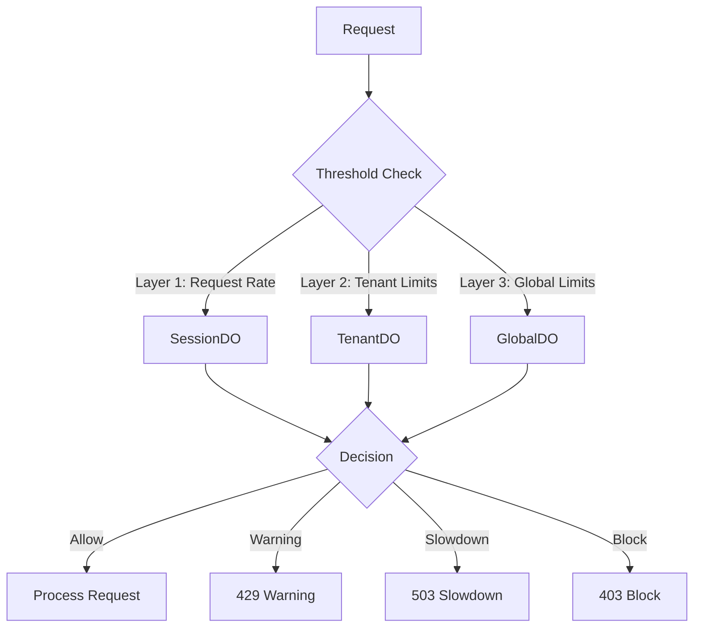
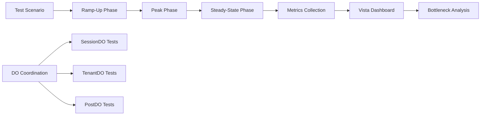
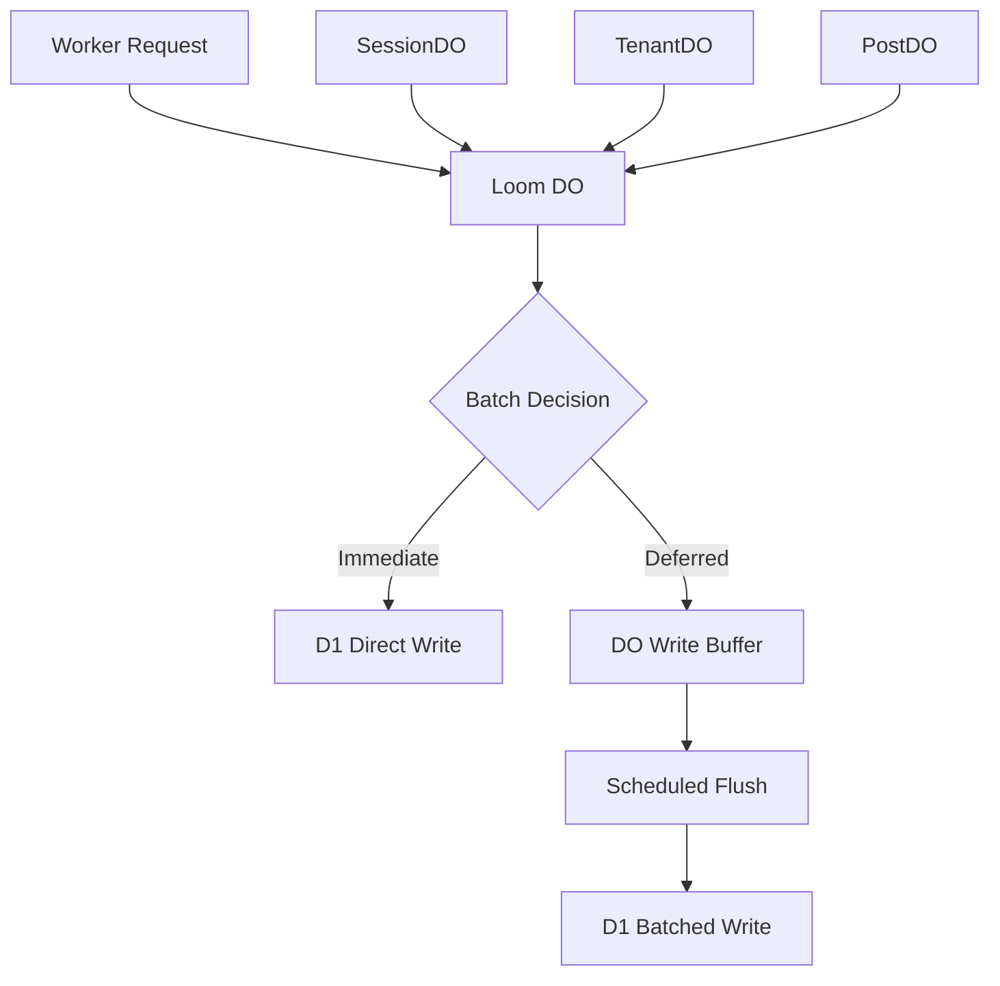

# Grove Architecture Patterns

Comprehensive collection of architectural patterns, design principles, and implementation guides for the Grove ecosystem.

---

## Overview

Grove patterns are reusable solutions to common problems in multi-tenant blog platforms, Cloudflare Workers, and distributed systems. Each pattern includes implementation guidance, integration points, and real-world examples.

---

## Core Patterns

### 🛡️ Security & Protection

| Pattern | Purpose | Status | Integration |
|---------|---------|--------|-------------|
| **[Threshold](threshold-pattern.md)** | Multi-layer rate limiting & abuse prevention | **Active** | Loom DO, SessionDO, TenantDO |
| **[Firefly](firefly-pattern.md)** | Real-time notifications & WebSocket coordination | Planned | PostDO, CommentDO |
| **[Prism](prism-pattern.md)** | Multi-tenant data isolation & access control | Active | TenantDO, D1 partitioning |

### 📊 Observability & Testing

| Pattern | Purpose | Status | Integration |
|---------|---------|--------|-------------|
| **[Sentinel](sentinel-pattern.md)** | Realistic load testing & scale validation | **Planned (~1 month)** | Vista, D1, DO coordination |
| **[Songbird](songbird-pattern.md)** | Structured logging & audit trails | Active | Loom DO, D1 logging |
| **[Vineyard](vineyard-spec.md)** | Vista LoadTest package specification | **New** | Sentinel, Vista monitoring |

### 🏗️ Architecture & Coordination

| Pattern | Purpose | Status | Integration |
|---------|---------|--------|-------------|
| **[Loom](loom-durable-objects-pattern.md)** | Durable Objects coordination layer | **Active** | All DOs, D1 batching |

---

## Pattern Details

### 🛡️ Threshold Pattern
**Multi-layer rate limiting & abuse prevention**



**Key Features:**
- Graduated response (warning → slowdown → block → ban)
- Multi-layer protection (session, tenant, global)
- Real-time adaptation to attack patterns
- Integration with Loom DO coordination

**Implementation Priority:** **HIGH** (Security-critical, immediate implementation)

**Related Guides:**
- [Rate Limiting Guide](../guides/rate-limiting-guide.md) - Step-by-step implementation
- [Loom Pattern](loom-durable-objects-pattern.md) - DO coordination layer

---

### 📊 Sentinel Pattern  
**Realistic load testing & scale validation**



**Key Features:**
- Realistic Grove traffic mix simulation
- Ramp-up testing methodology (0→peak→steady)
- Durable Object coordination testing
- Vista monitoring integration

**Implementation Priority:** **MEDIUM** (~1 month out, after Threshold)

**Related Guides:**
- [Load Testing Guide](../guides/load-testing-guide.md) - Step-by-step implementation
- [Vineyard Spec](vineyard-spec.md) - Vista LoadTest package
- [Vista Spec](../specs/vista-spec.md) - Monitoring system

---

### 🏗️ Loom Pattern
**Durable Objects coordination layer**



**Key Features:**
- D1 write batching & optimization
- DO coordination & fan-out management
- Transaction consistency guarantees
- Integration with all Grove DOs

**Implementation Status:** **ACTIVE** (Core infrastructure)

**Related Documents:**
- [D1 Replication Analysis](../d1-replication-analysis.md)

---

## Implementation Roadmap

### Phase 1: Security Foundation (Now)
1. **Threshold Pattern** - Rate limiting & abuse prevention
2. **Firefly Pattern** - Real-time notifications
3. **Prism Pattern enhancements** - Tenant isolation

### Phase 2: Observability (Next Month)
1. **Sentinel Pattern** - Load testing framework
2. **Vineyard Package** - Vista LoadTest integration
3. **Songbird enhancements** - Advanced logging

### Phase 3: Scale & Performance (Q1 2026)
1. **Loom optimizations** - D1 batching improvements
2. **DO coordination** - Enhanced fan-out patterns
3. **Cache strategies** - Multi-level caching

---

## Integration Matrix

| Pattern | SessionDO | TenantDO | PostDO | Vista | D1 | R2 |
|---------|-----------|----------|--------|-------|----|----|
| **Threshold** | ✅ Primary | ✅ Tenant limits | ⚠️ Indirect | ⚠️ Metrics | ⚠️ Logging | ❌ |
| **Sentinel** | ✅ Stress test | ✅ Isolation test | ✅ Race tests | ✅ Dashboard | ✅ Metrics | ✅ Storage |
| **Loom** | ✅ Coordination | ✅ Coordination | ✅ Coordination | ⚠️ Metrics | ✅ Batching | ❌ |
| **Firefly** | ✅ Notifications | ✅ Tenant alerts | ✅ Post alerts | ⚠️ Metrics | ✅ Storage | ❌ |
| **Prism** | ❌ | ✅ Primary | ✅ Access control | ❌ | ✅ Partitioning | ✅ Isolation |

**Legend:** ✅ Direct integration, ⚠️ Indirect/metrics only, ❌ No integration

---

## Getting Started

### Quick Start Guides
1. **[Rate Limiting](../guides/rate-limiting-guide.md)** - Implement Threshold pattern
2. **[Load Testing](../guides/load-testing-guide.md)** - Set up Sentinel testing
3. **[DO Coordination](loom-durable-objects-pattern.md)** - Understand Loom architecture

### Development Workflow
```bash
# 1. Review pattern documentation
# 2. Check integration requirements
# 3. Implement core components
# 4. Test with existing systems
# 5. Deploy & monitor
```

### Testing Strategy
- **Unit Tests**: Pattern-specific logic
- **Integration Tests**: DO coordination
- **Load Tests**: Sentinel scenarios
- **Security Tests**: Threshold protection

---

## Related Documentation

### Specifications
- [Vista Spec](../specs/vista-spec.md) - Monitoring system
- [Rings Spec](../specs/rings-spec.md) - Analytics system
- [Multi-Tenant Architecture](../multi-tenant-architecture.md) - Core architecture

### Integration Guides
- [AI Gateway Integration](../grove-ai-gateway-integration.md) - Cloudflare AI Gateway setup for per-tenant AI quotas and observability

### Guides
- [Rate Limiting Guide](../guides/rate-limiting-guide.md) - Threshold implementation
- [Load Testing Guide](../guides/load-testing-guide.md) - Sentinel implementation
- [Tenant Setup Guide](../tenant-setup-guide.md) - Multi-tenant configuration

### Architecture
- [Cloudflare Architecture](../cloudflare-architecture-guide.md) - Infrastructure
- [Project Organization](../project-organization.md) - Codebase structure

---

## Contributing

### Adding New Patterns
1. Create pattern document in `docs/patterns/`
2. Follow template structure
3. Include integration matrix
4. Update this index
5. Add to TODOS.md implementation plan

### Pattern Template
```markdown
# Pattern Name

## Purpose
Brief description of what problem this solves.

## Architecture
Diagrams and component descriptions.

## Implementation
Step-by-step implementation guide.

## Integration
How this integrates with other patterns.

## Testing
Validation and testing approach.

## References
Links to related documents.
```

---

## Version History

| Date | Version | Changes |
|------|---------|---------|
| 2026-01-02 | 1.0 | Initial patterns index with Threshold, Sentinel, Loom |
| 2025-12-25 | 0.9 | Added Firefly, Prism, Songbird patterns |
| 2025-11-30 | 0.8 | Initial Grove Durable Objects architecture |

---

*Last Updated: January 2026*  
*Part of the Grove Architecture Documentation*