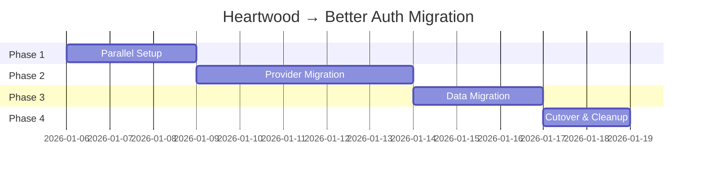
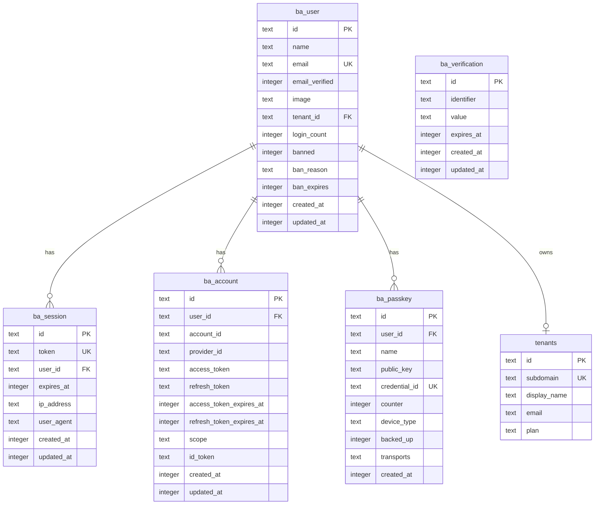

# Heartwood → Better Auth Migration Plan

```
                          ╭──────────╮
                       ╭──│ ╭──────╮ │──╮
                     ╭─│  │ │ ╭──╮ │ │  │─╮
                    │  │  │ │ │→ │ │ │  │  │
                     ╰─│  │ │ ╰──╯ │ │  │─╯
                       ╰──│ ╰──────╯ │──╯
                          ╰──────────╯

       from custom rings to community roots
```

> **Migration Type**: Authentication Infrastructure
> **Status**: Planning
> **Target**: Better Auth with Cloudflare Integration
> **Author**: Claude (with guidance from Autumn)
> **Created**: January 2026

---

## Table of Contents

1. [Executive Summary](#executive-summary)
2. [Architecture Comparison](#architecture-comparison)
3. [Migration Phases](#migration-phases)
4. [Schema Documentation](#schema-documentation)
5. [Integration Points](#integration-points)
6. [Rollback Plan](#rollback-plan)
7. [Performance Expectations](#performance-expectations)

---

## Executive Summary

### The Problem

Heartwood, Grove's custom authentication system, has a critical performance issue: **login flows take ~15 seconds**. This is unacceptable for public launch. The delay stems from the multi-hop architecture between OAuth providers, the GroveAuth Worker, session coordination, and D1 writes.

### The Solution

Migrate to **Better Auth**, a modern, production-ready authentication library with first-class Cloudflare support via `better-auth-cloudflare`. This provides:

- **Edge-native session handling** with KV caching
- **Built-in OAuth** with optimized flows
- **Magic links** (replacing our 6-digit codes)
- **Passkey/WebAuthn** support (new capability)
- **Drizzle ORM** integration for type-safe database operations

### Goals

| Goal                 | Metric                       |
| -------------------- | ---------------------------- |
| Login latency        | 15s → <2s                    |
| Session validation   | 50-200ms → <5ms              |
| Passwordless auth    | 6-digit codes → magic links  |
| New capabilities     | Add passkey/WebAuthn support |
| Developer experience | Type-safe, documented API    |

### Non-Goals

- Adding username/password authentication
- Public registration (remain allowlist-based)
- Changing the overall Grove authentication model

---

## Architecture Comparison

### Current Heartwood Architecture

```
┌─────────────────────────────────────────────────────────────────────────┐
│                          HEARTWOOD (Current)                             │
└─────────────────────────────────────────────────────────────────────────┘

┌──────────────┐     ┌──────────────────┐     ┌────────────────────────────┐
│ Client Site  │────▶│ GroveAuth Worker │────▶│ OAuth Providers            │
│ (Engine)     │     │ (Hono.js)        │     │ (Google, GitHub)           │
└──────────────┘     └────────┬─────────┘     └────────────────────────────┘
       │                      │                          │
       │                      ▼                          │
       │             ┌────────────────┐                  │
       │             │  D1 Database   │◀─────────────────┘
       │             │  - users       │
       │             │  - sessions    │
       │             │  - magic_codes │
       │             │  - rate_limits │
       │             └────────────────┘
       │                      │
       ▼                      ▼
┌──────────────┐     ┌────────────────┐
│  SessionDO   │────▶│ Session State  │
│  (per-user)  │     │ (SQLite in DO) │
└──────────────┘     └────────────────┘
```

**Problems:**

1. Multiple Workers involved in auth flow
2. D1 writes on every login (slow)
3. SessionDO adds complexity without solving core latency
4. Magic codes require email round-trip + user action
5. Custom JWT implementation requires maintenance

### Target Better Auth Architecture

```
┌─────────────────────────────────────────────────────────────────────────┐
│                          BETTER AUTH (Target)                            │
└─────────────────────────────────────────────────────────────────────────┘

┌──────────────┐     ┌──────────────────┐     ┌────────────────────────────┐
│ Client Site  │────▶│ Better Auth      │────▶│ OAuth Providers            │
│ (Engine)     │     │ (Edge Runtime)   │     │ (Google, GitHub)           │
└──────────────┘     └────────┬─────────┘     └────────────────────────────┘
                              │
              ┌───────────────┼───────────────┐
              ▼               ▼               ▼
     ┌────────────────┐ ┌──────────┐ ┌─────────────────┐
     │  D1 Database   │ │ KV Cache │ │ Resend (Email)  │
     │  (Drizzle ORM) │ │ Sessions │ │ Magic Links     │
     │  - user        │ └──────────┘ └─────────────────┘
     │  - session     │
     │  - account     │
     │  - verification│
     └────────────────┘
```

**Improvements:**

1. Single Worker handles entire auth flow
2. KV caching for sub-millisecond session reads
3. Magic links (one-click) instead of codes
4. Passkey support built-in
5. Drizzle ORM for type-safe queries

---

### Data Model Comparison

#### Users

| Heartwood Field | Better Auth Field                   | Notes                                   |
| --------------- | ----------------------------------- | --------------------------------------- |
| `id` (UUID)     | `id` (string)                       | Direct mapping                          |
| `groveauth_id`  | -                                   | Replaced by `account.providerAccountId` |
| `email`         | `email`                             | Direct mapping                          |
| `display_name`  | `name`                              | Renamed                                 |
| `avatar_url`    | `image`                             | Renamed                                 |
| `tenant_id`     | -                                   | Custom field, preserve                  |
| `last_login_at` | `updatedAt`                         | Approximate (update on login)           |
| `login_count`   | -                                   | Custom field, preserve or drop          |
| `is_active`     | `banned`, `banReason`, `banExpires` | Better Auth has richer ban model        |
| `created_at`    | `createdAt`                         | Direct mapping                          |
| `updated_at`    | `updatedAt`                         | Direct mapping                          |

#### Sessions

| Heartwood Field | Better Auth Field | Notes                                |
| --------------- | ----------------- | ------------------------------------ |
| `id` (token)    | `token`           | Direct mapping                       |
| `tenant_id`     | -                 | Drop (user-level, not session-level) |
| `user_email`    | -                 | Replaced by `userId` FK              |
| `expires_at`    | `expiresAt`       | Direct mapping                       |
| `created_at`    | `createdAt`       | Direct mapping                       |
| -               | `userId`          | New: FK to user table                |
| -               | `ipAddress`       | New: Optional IP tracking            |
| -               | `userAgent`       | New: Optional UA tracking            |

#### OAuth Accounts

| Heartwood Field         | Better Auth Field      | Notes                     |
| ----------------------- | ---------------------- | ------------------------- |
| `provider` (on user)    | `providerId`           | e.g., "google", "github"  |
| `provider_id` (on user) | `accountId`            | Provider's user ID        |
| -                       | `accessToken`          | New: Stored encrypted     |
| -                       | `refreshToken`         | New: Stored encrypted     |
| -                       | `accessTokenExpiresAt` | New: For token refresh    |
| -                       | `scope`                | New: OAuth scopes granted |

#### Magic Codes → Verifications

| Heartwood Field | Better Auth Field | Notes                          |
| --------------- | ----------------- | ------------------------------ |
| `id`            | `id`              | Direct mapping                 |
| `email`         | `identifier`      | Renamed, more generic          |
| `code`          | `value`           | Renamed, stores token not code |
| `created_at`    | `createdAt`       | Direct mapping                 |
| `expires_at`    | `expiresAt`       | Direct mapping                 |
| `used`          | -                 | Deleted on use instead         |

---

## Migration Phases

### Overview



---

### Phase 1: Parallel Setup

**Goal**: Install Better Auth alongside Heartwood without disrupting existing auth.

#### 1.1 Install Dependencies

```bash
cd libs/engine
pnpm add better-auth better-auth-cloudflare @better-auth/cli drizzle-orm
```

#### 1.2 Create Better Auth Configuration

```typescript
// src/lib/server/auth/better-auth.ts
import { betterAuth } from "better-auth";
import { cloudflare } from "better-auth-cloudflare";
import { drizzleAdapter } from "better-auth/adapters/drizzle";
import { passkey } from "@better-auth/passkey";
import { magicLink } from "@better-auth/magic-link";

export function createAuth(env: Env) {
	return betterAuth({
		// Database adapter using D1 via Drizzle
		database: drizzleAdapter(env.DB, {
			provider: "sqlite",
			schema: {
				user: "ba_user",
				session: "ba_session",
				account: "ba_account",
				verification: "ba_verification",
			},
		}),

		// Session storage in KV for edge-fast reads
		session: {
			strategy: "database", // Also writes to D1 for durability
			expiresIn: 60 * 60 * 24 * 30, // 30 days
			updateAge: 60 * 60 * 24, // Update session daily
			cookieCache: {
				enabled: true,
				maxAge: 60 * 5, // 5-minute client cache
			},
		},

		// Secondary session cache in KV
		secondaryStorage: cloudflare({
			kv: env.AUTH_SESSIONS, // KV namespace for sessions
		}),

		// OAuth providers
		socialProviders: {
			google: {
				clientId: env.GOOGLE_CLIENT_ID,
				clientSecret: env.GOOGLE_CLIENT_SECRET,
				scope: ["openid", "email", "profile"],
			},
			github: {
				clientId: env.GITHUB_CLIENT_ID,
				clientSecret: env.GITHUB_CLIENT_SECRET,
				scope: ["user:email", "read:user"],
			},
		},

		// Plugins
		plugins: [
			// Magic link authentication (replaces magic codes)
			magicLink({
				sendMagicLink: async ({ email, url }) => {
					await fetch("https://api.resend.com/emails", {
						method: "POST",
						headers: {
							Authorization: `Bearer ${env.RESEND_API_KEY}`,
							"Content-Type": "application/json",
						},
						body: JSON.stringify({
							from: "Grove <noreply@grove.place>",
							to: email,
							subject: "Sign in to Grove",
							html: `
                <p>Click the link below to sign in to Grove:</p>
                <a href="${url}">Sign in to Grove</a>
                <p>This link expires in 10 minutes.</p>
                <p>If you didn't request this, you can safely ignore this email.</p>
              `,
						}),
					});
				},
				expiresIn: 60 * 10, // 10 minutes
			}),

			// Passkey/WebAuthn support (new capability!)
			passkey({
				rpID: "grove.place",
				rpName: "Grove",
				origin: "https://grove.place",
			}),
		],

		// Custom user fields for Grove
		user: {
			additionalFields: {
				tenantId: {
					type: "string",
					required: false,
				},
				loginCount: {
					type: "number",
					required: false,
					defaultValue: 0,
				},
			},
		},

		// Rate limiting: Disabled - use Threshold pattern instead
		// Better Auth's built-in rate limiting is bypassed in favor of Grove's
		// multi-layer Threshold system (Edge → Tenant → User → Endpoint)
		// See: docs/patterns/threshold-pattern.md
		rateLimit: {
			enabled: false, // Threshold handles this
		},

		// Trusted origins
		trustedOrigins: ["https://grove.place", "https://*.grove.place"],
	});
}

export type Auth = ReturnType<typeof createAuth>;
```

#### 1.3 Create Drizzle Schema

```typescript
// src/lib/server/db/schema/auth.ts
import { sqliteTable, text, integer } from "drizzle-orm/sqlite-core";

// Better Auth tables (prefixed with ba_ to avoid conflicts)
export const baUser = sqliteTable("ba_user", {
	id: text("id").primaryKey(),
	name: text("name"),
	email: text("email").notNull().unique(),
	emailVerified: integer("emailVerified", { mode: "boolean" }),
	image: text("image"),
	// Grove custom fields
	tenantId: text("tenant_id"),
	loginCount: integer("login_count").default(0),
	// Ban fields (Better Auth built-in)
	banned: integer("banned", { mode: "boolean" }),
	banReason: text("ban_reason"),
	banExpires: integer("ban_expires"),
	// Timestamps
	createdAt: integer("created_at", { mode: "timestamp" }).notNull(),
	updatedAt: integer("updated_at", { mode: "timestamp" }).notNull(),
});

export const baSession = sqliteTable("ba_session", {
	id: text("id").primaryKey(),
	token: text("token").notNull().unique(),
	userId: text("user_id")
		.notNull()
		.references(() => baUser.id, { onDelete: "cascade" }),
	expiresAt: integer("expires_at", { mode: "timestamp" }).notNull(),
	ipAddress: text("ip_address"),
	userAgent: text("user_agent"),
	createdAt: integer("created_at", { mode: "timestamp" }).notNull(),
	updatedAt: integer("updated_at", { mode: "timestamp" }).notNull(),
});

export const baAccount = sqliteTable("ba_account", {
	id: text("id").primaryKey(),
	userId: text("user_id")
		.notNull()
		.references(() => baUser.id, { onDelete: "cascade" }),
	accountId: text("account_id").notNull(), // Provider's user ID
	providerId: text("provider_id").notNull(), // e.g., "google", "github"
	accessToken: text("access_token"),
	refreshToken: text("refresh_token"),
	accessTokenExpiresAt: integer("access_token_expires_at", { mode: "timestamp" }),
	refreshTokenExpiresAt: integer("refresh_token_expires_at", { mode: "timestamp" }),
	scope: text("scope"),
	idToken: text("id_token"),
	createdAt: integer("created_at", { mode: "timestamp" }).notNull(),
	updatedAt: integer("updated_at", { mode: "timestamp" }).notNull(),
});

export const baVerification = sqliteTable("ba_verification", {
	id: text("id").primaryKey(),
	identifier: text("identifier").notNull(), // email or phone
	value: text("value").notNull(), // token/code
	expiresAt: integer("expires_at", { mode: "timestamp" }).notNull(),
	createdAt: integer("created_at", { mode: "timestamp" }).notNull(),
	updatedAt: integer("updated_at", { mode: "timestamp" }).notNull(),
});

// Passkey credentials (for WebAuthn)
export const baPasskey = sqliteTable("ba_passkey", {
	id: text("id").primaryKey(),
	userId: text("user_id")
		.notNull()
		.references(() => baUser.id, { onDelete: "cascade" }),
	name: text("name"), // User-friendly name like "MacBook Pro"
	publicKey: text("public_key").notNull(),
	credentialId: text("credential_id").notNull().unique(),
	counter: integer("counter").notNull().default(0),
	deviceType: text("device_type"), // "singleDevice" or "multiDevice"
	backedUp: integer("backed_up", { mode: "boolean" }),
	transports: text("transports"), // JSON array
	createdAt: integer("created_at", { mode: "timestamp" }).notNull(),
});
```

#### 1.4 Create D1 Migration

```sql
-- migrations/015_better_auth.sql
-- Better Auth tables (parallel to Heartwood during migration)

-- =============================================================================
-- USERS (Better Auth)
-- =============================================================================
CREATE TABLE IF NOT EXISTS ba_user (
  id TEXT PRIMARY KEY,
  name TEXT,
  email TEXT NOT NULL UNIQUE,
  email_verified INTEGER,
  image TEXT,
  -- Grove custom fields
  tenant_id TEXT,
  login_count INTEGER DEFAULT 0,
  -- Ban fields
  banned INTEGER,
  ban_reason TEXT,
  ban_expires INTEGER,
  -- Timestamps
  created_at INTEGER NOT NULL,
  updated_at INTEGER NOT NULL,

  FOREIGN KEY (tenant_id) REFERENCES tenants(id) ON DELETE SET NULL
);

CREATE INDEX IF NOT EXISTS idx_ba_user_email ON ba_user(email);
CREATE INDEX IF NOT EXISTS idx_ba_user_tenant ON ba_user(tenant_id);

-- =============================================================================
-- SESSIONS (Better Auth)
-- =============================================================================
CREATE TABLE IF NOT EXISTS ba_session (
  id TEXT PRIMARY KEY,
  token TEXT NOT NULL UNIQUE,
  user_id TEXT NOT NULL,
  expires_at INTEGER NOT NULL,
  ip_address TEXT,
  user_agent TEXT,
  created_at INTEGER NOT NULL,
  updated_at INTEGER NOT NULL,

  FOREIGN KEY (user_id) REFERENCES ba_user(id) ON DELETE CASCADE
);

CREATE INDEX IF NOT EXISTS idx_ba_session_token ON ba_session(token);
CREATE INDEX IF NOT EXISTS idx_ba_session_user ON ba_session(user_id);
CREATE INDEX IF NOT EXISTS idx_ba_session_expires ON ba_session(expires_at);

-- =============================================================================
-- ACCOUNTS (OAuth providers)
-- =============================================================================
CREATE TABLE IF NOT EXISTS ba_account (
  id TEXT PRIMARY KEY,
  user_id TEXT NOT NULL,
  account_id TEXT NOT NULL,
  provider_id TEXT NOT NULL,
  access_token TEXT,
  refresh_token TEXT,
  access_token_expires_at INTEGER,
  refresh_token_expires_at INTEGER,
  scope TEXT,
  id_token TEXT,
  created_at INTEGER NOT NULL,
  updated_at INTEGER NOT NULL,

  FOREIGN KEY (user_id) REFERENCES ba_user(id) ON DELETE CASCADE
);

CREATE INDEX IF NOT EXISTS idx_ba_account_user ON ba_account(user_id);
CREATE UNIQUE INDEX IF NOT EXISTS idx_ba_account_provider ON ba_account(provider_id, account_id);

-- =============================================================================
-- VERIFICATIONS (Magic links, email verification)
-- =============================================================================
CREATE TABLE IF NOT EXISTS ba_verification (
  id TEXT PRIMARY KEY,
  identifier TEXT NOT NULL,
  value TEXT NOT NULL,
  expires_at INTEGER NOT NULL,
  created_at INTEGER NOT NULL,
  updated_at INTEGER NOT NULL
);

CREATE INDEX IF NOT EXISTS idx_ba_verification_identifier ON ba_verification(identifier);
CREATE INDEX IF NOT EXISTS idx_ba_verification_expires ON ba_verification(expires_at);

-- =============================================================================
-- PASSKEYS (WebAuthn credentials)
-- =============================================================================
CREATE TABLE IF NOT EXISTS ba_passkey (
  id TEXT PRIMARY KEY,
  user_id TEXT NOT NULL,
  name TEXT,
  public_key TEXT NOT NULL,
  credential_id TEXT NOT NULL UNIQUE,
  counter INTEGER NOT NULL DEFAULT 0,
  device_type TEXT,
  backed_up INTEGER,
  transports TEXT,
  created_at INTEGER NOT NULL,

  FOREIGN KEY (user_id) REFERENCES ba_user(id) ON DELETE CASCADE
);

CREATE INDEX IF NOT EXISTS idx_ba_passkey_user ON ba_passkey(user_id);
CREATE INDEX IF NOT EXISTS idx_ba_passkey_credential ON ba_passkey(credential_id);
```

#### 1.5 Update wrangler.toml

```toml
# libs/engine/wrangler.toml

# Add KV namespace for session caching
[[kv_namespaces]]
binding = "AUTH_SESSIONS"
id = "your-kv-namespace-id"       # Production
# preview_id = "your-preview-id"  # For wrangler dev

# Existing D1 binding (unchanged)
[[d1_databases]]
binding = "DB"
database_name = "grove-engine-db"
database_id = "your-database-id"

# Remove AUTH service binding after cutover (Phase 4)
# [[services]]
# binding = "AUTH"
# service = "groveauth"
```

Create the KV namespace:

```bash
# Create KV namespace for session caching
wrangler kv:namespace create AUTH_SESSIONS
wrangler kv:namespace create AUTH_SESSIONS --preview
```

---

### Phase 2: Provider Migration

**Goal**: Configure all authentication providers in Better Auth.

#### 2.1 Google OAuth Configuration

Update Google Cloud Console:

1. Go to [Google Cloud Console](https://console.cloud.google.com/)
2. Navigate to **APIs & Services** → **Credentials**
3. Edit your OAuth 2.0 Client ID
4. Add authorized redirect URIs:
   - `https://grove.place/api/auth/callback/google`
   - `https://*.grove.place/api/auth/callback/google`
   - `http://localhost:5173/api/auth/callback/google` (development)

```typescript
// No code changes needed - already configured in createAuth()
socialProviders: {
  google: {
    clientId: env.GOOGLE_CLIENT_ID,
    clientSecret: env.GOOGLE_CLIENT_SECRET,
    scope: ["openid", "email", "profile"],
  },
},
```

#### 2.2 GitHub OAuth Configuration

Update GitHub OAuth App:

1. Go to [GitHub Developer Settings](https://github.com/settings/developers)
2. Edit your OAuth App
3. Update Authorization callback URL:
   - `https://grove.place/api/auth/callback/github`

```typescript
// No code changes needed - already configured in createAuth()
socialProviders: {
  github: {
    clientId: env.GITHUB_CLIENT_ID,
    clientSecret: env.GITHUB_CLIENT_SECRET,
    scope: ["user:email", "read:user"],
  },
},
```

#### 2.3 Magic Link Setup

Magic links replace the 6-digit magic codes. Better Auth handles link generation; we configure email delivery via Resend.

```typescript
// Already configured in createAuth(), but here's the full Resend implementation:
// Note: Includes both HTML and plaintext for email client compatibility

magicLink({
  sendMagicLink: async ({ email, url }) => {
    await fetch("https://api.resend.com/emails", {
      method: "POST",
      headers: {
        "Authorization": `Bearer ${env.RESEND_API_KEY}`,
        "Content-Type": "application/json",
      },
      body: JSON.stringify({
        from: "Grove <noreply@grove.place>",
        to: email,
        subject: "Sign in to Grove",
        // Plaintext version (email best practice - some clients prefer this)
        text: `Sign in to Grove

Click the link below to sign in. This link expires in 10 minutes.

${url}

If you didn't request this, you can safely ignore this email.
This link can only be used once.

- Grove`,
        // HTML version
        html: `<!DOCTYPE html>
<html>
<head>
  <meta charset="utf-8">
  <meta name="viewport" content="width=device-width, initial-scale=1.0">
  <style>
    body {
      font-family: -apple-system, BlinkMacSystemFont, 'Segoe UI', Roboto, sans-serif;
      line-height: 1.6;
      color: #333;
    }
    .container { max-width: 480px; margin: 0 auto; padding: 32px; }
    .logo { font-size: 24px; font-weight: bold; color: #2d5a27; margin-bottom: 24px; }
    .button {
      display: inline-block;
      background: #2d5a27;
      color: white !important;
      padding: 12px 24px;
      border-radius: 8px;
      text-decoration: none;
      margin: 24px 0;
      font-weight: 500;
    }
    .footer { color: #666; font-size: 14px; margin-top: 32px; }
    .link-fallback { word-break: break-all; color: #666; font-size: 12px; }
  </style>
</head>
<body>
  <div class="container">
    <div class="logo">Grove</div>
    <h1 style="margin-top: 0;">Sign in to Grove</h1>
    <p>Click the button below to sign in. This link expires in 10 minutes.</p>
    <a href="${url}" class="button">Sign in to Grove</a>
    <p class="link-fallback">
      Or copy this link: ${url}
    </p>
    <p class="footer">
      If you didn't request this, you can safely ignore this email.
      <br>
      This link can only be used once.
    </p>
  </div>
</body>
</html>`,
      }),
    });
  },
  expiresIn: 60 * 10, // 10 minutes
}),
```

> **Email Testing Recommendation**: Test magic link emails with major clients
> (Gmail, Outlook, Apple Mail, Yahoo) before launch. Use tools like
> [Litmus](https://litmus.com) or [Email on Acid](https://emailonacid.com)
> to preview rendering across clients.

#### 2.4 Passkey Configuration

Passkeys are a new capability not available in Heartwood. They provide passwordless, phishing-resistant authentication.

> **Browser Compatibility Note**
>
> WebAuthn/Passkeys require:
>
> - **HTTPS** (will not work on HTTP, even localhost)
> - **User gesture** (button click, not automatic)
> - **Modern browser support**:
>   - Safari 16+ (macOS Ventura, iOS 16+)
>   - Chrome 108+
>   - Firefox 119+
>   - Edge 108+
>
> Passkeys should be offered as an **optional enhancement**, not required.
> Always provide fallback auth methods (OAuth, magic link).

```typescript
// Already configured in createAuth()
plugins: [
  passkey({
    rpID: "grove.place",        // Relying Party ID (your domain)
    rpName: "Grove",            // Display name in passkey prompts
    origin: "https://grove.place",

    // Optional: Customize attestation
    attestation: "none",        // "none", "indirect", or "direct"

    // Optional: User verification requirement
    userVerification: "preferred", // "required", "preferred", or "discouraged"
  }),
],
```

**Frontend Passkey Registration (with graceful degradation):**

```typescript
// src/lib/auth/passkey.ts
import { client } from "$lib/auth/client";

/**
 * Check if WebAuthn/Passkeys are supported in this browser
 */
export function isPasskeySupported(): boolean {
	return (
		typeof window !== "undefined" &&
		window.PublicKeyCredential !== undefined &&
		typeof window.PublicKeyCredential === "function"
	);
}

/**
 * Check if platform authenticator (Touch ID, Face ID, Windows Hello) is available
 */
export async function isPlatformAuthenticatorAvailable(): Promise<boolean> {
	if (!isPasskeySupported()) return false;

	try {
		return await PublicKeyCredential.isUserVerifyingPlatformAuthenticatorAvailable();
	} catch {
		return false;
	}
}

export async function registerPasskey() {
	if (!isPasskeySupported()) {
		throw new Error("Passkeys are not supported in this browser");
	}

	const result = await client.passkey.register({
		name: getDeviceName(),
	});

	if (result.error) {
		throw new Error(result.error.message);
	}

	return result.data;
}

export async function authenticateWithPasskey() {
	if (!isPasskeySupported()) {
		throw new Error("Passkeys are not supported in this browser");
	}

	const result = await client.passkey.authenticate();

	if (result.error) {
		throw new Error(result.error.message);
	}

	return result.data;
}

function getDeviceName(): string {
	const ua = navigator.userAgent;
	if (ua.includes("Mac")) return "Mac";
	if (ua.includes("iPhone")) return "iPhone";
	if (ua.includes("iPad")) return "iPad";
	if (ua.includes("Android")) return "Android";
	if (ua.includes("Windows")) return "Windows PC";
	return "Unknown Device";
}
```

---

### Phase 3: Data Migration

**Goal**: Migrate existing users while preserving all data and associations.

#### 3.1 Migration Script

```typescript
// scripts/migrate-heartwood-to-better-auth.ts

import { drizzle } from "drizzle-orm/d1";

interface HeartwordUser {
	id: string;
	groveauth_id: string;
	email: string;
	display_name: string | null;
	avatar_url: string | null;
	tenant_id: string | null;
	last_login_at: number | null;
	login_count: number;
	is_active: number;
	created_at: number;
	updated_at: number;
}

interface HeartwordSession {
	id: string;
	tenant_id: string;
	user_email: string;
	expires_at: number;
	created_at: number;
}

export async function migrateUsers(db: D1Database) {
	console.log("Starting Heartwood → Better Auth migration...");

	// 1. Fetch all Heartwood users
	const users = await db.prepare("SELECT * FROM users").all<HeartwordUser>();

	console.log(`Found ${users.results.length} users to migrate`);

	// 2. Migrate each user
	for (const user of users.results) {
		const now = Date.now();

		// Insert into Better Auth user table
		await db
			.prepare(
				`
        INSERT INTO ba_user (
          id, name, email, email_verified, image,
          tenant_id, login_count, banned, created_at, updated_at
        ) VALUES (?, ?, ?, ?, ?, ?, ?, ?, ?, ?)
        ON CONFLICT (email) DO UPDATE SET
          name = excluded.name,
          image = excluded.image,
          tenant_id = excluded.tenant_id,
          login_count = excluded.login_count,
          updated_at = excluded.updated_at
      `,
			)
			.bind(
				user.id,
				user.display_name,
				user.email,
				1, // email_verified = true (they've logged in before)
				user.avatar_url,
				user.tenant_id,
				user.login_count,
				user.is_active === 0 ? 1 : 0, // banned = inverse of is_active
				user.created_at || now,
				now,
			)
			.run();

		// NOTE: We intentionally do NOT create ba_account records during migration.
		// Heartwood stores provider info in the external GroveAuth service, not in
		// our D1 database, so we don't know which provider each user used.
		//
		// Better Auth will automatically create the correct account record when
		// users log in for the first time post-migration. It links accounts by
		// email, so users can log in with any provider and it will link to their
		// existing user record.
		//
		// This approach is safer than guessing providers and ensures accurate data.

		console.log(`Migrated user: ${user.email}`);
	}

	console.log("User migration complete!");
}

export async function validateTenantReferences(db: D1Database): Promise<{
	valid: number;
	orphaned: string[];
}> {
	// Validate that all tenant_id references point to existing tenants
	const orphaned = await db
		.prepare(
			`
      SELECT u.id, u.email, u.tenant_id
      FROM users u
      LEFT JOIN tenants t ON t.id = u.tenant_id
      WHERE u.tenant_id IS NOT NULL AND t.id IS NULL
    `,
		)
		.all<{ id: string; email: string; tenant_id: string }>();

	if (orphaned.results.length > 0) {
		console.warn("Found users with orphaned tenant references:");
		for (const user of orphaned.results) {
			console.warn(`  - ${user.email} references non-existent tenant: ${user.tenant_id}`);
		}
	}

	const validCount = await db
		.prepare(
			"SELECT COUNT(*) as count FROM users WHERE tenant_id IS NULL OR tenant_id IN (SELECT id FROM tenants)",
		)
		.first<{ count: number }>();

	return {
		valid: validCount?.count ?? 0,
		orphaned: orphaned.results.map((u) => u.email),
	};
}

// IMPORTANT: Clean cutover is the ONLY supported migration strategy.
// Session formats differ too significantly between Heartwood and Better Auth
// to reliably preserve sessions. Schedule migration during low-traffic period.
export async function invalidateAllSessions(db: D1Database) {
	console.log("Invalidating all Heartwood sessions (clean cutover)...");
	console.log("All users will need to re-login after migration.");

	// Count active sessions for logging
	const count = await db
		.prepare("SELECT COUNT(*) as count FROM sessions WHERE expires_at > unixepoch()")
		.first<{ count: number }>();

	console.log(`Found ${count?.count ?? 0} active sessions that will be invalidated.`);

	// Better Auth will create new sessions on login - no action needed here.
	// The old sessions table will be cleaned up in Phase 4 (Heartwood Cleanup).
}

// Run migration
export async function runMigration(env: Env) {
	const db = env.DB;

	console.log("=== Heartwood → Better Auth Migration ===");
	console.log("");

	// Step 0: Validate tenant references
	console.log("Step 0: Validating tenant references...");
	const validation = await validateTenantReferences(db);
	console.log(`  Valid users: ${validation.valid}`);
	if (validation.orphaned.length > 0) {
		console.warn(`  WARNING: ${validation.orphaned.length} users have orphaned tenant references`);
		console.warn("  These users will be migrated but their tenant_id will be invalid.");
		console.warn("  Consider fixing these before migration or setting tenant_id to NULL.");
	}
	console.log("");

	// Step 1: Migrate users
	console.log("Step 1: Migrating users...");
	await migrateUsers(db);
	console.log("");

	// Step 2: Clean session cutover
	console.log("Step 2: Clean session cutover...");
	await invalidateAllSessions(db);
	console.log("");

	console.log("=== Migration Complete ===");
	console.log("All users will need to re-login.");
	console.log("Better Auth will create account records on first login.");
}
```

#### 3.2 Account Linking Preservation

Better Auth automatically handles account linking. When a user logs in via a new provider with the same email, it links to their existing account.

```typescript
// Better Auth handles this automatically via:
// 1. Look up user by email from OAuth profile
// 2. If user exists, create new account record linked to user
// 3. If user doesn't exist, create both user and account

// To verify account linking after migration:
const user = await db
	.prepare(
		`
    SELECT u.*, GROUP_CONCAT(a.provider_id) as providers
    FROM ba_user u
    LEFT JOIN ba_account a ON a.user_id = u.id
    WHERE u.email = ?
    GROUP BY u.id
  `,
	)
	.bind(email)
	.first();

console.log(`User ${email} has providers: ${user.providers}`);
```

---

### Phase 4: Cutover

**Goal**: Switch all traffic from Heartwood to Better Auth.

#### 4.1 Create Better Auth Routes

```typescript
// src/routes/api/auth/[...path]/+server.ts
import { createAuth } from "$lib/server/auth/better-auth";
import type { RequestHandler } from "./$types";

export const GET: RequestHandler = async ({ request, platform }) => {
	const auth = createAuth(platform!.env);
	return auth.handler(request);
};

export const POST: RequestHandler = async ({ request, platform }) => {
	const auth = createAuth(platform!.env);
	return auth.handler(request);
};
```

#### 4.2 Update Session Validation Hook

```typescript
// src/hooks.server.ts (updated auth section)
import { createAuth } from "$lib/server/auth/better-auth";

export const handle: Handle = async ({ event, resolve }) => {
	// ... (Turnstile and subdomain routing unchanged)

	// =========================================================================
	// AUTHENTICATION (Better Auth)
	// =========================================================================
	if (event.platform?.env) {
		const auth = createAuth(event.platform.env);
		const session = await auth.api.getSession({
			headers: event.request.headers,
		});

		if (session?.user) {
			event.locals.user = {
				id: session.user.id,
				email: session.user.email,
				name: session.user.name ?? undefined,
				picture: session.user.image ?? undefined,
				tenantId: session.user.tenantId,
			};
		}
	}

	// ... (CSRF and security headers unchanged)
};
```

#### 4.3 Create Auth Client for Frontend

```typescript
// src/lib/auth/client.ts
import { createAuthClient } from "better-auth/svelte";

export const client = createAuthClient({
	baseURL: "/api/auth", // Relative to current origin
});

// Re-export useful utilities
export const { signIn, signOut, signUp, useSession } = client;
```

#### 4.4 Update Login Page

```svelte
<!-- src/routes/auth/login/+page.svelte -->
<script lang="ts">
	import { client } from "$lib/auth/client";
	import { goto } from "$app/navigation";
	import { isPasskeySupported } from "$lib/auth/passkey";

	let email = "";
	let loading = false;
	let error: string | null = null;
	let magicLinkSent = false;
	let rateLimitRetryAfter: number | null = null;

	// Check passkey support on mount
	let passkeyAvailable = false;
	$effect(() => {
		passkeyAvailable = isPasskeySupported();
	});

	/**
	 * Map error codes to user-friendly messages
	 */
	function getErrorMessage(err: { code?: string; message?: string }): string {
		switch (err.code) {
			case "RATE_LIMIT_EXCEEDED":
				return "Too many attempts. Please wait a moment and try again.";
			case "INVALID_CREDENTIALS":
				return "Invalid email or the account doesn't exist.";
			case "EMAIL_NOT_VERIFIED":
				return "Please verify your email first.";
			case "ACCOUNT_LOCKED":
				return "Account temporarily locked. Try again later.";
			case "OAUTH_ERROR":
				return "Sign-in provider error. Please try again or use a different method.";
			case "NETWORK_ERROR":
				return "Network error. Check your connection and try again.";
			default:
				return err.message || "Something went wrong. Please try again.";
		}
	}

	/**
	 * Handle auth errors with rate limit support
	 */
	function handleError(result: {
		error?: { code?: string; message?: string; retryAfter?: number };
	}) {
		if (result.error) {
			error = getErrorMessage(result.error);
			if (result.error.retryAfter) {
				rateLimitRetryAfter = result.error.retryAfter;
				// Auto-clear after retry period
				setTimeout(() => {
					rateLimitRetryAfter = null;
				}, result.error.retryAfter * 1000);
			}
			loading = false;
			return true;
		}
		return false;
	}

	async function signInWithGoogle() {
		loading = true;
		error = null;

		try {
			const result = await client.signIn.social({
				provider: "google",
				callbackURL: "/admin",
			});

			if (!handleError(result)) {
				// Success - user is redirected to Google
			}
		} catch (err) {
			error = "Network error. Check your connection and try again.";
			loading = false;
		}
	}

	async function signInWithGitHub() {
		loading = true;
		error = null;

		try {
			const result = await client.signIn.social({
				provider: "github",
				callbackURL: "/admin",
			});

			if (!handleError(result)) {
				// Success - user is redirected to GitHub
			}
		} catch (err) {
			error = "Network error. Check your connection and try again.";
			loading = false;
		}
	}

	async function signInWithEmail() {
		if (!email) {
			error = "Please enter your email";
			return;
		}

		loading = true;
		error = null;

		try {
			const result = await client.signIn.magicLink({
				email,
				callbackURL: "/admin",
			});

			if (!handleError(result)) {
				magicLinkSent = true;
				loading = false;
			}
		} catch (err) {
			error = "Network error. Check your connection and try again.";
			loading = false;
		}
	}

	async function signInWithPasskey() {
		if (!passkeyAvailable) {
			error = "Passkeys are not supported in this browser. Try another sign-in method.";
			return;
		}

		loading = true;
		error = null;

		try {
			const result = await client.signIn.passkey();

			if (!handleError(result)) {
				goto("/admin");
			}
		} catch (err) {
			// WebAuthn can throw various errors
			if (err instanceof Error) {
				if (err.name === "NotAllowedError") {
					error = "Passkey authentication was cancelled.";
				} else if (err.name === "SecurityError") {
					error = "Passkeys require a secure connection (HTTPS).";
				} else {
					error = "Passkey error: " + err.message;
				}
			} else {
				error = "Network error. Check your connection and try again.";
			}
			loading = false;
		}
	}
</script>

<div class="login-container">
	<h1>Sign in to Grove</h1>

	{#if error}
		<div class="error" role="alert">
			{error}
			{#if rateLimitRetryAfter}
				<p class="retry-timer">Try again in {rateLimitRetryAfter} seconds</p>
			{/if}
		</div>
	{/if}

	{#if magicLinkSent}
		<div class="success">
			<h2>Check your email!</h2>
			<p>We sent a magic link to <strong>{email}</strong></p>
			<p>Click the link in the email to sign in.</p>
			<button
				onclick={() => {
					magicLinkSent = false;
					email = "";
				}}
			>
				Use a different email
			</button>
		</div>
	{:else}
		<div class="providers">
			<button onclick={signInWithGoogle} disabled={loading || rateLimitRetryAfter}>
				{loading ? "Signing in..." : "Sign in with Google"}
			</button>

			<button onclick={signInWithGitHub} disabled={loading || rateLimitRetryAfter}>
				{loading ? "Signing in..." : "Sign in with GitHub"}
			</button>

			{#if passkeyAvailable}
				<button onclick={signInWithPasskey} disabled={loading || rateLimitRetryAfter}>
					{loading ? "Signing in..." : "Sign in with Passkey"}
				</button>
			{/if}
		</div>

		<div class="divider">or</div>

		<form onsubmit|preventDefault={signInWithEmail}>
			<input
				type="email"
				bind:value={email}
				placeholder="you@example.com"
				disabled={loading || rateLimitRetryAfter}
				required
			/>
			<button type="submit" disabled={loading || rateLimitRetryAfter || !email}>
				{loading ? "Sending..." : "Send Magic Link"}
			</button>
		</form>
	{/if}
</div>
```

#### 4.5 Heartwood Cleanup

After successful cutover and monitoring period (1-2 weeks):

```sql
-- migrations/016_heartwood_cleanup.sql
-- Run ONLY after confirming Better Auth is working

-- 1. Backup Heartwood tables (optional, for audit trail)
-- CREATE TABLE _archive_users AS SELECT * FROM users;
-- CREATE TABLE _archive_sessions AS SELECT * FROM sessions;
-- CREATE TABLE _archive_magic_codes AS SELECT * FROM magic_codes;

-- 2. Drop Heartwood tables
DROP TABLE IF EXISTS magic_codes;
DROP TABLE IF EXISTS rate_limits;
DROP TABLE IF EXISTS failed_attempts;
DROP TABLE IF EXISTS sessions;  -- The old sessions table

-- 3. Rename Better Auth tables (remove ba_ prefix)
-- ALTER TABLE ba_user RENAME TO auth_user;
-- ALTER TABLE ba_session RENAME TO auth_session;
-- ALTER TABLE ba_account RENAME TO auth_account;
-- ALTER TABLE ba_verification RENAME TO auth_verification;
-- ALTER TABLE ba_passkey RENAME TO auth_passkey;

-- 4. Update foreign keys in users table
-- (If you kept the old users table for tenant_id reference)
-- This depends on your final schema decision
```

Update wrangler.toml to remove AUTH service binding:

```toml
# Remove this section after cutover:
# [[services]]
# binding = "AUTH"
# service = "groveauth"
```

---

## Schema Documentation

### Final Better Auth Schema



### Custom Fields for Grove

| Field         | Table        | Type      | Purpose                           |
| ------------- | ------------ | --------- | --------------------------------- |
| `tenant_id`   | `ba_user`    | text (FK) | Links user to their owned tenant  |
| `login_count` | `ba_user`    | integer   | Tracks total logins for analytics |
| `name`        | `ba_passkey` | text      | User-friendly device name         |

---

## Integration Points

### How Grove Services Consume Better Auth

#### Engine (Main Platform)

```typescript
// src/routes/admin/+layout.server.ts
import { createAuth } from "$lib/server/auth/better-auth";
import { redirect } from "@sveltejs/kit";

export async function load({ platform, request }) {
	const auth = createAuth(platform!.env);
	const session = await auth.api.getSession({
		headers: request.headers,
	});

	if (!session?.user) {
		throw redirect(302, "/auth/login");
	}

	return {
		user: session.user,
	};
}
```

#### Lattice (API Routes)

```typescript
// src/routes/api/posts/+server.ts
import { createAuth } from "$lib/server/auth/better-auth";
import { json, error } from "@sveltejs/kit";

export async function POST({ request, platform }) {
	const auth = createAuth(platform!.env);
	const session = await auth.api.getSession({
		headers: request.headers,
	});

	if (!session?.user) {
		throw error(401, "Unauthorized");
	}

	// User is authenticated, proceed with post creation
	const body = await request.json();
	// ...
}
```

#### Meadow (Community Feed)

Uses same authentication pattern - sessions are shared across all Grove subdomains via `.grove.place` cookie domain.

#### Amber (Media/CDN)

```typescript
// src/routes/api/media/[...path]/+server.ts
import { createAuth } from "$lib/server/auth/better-auth";
import { error } from "@sveltejs/kit";

export async function GET({ request, platform, params }) {
	const auth = createAuth(platform!.env);
	const session = await auth.api.getSession({
		headers: request.headers,
	});

	// Public media doesn't require auth
	const isPublicPath = params.path.startsWith("public/");
	if (isPublicPath) {
		return serveFromR2(params.path);
	}

	// Private media requires authentication and ownership check
	if (!session?.user) {
		throw error(401, "Unauthorized");
	}

	// Extract tenant from path: /media/{tenantId}/...
	const [tenantId] = params.path.split("/");
	if (session.user.tenantId !== tenantId) {
		throw error(403, "You don't have access to this media");
	}

	return serveFromR2(params.path);
}
```

#### Rings (Analytics)

```typescript
// Validate user owns the tenant they're requesting analytics for
const session = await auth.api.getSession({ headers: request.headers });

if (!session?.user) {
	throw error(401, "Unauthorized");
}

if (session.user.tenantId !== requestedTenantId) {
	throw error(403, "Forbidden: You don't own this tenant");
}
```

### Breaking Changes

| Change         | Impact                                        | Migration Path                      |
| -------------- | --------------------------------------------- | ----------------------------------- |
| Cookie name    | `grove_session` → `better-auth.session_token` | Automatic: new cookies set on login |
| Session format | Custom JWT → Better Auth token                | Users must re-login                 |
| Magic codes    | 6-digit codes → Magic links                   | UI update, improved UX              |
| API endpoints  | `/auth/*` → `/api/auth/*`                     | Update frontend calls               |

---

## Rollback Plan

### Pre-Migration Checklist

- [ ] Full D1 database backup
- [ ] Document current Heartwood table row counts
- [ ] Test rollback procedure in staging
- [ ] Ensure Heartwood service is still deployable

### Rollback Procedure

If issues arise during or after migration:

#### Stage 1: Immediate (Within 24 Hours)

```typescript
// Option A: Re-enable Heartwood service binding
// Update wrangler.toml to add back:
[[services]];
binding = "AUTH";
service = "groveauth";

// Option B: Update hooks.server.ts to use Heartwood
// Revert the authentication section to use SessionDO validation
```

#### Stage 2: Data Rollback (If Needed)

```sql
-- Restore sessions from backup
-- (Only needed if clean cutover was used)

-- Users table wasn't modified, only added to
-- No user data rollback needed

-- If Better Auth tables need removal:
DROP TABLE IF EXISTS ba_session;
DROP TABLE IF EXISTS ba_account;
DROP TABLE IF EXISTS ba_verification;
DROP TABLE IF EXISTS ba_passkey;
DROP TABLE IF EXISTS ba_user;
```

#### Stage 3: Code Rollback

```bash
# Revert to last working commit
git revert --no-commit HEAD~n..HEAD  # n = number of migration commits
git commit -m "revert: rollback Better Auth migration"
git push
```

### Data Integrity Preservation

- **Users**: Migrated to `ba_user`, original `users` table preserved
- **Sessions**: Clean cutover recommended; users re-login
- **OAuth tokens**: Stored in `ba_account` for token refresh
- **Tenant associations**: `tenant_id` preserved in `ba_user`

---

## Performance Expectations

### Latency Improvements

| Operation          | Heartwood | Better Auth | Improvement   |
| ------------------ | --------- | ----------- | ------------- |
| Google OAuth login | 12-15s    | 1-2s        | 85-90% faster |
| GitHub OAuth login | 10-12s    | 1-2s        | 80-85% faster |
| Magic code/link    | 15-20s\*  | 3-5s\*      | 75% faster    |
| Session validation | 50-200ms  | <5ms        | 95%+ faster   |
| Token refresh      | 200-500ms | <50ms       | 90% faster    |

\*Includes user time to check email and click

### Session Validation Latency (Detailed)

The session validation latency varies based on cache state:

| Scenario                | p50     | p95   | p99   | Notes                          |
| ----------------------- | ------- | ----- | ----- | ------------------------------ |
| KV cache hit            | 1-2ms   | 3ms   | 5ms   | Optimal path, ~90% of requests |
| KV cache miss → D1      | 10-15ms | 25ms  | 40ms  | First request after TTL expiry |
| Cold start + D1         | 50-80ms | 120ms | 200ms | First request after deploy     |
| KV cache miss + D1 miss | 15-20ms | 30ms  | 50ms  | Invalid/expired session        |

**Complete validation flow includes:**

1. Cookie parsing (~0.5ms)
2. KV lookup (~1-2ms cache hit, ~5ms cache miss)
3. D1 query on cache miss (~10-15ms)
4. Response serialization (~0.5ms)

**Expected cache hit rate**: >90% under normal traffic patterns

### Session Caching Behavior

```
Request Flow with KV Cache:
┌─────────┐   ┌────────────┐   ┌──────────┐
│ Request │──▶│ KV Lookup  │──▶│ Response │
│         │   │ (~1-2ms)   │   │          │
└─────────┘   └────────────┘   └──────────┘
                    │
                    ▼ (cache miss)
              ┌────────────┐
              │ D1 Lookup  │
              │ (~10-20ms) │
              └────────────┘
```

- **KV TTL**: 5 minutes (configurable)
- **Cache invalidation**: On logout, session update
- **Cold start**: First request after deploy hits D1

### Cold Start Elimination

Better Auth running in SvelteKit Worker:

- No separate Worker to cold start
- No SessionDO to wake from hibernation
- Single Worker handles everything

---

## Appendix A: Environment Variables

### Required Secrets

```bash
# OAuth providers (existing)
wrangler secret put GOOGLE_CLIENT_ID
wrangler secret put GOOGLE_CLIENT_SECRET
wrangler secret put GITHUB_CLIENT_ID
wrangler secret put GITHUB_CLIENT_SECRET

# Email service (existing)
wrangler secret put RESEND_API_KEY

# Better Auth (new) - CRITICAL: Generate a secure random secret
# Generate with: openssl rand -base64 32
# Or: node -e "console.log(require('crypto').randomBytes(32).toString('base64'))"
wrangler secret put BETTER_AUTH_SECRET
```

> **Security Note**: `BETTER_AUTH_SECRET` is used to sign session tokens.
>
> - Must be at least 32 characters
> - Must be cryptographically random (not a passphrase)
> - Must be unique per environment (don't share between staging/production)
> - Rotating this secret will invalidate all active sessions

### Variables

```toml
# wrangler.toml
[vars]
# Better Auth
BETTER_AUTH_URL = "https://grove.place"

# Existing (may be removed after cutover)
GROVEAUTH_URL = "https://auth.grove.place"
```

---

## Appendix B: Testing Checklist

### Pre-Cutover Testing

#### Authentication Flows

- [ ] Google OAuth flow works in staging
- [ ] GitHub OAuth flow works in staging
- [ ] Magic link flow works in staging
- [ ] Magic link email renders correctly in Gmail
- [ ] Magic link email renders correctly in Outlook
- [ ] Magic link email renders correctly in Apple Mail
- [ ] Passkey registration works (Chrome, Safari, Firefox)
- [ ] Passkey authentication works
- [ ] Passkey graceful degradation on unsupported browsers

#### Session Management

- [ ] Session persists across page refreshes
- [ ] Session persists across subdomains (\*.grove.place)
- [ ] Session cookie set with correct domain (.grove.place)
- [ ] Session cookie set with Secure flag in production
- [ ] Session cookie set with HttpOnly flag
- [ ] Logout clears session properly
- [ ] Logout invalidates KV cache entry

#### Rate Limiting (via Threshold)

- [ ] Cloudflare edge rate limiting blocks high-volume attacks
- [ ] Tenant rate limiting respects tier (Seedling: 100/min, Oak: 1000/min)
- [ ] User rate limiting per endpoint works (auth: 5/5min)
- [ ] Magic link rate limit works (3 per hour per email)
- [ ] X-RateLimit-\* headers returned correctly
- [ ] Graduated response works (warning → slowdown → block → ban)
- [ ] Shadow ban adds delay without revealing status

#### Caching

- [ ] KV caching works (check CloudFlare dashboard)
- [ ] KV cache invalidated on logout
- [ ] KV cache TTL respected (5 minutes)

#### Error Handling

- [ ] OAuth failure returns user-friendly error
- [ ] Magic link expiration handled gracefully
- [ ] Invalid session redirects to login
- [ ] Network errors show retry option
- [ ] Rate limit exceeded shows countdown

### Integration Testing

- [ ] Session propagation works across all subdomains
- [ ] Admin routes require authentication
- [ ] API routes validate session correctly
- [ ] Tenant ownership validated for protected resources
- [ ] CSRF protection works with Better Auth

### Load Testing

- [ ] 100 concurrent login attempts succeed
- [ ] Session validation handles 1000 req/s
- [ ] KV cache hit rate >90% under load
- [ ] No D1 connection pool exhaustion

### Security Testing

- [ ] CSRF protection prevents cross-site requests
- [ ] Session fixation attack prevented (new session on login)
- [ ] Session tokens are cryptographically random (min 128 bits entropy)
- [ ] Sensitive data not logged (tokens, secrets, PII)
- [ ] OAuth state parameter validated (CSRF protection)
- [ ] OAuth scope validation (only requested scopes granted)
- [ ] Redirect URLs validated against allowlist (trustedOrigins)
- [ ] X-Forwarded-Host spoofing prevented
- [ ] Subdomain tenant isolation verified
- [ ] Token refresh rotation working (old refresh token invalidated)
- [ ] Session binding to user agent (optional, if enabled)

### Post-Cutover Monitoring

- [ ] Monitor login success rate (should be >99%)
- [ ] Monitor session validation latency (<10ms p99)
- [ ] Monitor error rates in Cloudflare dashboard
- [ ] Check KV cache hit rate (should be >90%)
- [ ] Verify email delivery rates via Resend dashboard
- [ ] Monitor D1 read/write patterns
- [ ] Alert on authentication error spikes

---

## Appendix C: Migration Timeline

| Day   | Action                                                             | Owner     |
| ----- | ------------------------------------------------------------------ | --------- |
| -7    | Send user communication: "Auth system maintenance scheduled"       | Product   |
| -2    | Send reminder: "Auth maintenance in 2 days, expect brief re-login" | Product   |
| 1     | Run D1 migration (Phase 1.4)                                       | Developer |
| 1     | Create KV namespace (Phase 1.5)                                    | Developer |
| 2-3   | Update OAuth redirect URIs (Phase 2)                               | Developer |
| 3     | Run data migration script (Phase 3)                                | Developer |
| 4     | Deploy Better Auth routes (Phase 4.1)                              | Developer |
| 4     | Update hooks.server.ts (Phase 4.2)                                 | Developer |
| 5     | Update login page (Phase 4.4)                                      | Developer |
| 5-9   | Deploy to staging, full testing (3-5 days)                         | QA        |
| 10    | Final staging sign-off                                             | Team      |
| 11    | Deploy to production (low-traffic window: Sunday 2-4am PT)         | Developer |
| 11-17 | Active monitoring period (7 days)                                  | Team      |
| 18    | Review metrics, confirm success criteria met                       | Team      |
| 25    | If stable, run Heartwood cleanup (Phase 4.5)                       | Developer |

### Success Criteria (Before Cleanup)

- [ ] Login success rate >99% for 7 consecutive days
- [ ] No P0/P1 incidents related to authentication
- [ ] Session validation p99 latency <20ms
- [ ] KV cache hit rate >85%
- [ ] Zero data integrity issues reported

### User Communication Templates

**T-7 Days (Initial Notice)**

> Subject: Scheduled authentication system upgrade
>
> Hi [name],
>
> We're upgrading Grove's authentication system on [date] to improve login
> speed and add new security features like passkeys.
>
> What to expect:
>
> - You'll need to sign in again after the upgrade
> - Login will be faster (~2 seconds vs. ~15 seconds)
> - Your data and settings are not affected
>
> Questions? Reply to this email.

**T-2 Days (Reminder)**

> Subject: Reminder: Auth upgrade in 2 days
>
> Quick reminder that our authentication upgrade happens on [date].
> You'll need to re-login afterward, but everything else stays the same.

---

## Appendix D: Security Considerations

### Data at Rest

- **D1 encryption**: D1 does not encrypt data at rest by default. OAuth tokens
  stored in `ba_account` should be considered sensitive. Better Auth encrypts
  refresh tokens before storage when `BETTER_AUTH_SECRET` is configured.

- **Recommendation**: Do not store raw access tokens longer than necessary.
  Better Auth's token rotation helps minimize exposure.

### Subdomain Security

- **Tenant validation**: Ensure subdomain-to-tenant mapping is validated
  server-side. A malicious actor should not be able to access another tenant's
  data by manipulating subdomain headers.

- **Cookie scope**: Session cookies are scoped to `.grove.place` which means
  any subdomain can read them. This is intentional for SSO but requires
  trust in all subdomains.

### Rate Limiting via Threshold

Better Auth's built-in rate limiting is **disabled** in favor of Grove's
comprehensive **Threshold** pattern, which provides:

**4-Layer Protection:**

```
Layer 1: Cloudflare Edge    → 1000 req/min per IP (blocks before Workers)
Layer 2: TenantDO           → Tier-based (Seedling: 100/min, Oak: 1000/min)
Layer 3: SessionDO          → Per-user endpoint limits
Layer 4: Endpoint-specific  → Auth: 5/5min, Magic link: 3/hour
```

**Graduated Response:**

```
1st violation  → Allow + X-RateLimit-Warning header
2nd violation  → Allow + Warning + Log
3rd violation  → 429 + 1 min cooldown
4th violation  → 429 + 5 min cooldown + Shadow ban
5th violation  → 429 + 24 hour ban
```

**Auth-Specific Limits (in Threshold config):**

| Endpoint                         | Limit | Window | Rationale                   |
| -------------------------------- | ----- | ------ | --------------------------- |
| `/api/auth/magic-link`           | 3     | 1 hour | Prevent email spam          |
| `/api/auth/callback/*`           | 20    | 5 min  | OAuth flow protection       |
| `/api/auth/passkey/register`     | 5     | 1 hour | Prevent credential stuffing |
| `/api/auth/passkey/authenticate` | 10    | 5 min  | Brute force protection      |

**Integration Point:**

```typescript
// In hooks.server.ts - Threshold runs BEFORE Better Auth
import { checkThresholdRateLimit } from "$lib/server/threshold";

export const handle: Handle = async ({ event, resolve }) => {
	// Layer 2-4: Threshold rate limiting
	const rateLimitResult = await checkThresholdRateLimit(event);
	if (rateLimitResult.blocked) {
		return rateLimitResult.response; // 429 with proper headers
	}

	// Continue to Better Auth and route handling...
};
```

**References:**

- Full specification: `docs/patterns/threshold-pattern.md`
- Implementation guide: `docs/guides/rate-limiting-guide.md`

### Session Security

- **Rotation**: Sessions are rotated on sensitive operations (password change,
  privilege escalation). Better Auth handles this automatically.

- **Revocation**: Implement "sign out all devices" functionality using
  `auth.api.revokeAllSessions()`.

- **Binding**: Consider binding sessions to IP/User-Agent for high-security
  tenants (configurable per-tenant feature).

### CSRF Protection

Better Auth includes built-in CSRF protection. However, Grove also maintains
its own CSRF layer in `hooks.server.ts` for non-auth routes.

**How it works**:

1. Better Auth validates `Origin` header against `trustedOrigins`
2. OAuth flows use `state` parameter for CSRF protection
3. Grove's existing `csrf_token` cookie continues protecting other routes

**Configuration**:

```typescript
// In createAuth() - already configured
trustedOrigins: [
  "https://grove.place",
  "https://*.grove.place",
],
```

**Important**: The existing CSRF protection in `hooks.server.ts` should remain
for non-auth POST/PUT/DELETE routes. Better Auth handles auth routes internally.

---

_Document Version: 1.3_
_Last Updated: January 2026_
_Status: Planning_

**Changelog:**

- v1.3 - Integrated with Threshold rate limiting pattern; added CSRF docs; added Amber integration
- v1.2 - Added security considerations, extended timeline, improved testing
- v1.1 - Fixed provider assumption, added tenant validation, expanded error handling
- v1.0 - Initial migration plan
