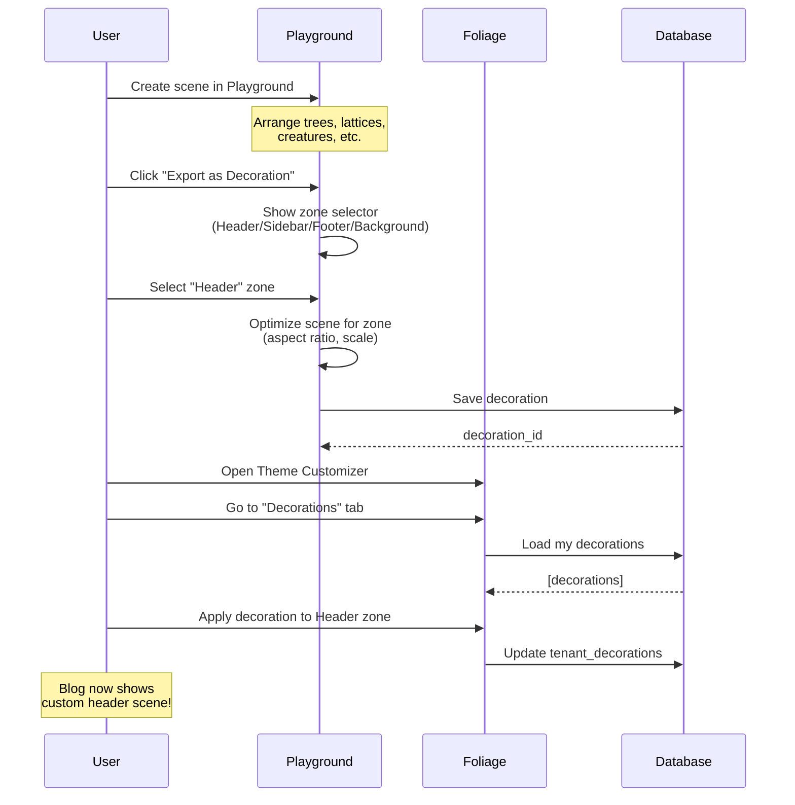

# Playground + Foliage Integration

> **The Vision**: MySpace-level customization with Grove's curated aesthetic
>
> Create scenes in the Playground → Import them as Decorations in Foliage → Your blog becomes uniquely yours

---

## The Connection

### Current State

**Playground** (proposed):
- Canvas-based drag-and-drop for nature components
- Create spatial compositions (lattice + vines + trees + fireflies)
- Export as PNG, save to localStorage

**Foliage** (existing):
- Theme system with Colors, Typography, Layout, Custom CSS
- 10 curated themes + full customizer (Oak+)
- Community theme sharing
- ThemeSettings stored per-tenant

### The Missing Link: **Decorations**

Scenes created in Playground become **Decorations** that users can apply to their blog through Foliage.

```
┌──────────────────────────────────────────────────────────────────────┐
│                                                                      │
│   PLAYGROUND                    FOLIAGE                              │
│   ──────────                    ───────                              │
│                                                                      │
│   ┌─────────────────┐           ┌─────────────────────────────────┐  │
│   │                 │           │  ThemeCustomizer                │  │
│   │  Create Scene   │    ───▶   │  ┌─────────────────────────────┐│  │
│   │  [🌲 🦋 ╔═╗]   │   Export  │  │ Colors │ Type │ Layout │ CSS ││  │
│   │  [🍄 🪨 ╚═╝]   │   as      │  ├─────────────────────────────┤│  │
│   │                 │   Decor   │  │       DECORATIONS (NEW!)    ││  │
│   └─────────────────┘           │  │  ┌───┐ ┌───┐ ┌───┐ ┌───┐   ││  │
│                                 │  │  │Hdr│ │Sde│ │Ftr│ │Bg │   ││  │
│                                 │  │  └───┘ └───┘ └───┘ └───┘   ││  │
│                                 │  └─────────────────────────────┘│  │
│                                 └─────────────────────────────────┘  │
│                                                                      │
└──────────────────────────────────────────────────────────────────────┘
```

---

## Why This Is MySpace-Level Customization

### MySpace (2005-2010)
- Add GIFs, backgrounds, music players
- Custom HTML/CSS in profile
- Glitter text, auto-playing music
- Wild, chaotic, uniquely personal
- **Problem**: No guardrails → accessibility nightmares, broken layouts

### Grove (2026)
- Add nature components (trees, creatures, flowers, lattices)
- Compose scenes in a visual editor (Playground)
- Apply scenes to themed zones on your blog
- Curated library → consistent aesthetic
- **Solution**: Guardrails + Personal expression

**The difference**: Instead of random GIFs and chaotic HTML, Grove users compose from a curated, accessible, beautiful component library. Same creative freedom, better outcomes.

---

## Decoration Zones

Blogs would have **designated zones** where decorations can be applied:

| Zone | Location | Use Case |
|------|----------|----------|
| **Header** | Above/behind site header | Scene sets the mood for your blog |
| **Sidebar** | Blog sidebar area | Decorative elements alongside content |
| **Footer** | Above/behind footer | Closing flourish |
| **Background** | Behind content area | Ambient scene (subtle, parallax) |

### Example: "Forest Blog" Theme

```
┌────────────────────────────────────────────────────────────────┐
│  ☁️        🌲🌲          ☁️            🌲🌲🌲         ☁️      │  ← Header Decoration
├────────────────────────────────────────────────────────────────┤
│                                                                │
│   MY FOREST BLOG                              │ ╔══╗ 🦋       │
│   ══════════════                              │ ║  ║ 🌿       │  ← Sidebar Decoration
│                                               │ ║  ║          │     (Lattice + Vine + Butterfly)
│   Today I went for a walk in the woods...    │ ╚══╝          │
│                                               │               │
│   The autumn leaves were beautiful...        │ 🍄🍄          │
│                                               │               │
├────────────────────────────────────────────────────────────────┤
│  🌿 🍂 🌿 🍂 🌿 🍂 🌿 🍂 🌿 🍂 🌿 🍂 🌿 🍂 🌿 🍂 🌿 🍂      │  ← Footer Decoration
└────────────────────────────────────────────────────────────────┘
```

---

## Technical Design

### New Data Structures

```typescript
// Added to Foliage's types.ts

/** A decoration created in Playground */
interface Decoration {
  id: string;
  name: string;
  creatorTenantId: string;

  /** The scene data from Playground */
  scene: PlaygroundScene;

  /** Which zone this decoration is designed for */
  targetZone: DecorationZone;

  /** Rendering options */
  options: DecorationOptions;

  /** For community sharing */
  status?: CommunityThemeStatus;
  downloads?: number;

  createdAt: string;
  updatedAt: string;
}

type DecorationZone = 'header' | 'sidebar' | 'footer' | 'background';

interface DecorationOptions {
  /** CSS position behavior */
  position: 'static' | 'sticky' | 'parallax';

  /** Opacity (0-1) */
  opacity: number;

  /** Whether animations play */
  animated: boolean;

  /** Responsive behavior */
  hideOnMobile: boolean;

  /** Z-index relative to content */
  layer: 'behind' | 'front';
}

// Extended ThemeSettings
interface ThemeSettings {
  // ... existing fields ...

  /** Decorations applied to this tenant's blog */
  decorations?: {
    header?: string;    // decoration ID
    sidebar?: string;
    footer?: string;
    background?: string;
  };
}
```

### New Database Tables

```sql
-- Add to Foliage migrations

CREATE TABLE decorations (
  id TEXT PRIMARY KEY,
  name TEXT NOT NULL,
  creator_tenant_id TEXT NOT NULL,

  -- Scene data from Playground (JSON)
  scene_data TEXT NOT NULL,

  -- Which zone it's designed for
  target_zone TEXT NOT NULL CHECK (target_zone IN ('header', 'sidebar', 'footer', 'background')),

  -- Rendering options (JSON)
  options TEXT NOT NULL,

  -- Thumbnail for preview
  thumbnail_path TEXT,

  -- Community sharing (Oak+)
  status TEXT DEFAULT 'private' CHECK (status IN ('private', 'pending', 'approved', 'featured')),
  downloads INTEGER DEFAULT 0,

  created_at INTEGER DEFAULT (unixepoch()),
  updated_at INTEGER DEFAULT (unixepoch()),

  FOREIGN KEY (creator_tenant_id) REFERENCES tenants(id)
);

CREATE INDEX idx_decorations_creator ON decorations(creator_tenant_id);
CREATE INDEX idx_decorations_zone ON decorations(target_zone);
CREATE INDEX idx_decorations_status ON decorations(status);

-- Junction table for tenant decoration assignments
CREATE TABLE tenant_decorations (
  tenant_id TEXT NOT NULL,
  zone TEXT NOT NULL CHECK (zone IN ('header', 'sidebar', 'footer', 'background')),
  decoration_id TEXT NOT NULL,

  PRIMARY KEY (tenant_id, zone),
  FOREIGN KEY (tenant_id) REFERENCES tenants(id) ON DELETE CASCADE,
  FOREIGN KEY (decoration_id) REFERENCES decorations(id)
);
```

### New Components

**In Foliage:**
```
src/lib/components/
├── DecorationPanel.svelte      # New tab in ThemeCustomizer
├── DecorationPicker.svelte     # Browse/select decorations
├── DecorationPreview.svelte    # Preview decoration in context
├── DecorationZoneEditor.svelte # Configure zone-specific options
└── CommunityDecorationBrowser.svelte # Browse shared decorations
```

**In Playground:**
```
src/lib/ui/components/playground/
├── ExportAsDecoration.svelte   # Export scene as Foliage decoration
└── DecorationZonePreview.svelte # Preview how scene looks in each zone
```

### Workflow



---

## Tier Access

| Tier | Playground | Decorations |
|------|------------|-------------|
| **Free** | View-only demo | None |
| **Seedling** | Create + export PNG | 1 decoration per zone |
| **Sapling** | Create + save scenes | 3 decorations per zone |
| **Oak** | Full access | Unlimited + Community browse |
| **Evergreen** | Full access | Unlimited + Community share |

---

## Integration Points

### 1. Playground → Export as Decoration

Add to Playground's export dialog:

```svelte
<!-- ExportDialog.svelte -->
<div class="export-options">
  <h3>Export Scene</h3>

  <button onclick={exportAsPNG}>
    Download as PNG
  </button>

  <button onclick={exportAsSVG}>
    Download as SVG
  </button>

  <hr />

  <h4>Save as Decoration</h4>
  <p class="text-sm text-muted">Use this scene on your blog!</p>

  <div class="zone-selector">
    <button onclick={() => saveAsDecoration('header')}>Header</button>
    <button onclick={() => saveAsDecoration('sidebar')}>Sidebar</button>
    <button onclick={() => saveAsDecoration('footer')}>Footer</button>
    <button onclick={() => saveAsDecoration('background')}>Background</button>
  </div>
</div>
```

### 2. Foliage → Decorations Tab

Add 5th tab to ThemeCustomizer:

```typescript
// ThemeCustomizer.svelte
const tabs = [
  { id: 'colors', label: 'Colors', icon: '🎨' },
  { id: 'typography', label: 'Typography', icon: '✍️' },
  { id: 'layout', label: 'Layout', icon: '📐' },
  { id: 'css', label: 'Custom CSS', icon: '💾' },
  { id: 'decorations', label: 'Decorations', icon: '🌿' }, // NEW!
];
```

### 3. Blog Layout → Render Decorations

```svelte
<!-- +layout.svelte in customer blog -->
<script>
  import { DecorationRenderer } from '@autumnsgrove/foliage/components';

  const { data } = $props();
</script>

{#if data.decorations?.header}
  <DecorationRenderer
    decoration={data.decorations.header}
    zone="header"
  />
{/if}

<Header />

<main>
  {#if data.decorations?.sidebar}
    <aside>
      <DecorationRenderer
        decoration={data.decorations.sidebar}
        zone="sidebar"
      />
    </aside>
  {/if}

  <slot />
</main>

{#if data.decorations?.footer}
  <DecorationRenderer
    decoration={data.decorations.footer}
    zone="footer"
  />
{/if}

<Footer />

{#if data.decorations?.background}
  <DecorationRenderer
    decoration={data.decorations.background}
    zone="background"
    class="fixed inset-0 -z-10 pointer-events-none"
  />
{/if}
```

---

## Community Decorations

Just like Community Themes, Oak+ users could:

1. **Share** their decorations with the community
2. **Browse** decorations others have created
3. **Import** decorations into their own theme
4. **Rate** decorations to surface the best ones

This creates a **decoration marketplace** where creative users can share their compositions.

---

## Implementation Phases

### Phase 1: Playground Core (Current Plan)
- Basic drag-and-drop canvas
- Asset palette with nature components
- Scene save/load to localStorage
- PNG export

### Phase 2: Decoration Export
- Add "Save as Decoration" to export dialog
- Zone selector (header/sidebar/footer/background)
- Preview how scene looks in each zone
- Save decoration to database

### Phase 3: Foliage Integration
- Add Decorations tab to ThemeCustomizer
- DecorationPicker component
- Zone assignment UI
- DecorationRenderer component

### Phase 4: Community Decorations
- Share decorations (Oak+)
- CommunityDecorationBrowser
- Moderation queue for decorations
- Import flow

### Phase 5: Polish
- Animation settings per zone
- Parallax effects for background
- Responsive handling (hide on mobile option)
- Performance optimization

---

## Why This Works

1. **Guardrails + Expression**: Users can't break their blog with bad HTML/CSS. They compose from pre-built, accessible components.

2. **Consistent Aesthetic**: Every decoration uses Grove's nature palette. Blogs look beautiful even with full customization.

3. **Community Building**: Sharing decorations creates a creative community. "Check out my header scene!"

4. **Tier Value**: Clear progression from basic customization to full creative freedom.

5. **It's FUN**: Dragging fireflies onto a canvas and seeing them on your blog? That's delightful.

---

## Summary

**Playground** is not just a standalone toy - it's the **creative studio** for Grove's theme system.

Users create → Export to Foliage → Apply to blog → Share with community

This is the MySpace DNA Grove has been missing: personal expression, creative freedom, making your space truly yours. But with Grove's sensibilities: curated, accessible, beautiful by default.

---

*Document created: 2026-01-04*
*This extends: `docs/plans/asset-playground-plan.md` + `docs/specs/foliage-project-spec.md`*
