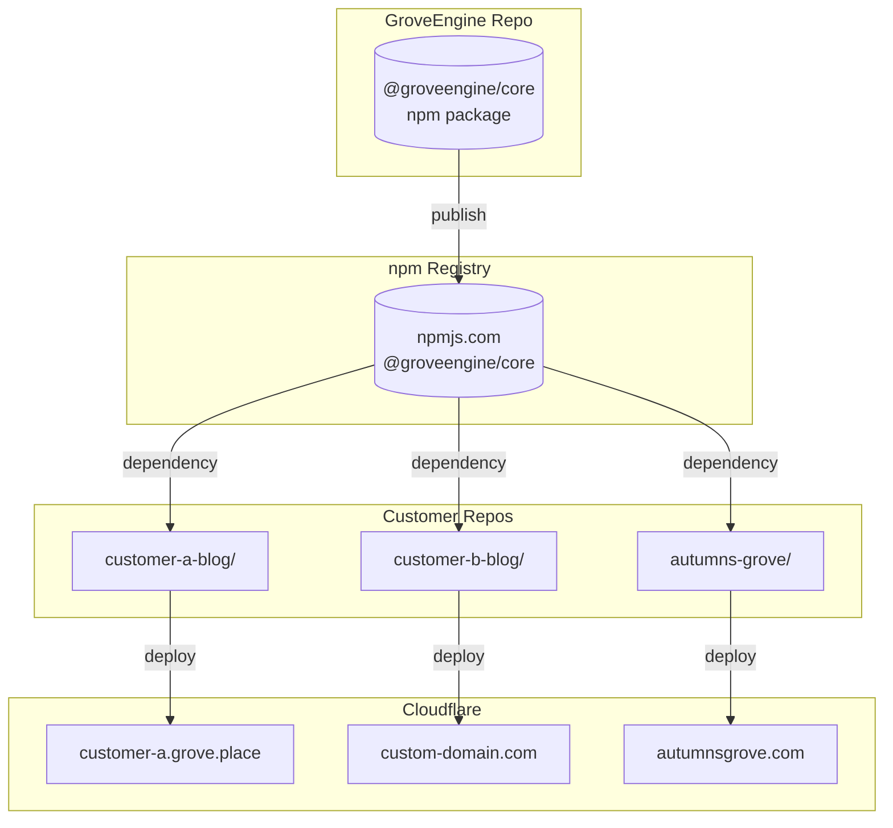
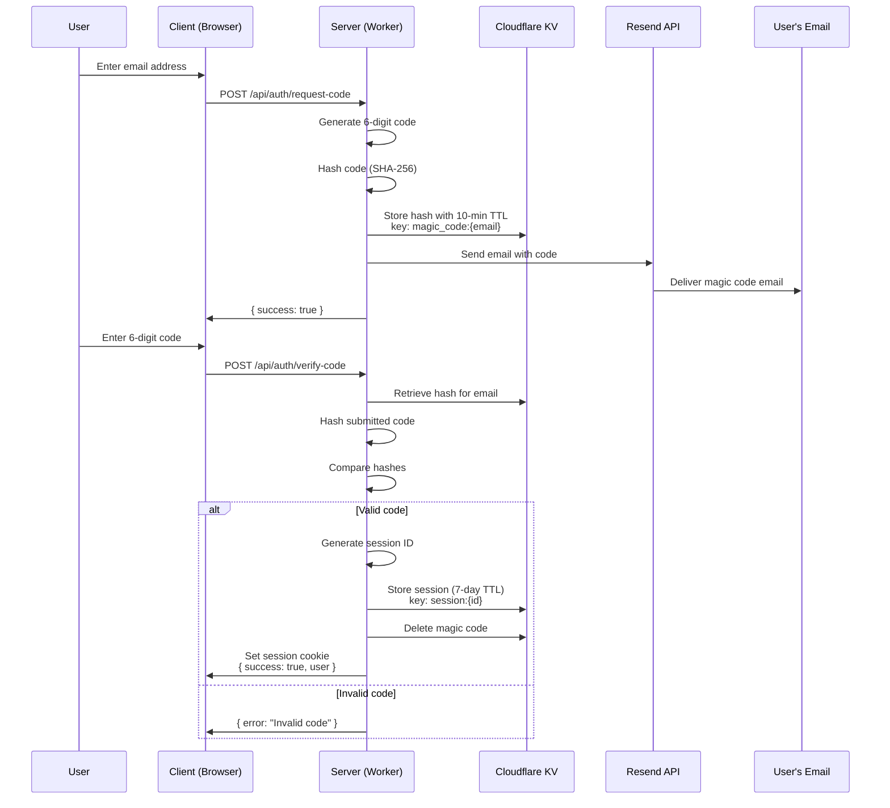

---
aliases:
date created: Friday, November 21st 2025, 3:01:54 pm
date modified: Tuesday, November 26th 2025
tags:
type: tech-spec
---

# GroveEngine - Technical Specification

**Package:** `@groveengine/core`
**Repository:** `GroveEngine`
**Type:** npm Package / SvelteKit Library
**Purpose:** Powers all individual blog instances with reusable components

---

## Overview

GroveEngine is a Cloudflare-native blog engine published as an npm package. Customers install `@groveengine/core` in their individual repositories to power their blogs. Each customer has a separate repository with their own Cloudflare resources (D1, KV, R2), deployed either on a `grove.place` subdomain or a custom domain.

---

## Architecture

### Tech Stack
- **Framework:** SvelteKit 2.0+ with `svelte-package` for library builds
- **Language:** TypeScript (strict mode)
- **Styling:** Tailwind CSS
- **Content:** Markdown with frontmatter
- **Media:** Cloudflare R2 + Images Transformations
- **Database:** Cloudflare D1 (per-customer databases)
- **Cache/Sessions:** Cloudflare KV
- **Build:** Vite + pnpm workspaces
- **Package Manager:** pnpm

### Deployment Model



---

## Package Structure

```
@groveengine/core/
├── src/lib/
│   ├── components/        # Svelte components
│   │   ├── blog/          # Post, PostCard, PostList, etc.
│   │   ├── layout/        # Header, Footer, Navigation, Sidebar
│   │   ├── admin/         # Admin panel components
│   │   ├── auth/          # Login, MagicCodeInput, etc.
│   │   └── ui/            # Buttons, Cards, Modals, etc.
│   ├── stores/            # Svelte stores (theme, user, etc.)
│   ├── utils/             # Utility functions
│   ├── server/            # Server-side utilities
│   │   ├── auth/          # Magic code verification, session management
│   │   ├── db/            # D1 utilities, queries
│   │   ├── storage/       # R2 upload/download helpers
│   │   └── email/         # Resend integration
│   ├── types/             # TypeScript type definitions
│   └── index.ts           # Public API exports
├── migrations/            # D1 database migrations
├── package.json
├── svelte.config.js       # For svelte-package
└── tsconfig.json
```

---

## Package Exports

### package.json Configuration

```json
{
  "name": "@groveengine/core",
  "version": "0.1.0",
  "exports": {
    ".": {
      "types": "./dist/index.d.ts",
      "svelte": "./dist/index.js"
    },
    "./components/*": {
      "types": "./dist/components/*.svelte.d.ts",
      "svelte": "./dist/components/*.svelte"
    },
    "./server": {
      "types": "./dist/server/index.d.ts",
      "default": "./dist/server/index.js"
    },
    "./stores": {
      "types": "./dist/stores/index.d.ts",
      "svelte": "./dist/stores/index.js"
    },
    "./migrations": "./migrations/*.sql"
  },
  "svelte": "./dist/index.js",
  "types": "./dist/index.d.ts",
  "files": ["dist", "migrations"],
  "peerDependencies": {
    "svelte": "^5.0.0",
    "@sveltejs/kit": "^2.0.0"
  }
}
```

### Import Examples

```typescript
// Main exports (components, types, utilities)
import { PostList, PostCard, Header, Footer } from '@groveengine/core';
import type { Post, User, SiteConfig } from '@groveengine/core';

// Server-side utilities (use in +page.server.ts, +server.ts)
import { verifyMagicCode, createSession, getPosts } from '@groveengine/core/server';

// Svelte stores
import { theme, user, siteConfig } from '@groveengine/core/stores';

// Direct component imports
import PostEditor from '@groveengine/core/components/admin/PostEditor.svelte';
```

---

## Authentication Flow

GroveEngine uses **magic code authentication** via Resend for passwordless login. This provides a secure, user-friendly experience without password management overhead.

### Magic Code Flow



### Implementation Details

**Code Generation:**
```typescript
// server/auth/magic-code.ts
export async function generateMagicCode(): Promise<string> {
  const array = new Uint32Array(1);
  crypto.getRandomValues(array);
  return String(array[0] % 1000000).padStart(6, '0');
}

export async function hashCode(code: string): Promise<string> {
  const encoder = new TextEncoder();
  const data = encoder.encode(code);
  const hash = await crypto.subtle.digest('SHA-256', data);
  return Array.from(new Uint8Array(hash))
    .map(b => b.toString(16).padStart(2, '0'))
    .join('');
}
```

**KV Storage Keys:**
- `magic_code:{email}` - Stores hashed code, 10-minute TTL
- `session:{sessionId}` - Stores user data, 7-day TTL

**Session Cookie:**
```typescript
cookies.set('session', sessionId, {
  path: '/',
  httpOnly: true,
  secure: true,
  sameSite: 'lax',
  maxAge: 60 * 60 * 24 * 7 // 7 days
});
```

### Future Enhancement: Username/Password Auth

Username/password authentication will be added as an optional alternative login method. This is documented in the roadmap but not part of the initial release.

---

## Database Schema (D1)

### Core Tables

#### users
```sql
CREATE TABLE users (
  id TEXT PRIMARY KEY,
  email TEXT UNIQUE NOT NULL,
  name TEXT,
  role TEXT DEFAULT 'user' CHECK (role IN ('admin', 'editor', 'user')),
  avatar_url TEXT,
  created_at INTEGER NOT NULL DEFAULT (unixepoch()),
  updated_at INTEGER NOT NULL DEFAULT (unixepoch())
);

CREATE INDEX idx_users_email ON users(email);
CREATE INDEX idx_users_role ON users(role);
```

#### posts
```sql
CREATE TABLE posts (
  id TEXT PRIMARY KEY,
  user_id TEXT NOT NULL,
  title TEXT NOT NULL,
  slug TEXT UNIQUE NOT NULL,
  content TEXT NOT NULL,
  excerpt TEXT,
  html TEXT, -- Pre-rendered HTML for performance
  status TEXT DEFAULT 'draft' CHECK (status IN ('draft', 'published', 'archived')),
  featured_image TEXT,
  word_count INTEGER,
  reading_time INTEGER, -- minutes
  published_at INTEGER,
  created_at INTEGER NOT NULL DEFAULT (unixepoch()),
  updated_at INTEGER NOT NULL DEFAULT (unixepoch()),
  FOREIGN KEY (user_id) REFERENCES users(id)
);

CREATE INDEX idx_posts_slug ON posts(slug);
CREATE INDEX idx_posts_status ON posts(status);
CREATE INDEX idx_posts_user ON posts(user_id);
CREATE INDEX idx_posts_published ON posts(published_at DESC) WHERE status = 'published';
```

#### sessions
```sql
CREATE TABLE sessions (
  id TEXT PRIMARY KEY,
  user_id TEXT NOT NULL,
  expires_at INTEGER NOT NULL,
  created_at INTEGER NOT NULL DEFAULT (unixepoch()),
  FOREIGN KEY (user_id) REFERENCES users(id) ON DELETE CASCADE
);

CREATE INDEX idx_sessions_user ON sessions(user_id);
CREATE INDEX idx_sessions_expires ON sessions(expires_at);
```

#### site_config
```sql
CREATE TABLE site_config (
  key TEXT PRIMARY KEY,
  value TEXT NOT NULL, -- JSON string
  updated_at INTEGER NOT NULL DEFAULT (unixepoch())
);
```

### Supporting Tables

#### tags
```sql
CREATE TABLE tags (
  id TEXT PRIMARY KEY,
  name TEXT UNIQUE NOT NULL,
  slug TEXT UNIQUE NOT NULL,
  created_at INTEGER NOT NULL DEFAULT (unixepoch())
);

CREATE INDEX idx_tags_slug ON tags(slug);
```

#### post_tags
```sql
CREATE TABLE post_tags (
  post_id TEXT NOT NULL,
  tag_id TEXT NOT NULL,
  PRIMARY KEY (post_id, tag_id),
  FOREIGN KEY (post_id) REFERENCES posts(id) ON DELETE CASCADE,
  FOREIGN KEY (tag_id) REFERENCES tags(id) ON DELETE CASCADE
);

CREATE INDEX idx_post_tags_post ON post_tags(post_id);
CREATE INDEX idx_post_tags_tag ON post_tags(tag_id);
```

#### media
```sql
CREATE TABLE media (
  id TEXT PRIMARY KEY,
  filename TEXT NOT NULL,
  original_name TEXT NOT NULL,
  url TEXT NOT NULL,
  r2_key TEXT NOT NULL,
  width INTEGER,
  height INTEGER,
  size INTEGER, -- bytes
  format TEXT, -- 'jpg', 'png', 'webp', etc.
  mime_type TEXT,
  uploaded_by TEXT,
  uploaded_at INTEGER NOT NULL DEFAULT (unixepoch()),
  FOREIGN KEY (uploaded_by) REFERENCES users(id)
);

CREATE INDEX idx_media_uploaded_by ON media(uploaded_by);
CREATE INDEX idx_media_uploaded_at ON media(uploaded_at DESC);
```

---

## Cloudflare Bindings

Customer repositories must configure the following bindings in their `wrangler.jsonc`:

### Required Bindings

```jsonc
{
  "$schema": "https://raw.githubusercontent.com/cloudflare/workers-sdk/main/packages/wrangler/schemas/config/config.schema.json",
  "name": "my-grove-blog",
  "compatibility_date": "2024-11-26",
  "compatibility_flags": ["nodejs_compat"],

  // D1 Database - stores posts, users, config
  "d1_databases": [
    {
      "binding": "DB",
      "database_name": "grove-blog",
      "database_id": "your-d1-database-id"
    }
  ],

  // KV Namespace - sessions, magic codes, cache
  "kv_namespaces": [
    {
      "binding": "KV",
      "id": "your-kv-namespace-id"
    }
  ],

  // R2 Bucket - media storage
  "r2_buckets": [
    {
      "binding": "STORAGE",
      "bucket_name": "grove-assets"
    }
  ]
}
```

### Environment Variables

```jsonc
{
  "vars": {
    "PUBLIC_SITE_URL": "https://myblog.grove.place",
    "PUBLIC_SITE_NAME": "My Awesome Blog"
  },

  // Secrets (set via wrangler secret put)
  // RESEND_API_KEY - for sending magic code emails
}
```

### App.Platform Interface

Extend SvelteKit's platform types in `src/app.d.ts`:

```typescript
declare global {
  namespace App {
    interface Platform {
      env: {
        DB: D1Database;
        KV: KVNamespace;
        STORAGE: R2Bucket;
        RESEND_API_KEY: string;
      };
      context: ExecutionContext;
      caches: CacheStorage;
    }

    interface Locals {
      user: import('@groveengine/core').User | null;
      session: import('@groveengine/core').Session | null;
    }
  }
}

export {};
```

---

## Core Features

### 1. Post Management

**Create & Edit Posts:**
- Markdown editor with live preview
- Frontmatter support (title, date, tags, excerpt, featured image)
- Auto-save drafts
- Slug generation from title
- Word count display
- Reading time estimation

**Post Interface:**
```typescript
interface Post {
  id: string;
  user_id: string;
  title: string;
  slug: string;
  content: string; // markdown
  excerpt?: string;
  html?: string; // pre-rendered
  status: 'draft' | 'published' | 'archived';
  featured_image?: string;
  word_count: number;
  reading_time: number; // minutes
  published_at?: number;
  created_at: number;
  updated_at: number;
  tags?: string[];
}
```

### 2. Theme System

**Theme Configuration:**
```json
{
  "name": "Default",
  "version": "1.0.0",
  "author": "Grove",
  "description": "The default Grove blog theme",
  "features": {
    "gutter_links": true,
    "table_of_contents": true,
    "featured_images": true,
    "tags": true,
    "author_bio": true
  },
  "customizable": {
    "colors": ["primary", "secondary", "accent"],
    "fonts": ["heading", "body"],
    "layout": ["sidebar", "no-sidebar"]
  }
}
```

### 3. Media Management

**Image Upload:**
- Drag & drop upload in editor
- Multiple image formats (JPG, PNG, GIF, WebP)
- Automatic optimization via Cloudflare Images
- R2 storage with CDN delivery

**Responsive Images:**
```html

```

### 4. Admin Panel

**Dashboard:**
- Post count & status overview
- Recent posts list
- Draft posts requiring attention
- Quick stats

**Post Editor:**
- Split view: markdown on left, preview on right
- Toolbar for common markdown formatting
- Save draft / Publish / Unpublish actions
- SEO preview

### 5. Content Features

**Gutter Links:**
- Sidebar links per post
- Support for external links and internal references

**Table of Contents:**
- Auto-generated from post headings
- Sticky sidebar on desktop
- Click to jump to section

**Tags:**
- Add tags to posts
- Tag archive pages
- Filter posts by tag

**RSS Feed:**
- Auto-generated RSS 2.0 feed
- Custom feed URL: `/rss.xml`

---

## API Reference

### Post API

**Get All Posts:**
```typescript
GET /api/posts
Query: {
  page?: number;
  limit?: number;
  status?: 'published' | 'draft' | 'archived';
  tag?: string;
}
Response: {
  posts: Post[];
  total: number;
  page: number;
  total_pages: number;
}
```

**Get Single Post:**
```typescript
GET /api/posts/[slug]
Response: Post | null
```

**Create Post:**
```typescript
POST /api/posts
Body: {
  title: string;
  content: string;
  excerpt?: string;
  tags?: string[];
  status?: 'draft' | 'published';
}
Response: { success: boolean; post: Post }
```

**Update Post:**
```typescript
PUT /api/posts/[id]
Body: Partial<Post>
Response: { success: boolean; post: Post }
```

**Delete Post:**
```typescript
DELETE /api/posts/[id]
Response: { success: boolean }
```

### Auth API

**Request Magic Code:**
```typescript
POST /api/auth/request-code
Body: { email: string }
Response: { success: boolean }
```

**Verify Code:**
```typescript
POST /api/auth/verify-code
Body: { email: string; code: string }
Response: { success: boolean; user?: User }
```

**Logout:**
```typescript
POST /api/auth/logout
Response: { success: boolean }
```

### Media API

**Upload Image:**
```typescript
POST /api/media/upload
Content-Type: multipart/form-data
Body: { file: File }
Response: {
  success: boolean;
  url: string;
  metadata: {
    width: number;
    height: number;
    size: number;
    format: string;
  }
}
```

**List Media:**
```typescript
GET /api/media
Query: { page?: number; limit?: number }
Response: {
  files: MediaFile[];
  total: number;
}
```

---

## Security

### Content Security
- Sanitize all markdown input (prevent XSS)
- Validate image uploads (type, size, dimensions)
- Rate limit authentication attempts
- CSRF protection on all forms

### Data Security
- Parameterized queries only (prevent SQL injection)
- Environment variables for secrets
- No sensitive data in client-side code
- Secure cookies for sessions (httpOnly, secure, sameSite)

### Access Control
- Admin routes protected by auth middleware
- API endpoints validate session and permissions
- Media files served with proper headers

---

## Performance

### Caching Strategy

**Edge Caching (Cloudflare):**
- Cache static assets for 1 year
- Cache blog post pages for 1 hour
- Purge cache on content update

**KV Caching:**
- Cache site config (5 minute TTL)
- Cache post counts (1 minute TTL)

### Bundle Optimization

**Code Splitting:**
- Admin panel code separate from blog
- Markdown editor loaded on demand

**Image Optimization:**
- WebP/AVIF format where supported
- Responsive images with srcset
- Lazy loading

---

## Testing

### Unit Tests
- Utility functions (slugify, date formatting)
- Markdown processing
- Auth code generation/verification

### Integration Tests
- Post CRUD operations
- Authentication flow
- Media upload & processing

### E2E Tests
- Full post creation flow
- Admin panel navigation
- Blog rendering

---

## Success Metrics

**Performance:**
- Page load time < 2 seconds
- Lighthouse score > 90
- Bundle size < 200KB (gzipped)

**Reliability:**
- Zero data loss incidents
- 99.9% uptime
- All tests passing

**Developer Experience:**
- Build time < 30 seconds
- Hot reload working
- Clear error messages
- Strong TypeScript coverage

---

*Last Updated: November 2025*
