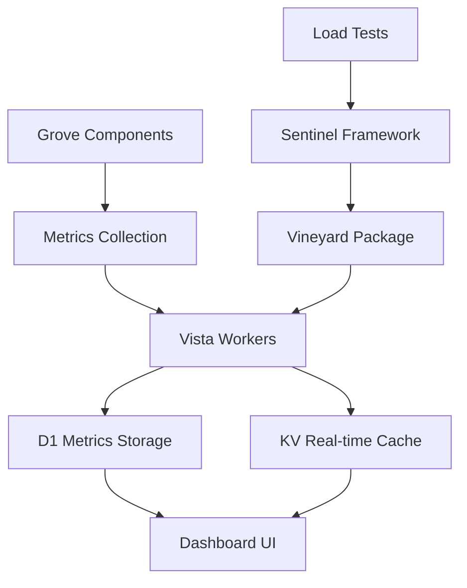

```
         🌲
         |
      ___|___
     |       |
     | SPECS |
     |_______|
         |
    ╱────┼────╲
   ╱     │     ╲
  ⟿     ⟿     ⟿
Core  Tools  Docs
```

> *All paths through the grove*

---

# Grove Specifications

Comprehensive collection of technical specifications, component designs, and implementation details for the Grove ecosystem.

---

## Overview

Grove specifications define the architecture, interfaces, and implementation details of all components in the Grove platform. Each specification includes API definitions, data models, integration points, and deployment requirements.

---

## Core Specifications

### 🏗️ Foundation & Infrastructure

| Specification | Purpose | Status | Integration |
|---------------|---------|--------|-------------|
| **[Lattice](lattice-spec.md)** | Core framework & multi-tenant engine | **Active** | All components |
| **[Engine](engine-spec.md)** | Blog rendering & content management | Active | Lattice, TenantDO |
| **[Website](website-spec.md)** | Public marketing site & landing pages | Active | Lattice, Engine |
| **[Meadow](meadow-spec.md)** | Community feed & social features | Planned | Lattice, PostDO |

### 📊 Monitoring & Analytics

| Specification | Purpose | Status | Integration |
|---------------|---------|--------|-------------|
| **[Vista](vista-spec.md)** | Infrastructure monitoring dashboard | **Active** | All components |
| **[Rings](rings-spec.md)** | Privacy-first analytics system | Active | PostDO, TenantDO |
| **[Vineyard](vineyard-spec.md)** | Vista LoadTest package | **New** | Sentinel, Vista |
| **[Vista LoadTest](vista-loadtest-spec.md)** | Load testing integration spec | **New** | Sentinel, Vista |

### 🎨 Customization & Theming

| Specification | Purpose | Status | Integration |
|---------------|---------|--------|-------------|
| **[Foliage](foliage-project-spec.md)** | Theme system & visual customization | Active | Engine, TenantDO |
| **[Terrarium](terrarium-spec.md)** | Creative canvas for scene composition | **New** | Foliage, Engine |

### 🔧 Tools & Services

| Specification | Purpose | Status | Integration |
|---------------|---------|--------|-------------|
| **[Amber](amber-spec.md)** | Image processing & optimization | Active | R2, Engine |
| **[Arbor](arbor-spec.md)** | Theme system & customization | Active | Engine, TenantDO |
| **[Bloom](bloom-spec.md)** | Email newsletter system | Planned | Resend, TenantDO |
| **[Clearing](clearing-spec.md)** | Data export & migration tools | Active | D1, R2 |

### 🛡️ Security & Operations

| Specification | Purpose | Status | Integration |
|---------------|---------|--------|-------------|
| **[Mycelium](mycelium-spec.md)** | Secret management & rotation | Active | All services |
| **[Patina](patina-spec.md)** | Backup & disaster recovery | Active | D1, R2 |
| **[Thorn](thorn-spec.md)** | Security scanning & compliance | Planned | CI/CD, D1 |

---

## Specification Details

### 🏗️ Lattice Specification
**Core framework & multi-tenant engine**

**Key Components:**
- **Multi-tenant routing**: Subdomain-based tenant isolation
- **Durable Objects**: SessionDO, TenantDO, PostDO coordination
- **D1 integration**: SQLite database with batching
- **R2 storage**: Media uploads & asset serving

**Implementation Status:** **ACTIVE** (Production)

**Related Patterns:**
- [Loom Pattern](../patterns/loom-durable-objects-pattern.md) - DO coordination
- [Threshold Pattern](../patterns/threshold-pattern.md) - Rate limiting
- [Grove Durable Objects](../patterns/grove-durable-objects-architecture.md)

---

### 📊 Vista Specification  
**Infrastructure monitoring dashboard**



**Key Features:**
- Real-time metrics collection
- Historical trend analysis
- Alerting & notification system
- Load test integration (Vineyard)

**Implementation Status:** **ACTIVE** (Production)

**New Integration:**
- **Vineyard Package** - Load testing results visualization
- **Vista LoadTest Spec** - Formal integration specification

**Related Documents:**
- [Vineyard Spec](vineyard-spec.md) - LoadTest package details
- [Vista LoadTest Spec](vista-loadtest-spec.md) - Integration specification
- [Sentinel Pattern](../patterns/sentinel-pattern.md) - Load testing framework

---

### 📊 Rings Specification
**Privacy-first analytics system**

**Key Principles:**
- No personal data collection
- Aggregate statistics only
- Client-side anonymization
- Durable Object-based processing

**Implementation Status:** **ACTIVE** (Production)

**Integration Points:**
- PostDO pageview tracking
- TenantDO usage analytics
- Vista metrics correlation

**Related Patterns:**
- [Loom Pattern](../patterns/loom-durable-objects-pattern.md) - DO coordination
- [Sentinel Pattern](../patterns/sentinel-pattern.md) - Load testing correlation

---

### 🔧 Vineyard Specification
**Vista LoadTest package**

**Purpose:** Integration of Sentinel load testing framework with Vista monitoring dashboard.

**Key Components:**
1. **Test Runner**: Executes Sentinel scenarios
2. **Metrics Collector**: Gathers test performance data
3. **Results Processor**: Analyzes bottlenecks & failures
4. **Dashboard Integration**: Visualizes results in Vista

**Implementation Status:** **NEW** (Specification complete, implementation planned)

**Integration:**
- ✅ Sentinel pattern compatibility
- ✅ Vista dashboard integration
- ✅ D1 metrics storage
- ✅ Real-time KV caching

**Related Documents:**
- [Sentinel Pattern](../patterns/sentinel-pattern.md) - Load testing framework
- [Vista Spec](vista-spec.md) - Monitoring system
- [Load Testing Guide](../guides/load-testing-guide.md) - Implementation guide

---

## Implementation Roadmap

### Phase 1: Core Infrastructure (Complete)
- ✅ Lattice framework
- ✅ Engine blog rendering
- ✅ Vista monitoring
- ✅ Rings analytics

### Phase 2: Security & Scale (Current)
- 🔄 Threshold rate limiting
- 🔄 Sentinel load testing
- 🔄 Vineyard integration
- 🔄 Mycelium secrets

### Phase 3: Community & Growth (Q1 2026)
- 📅 Meadow community feed
- 📅 Bloom newsletters
- 📅 Arbor theme marketplace
- 📅 Thorn security scanning

---

## Integration Matrix

| Specification | Lattice | Vista | Rings | D1 | R2 | DO |
|---------------|---------|-------|-------|----|----|----|
| **Lattice** | ✅ Core | ✅ Metrics | ✅ Analytics | ✅ Primary | ✅ Storage | ✅ All DOs |
| **Vista** | ✅ Metrics | ✅ Core | ✅ Correlation | ✅ Storage | ⚠️ Indirect | ✅ DO metrics |
| **Rings** | ✅ Integration | ✅ Metrics | ✅ Core | ✅ Storage | ❌ | ✅ PostDO |
| **Vineyard** | ⚠️ Testing | ✅ Primary | ⚠️ Correlation | ✅ Results | ❌ | ✅ DO tests |
| **Engine** | ✅ Framework | ✅ Metrics | ✅ Analytics | ✅ Content | ✅ Media | ✅ PostDO |

**Legend:** ✅ Direct integration, ⚠️ Indirect/metrics only, ❌ No integration

---

## Development Guidelines

### Specification Structure
Each specification should include:

1. **Overview**: Purpose and scope
2. **Architecture**: Component diagrams and relationships
3. **API Definitions**: Interfaces and data models
4. **Implementation Details**: Code examples and patterns
5. **Integration Points**: How this connects to other specs
6. **Deployment Requirements**: Infrastructure needs
7. **Testing Strategy**: Validation approach

### Versioning
- Use semantic versioning (MAJOR.MINOR.PATCH)
- Update version in specification header
- Maintain changelog for breaking changes
- Coordinate updates across dependent specs

### Documentation Standards
- Include Mermaid diagrams for complex workflows
- Use consistent terminology across all specs
- Link to related patterns and guides
- Provide real-world usage examples

---

## Getting Started

### For Developers
1. **Start with Lattice spec** - Understand core framework
2. **Review Engine spec** - Learn blog rendering
3. **Check Vista spec** - Set up monitoring
4. **Implement patterns** - Apply Threshold, Sentinel, etc.

### For Operators
1. **Deployment guide** - Infrastructure setup
2. **Monitoring setup** - Vista configuration
3. **Security configuration** - Threshold rate limiting
4. **Testing procedures** - Sentinel load testing

### For Contributors
1. **Review existing specs** - Understand architecture
2. **Follow template structure** - Maintain consistency
3. **Update integration matrix** - Document relationships
4. **Coordinate with patterns** - Ensure alignment

---

## Related Documentation

### Patterns
- [Patterns Index](../patterns/index.md) - Architectural patterns
- [Threshold Pattern](../patterns/threshold-pattern.md) - Rate limiting
- [Sentinel Pattern](../patterns/sentinel-pattern.md) - Load testing
- [Loom Pattern](../patterns/loom-durable-objects-pattern.md) - DO coordination

### Guides
- [Rate Limiting Guide](../guides/rate-limiting-guide.md) - Threshold implementation
- [Load Testing Guide](../guides/load-testing-guide.md) - Sentinel implementation
- [Tenant Setup Guide](../tenant-setup-guide.md) - Multi-tenant configuration

### Architecture
- [Multi-Tenant Architecture](../multi-tenant-architecture.md) - Core architecture
- [Cloudflare Architecture](../cloudflare-architecture-guide.md) - Infrastructure
- [Project Organization](../project-organization.md) - Codebase structure

---

## Version History

| Date | Version | Changes |
|------|---------|---------|
| 2026-01-02 | 2.0 | Added Vineyard, Vista LoadTest specs; updated integration matrix |
| 2025-12-25 | 1.5 | Added Mycelium, Patina, Renovate specs |
| 2025-11-30 | 1.0 | Initial specifications collection |

---

## Contributing

### Adding New Specifications
1. Create specification document in `docs/specs/`
2. Follow template structure
3. Include integration matrix updates
4. Update this index
5. Add to TODOS.md implementation plan

### Specification Template
```markdown
# Specification Name

## Purpose
Brief description of what this component does.

## Architecture
Diagrams and component descriptions.

## API Definitions
Interfaces, data models, and endpoints.

## Implementation
Code examples and implementation patterns.

## Integration
How this integrates with other specifications.

## Deployment
Infrastructure requirements and setup.

## Testing
Validation and testing approach.

## References
Links to related documents.
```

---

*Last Updated: January 2026*  
*Part of the Grove Technical Documentation*