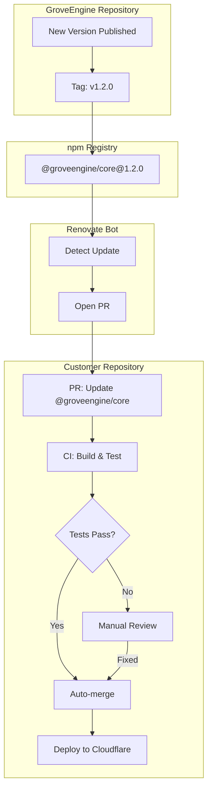
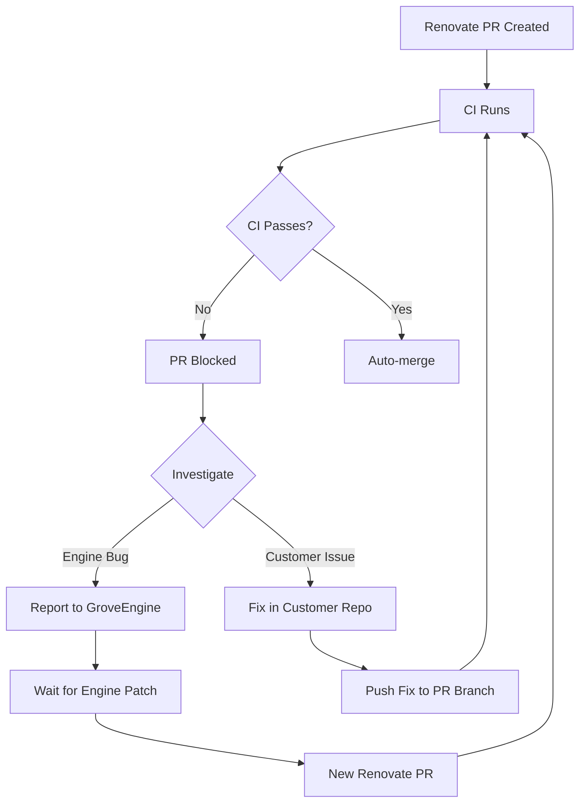

# Renovate Configuration Specification

**Purpose:** Automated dependency updates for GroveEngine and customer repositories
**Tool:** [Renovate](https://docs.renovatebot.com/)

---

## Overview

Renovate Bot automatically monitors dependencies and opens pull requests when updates are available. This ensures:

- **Security:** Patches are applied quickly
- **Freshness:** Dependencies stay up-to-date
- **Automation:** Minimal manual intervention required
- **Safety:** CI validates updates before merging

---

## Update Propagation Flow



---

## Engine Repository Configuration

### renovate.json

```json
{
  "$schema": "https://docs.renovatebot.com/renovate-schema.json",
  "extends": [
    "config:recommended",
    "schedule:weekends",
    ":maintainLockFilesWeekly"
  ],
  "labels": ["dependencies"],
  "rangeStrategy": "pin",
  "packageRules": [
    {
      "description": "Auto-merge patch and minor updates for dev dependencies",
      "matchDepTypes": ["devDependencies"],
      "matchUpdateTypes": ["patch", "minor"],
      "automerge": true,
      "automergeType": "pr"
    },
    {
      "description": "Auto-merge patch updates for production dependencies",
      "matchDepTypes": ["dependencies"],
      "matchUpdateTypes": ["patch"],
      "automerge": true,
      "automergeType": "pr"
    },
    {
      "description": "Group Svelte ecosystem updates",
      "matchPackagePatterns": ["^svelte", "^@sveltejs/"],
      "groupName": "Svelte ecosystem"
    },
    {
      "description": "Group Cloudflare tooling updates",
      "matchPackagePatterns": ["^@cloudflare/", "^wrangler"],
      "groupName": "Cloudflare tooling"
    },
    {
      "description": "Group TypeScript and type definitions",
      "matchPackagePatterns": ["^typescript$", "^@types/"],
      "groupName": "TypeScript"
    },
    {
      "description": "Group testing dependencies",
      "matchPackagePatterns": ["^vitest", "^@testing-library/", "^playwright"],
      "groupName": "Testing"
    }
  ],
  "vulnerabilityAlerts": {
    "enabled": true,
    "labels": ["security"]
  }
}
```

### Configuration Explained

| Setting | Purpose |
|---------|---------|
| `config:recommended` | Sensible defaults for most repositories |
| `schedule:weekends` | Run updates on weekends to minimize disruption |
| `:maintainLockFilesWeekly` | Keep lockfiles fresh |
| `rangeStrategy: pin` | Pin exact versions for reproducibility |
| `automerge` | Automatically merge low-risk updates |
| `groupName` | Group related packages into single PR |

---

## Customer Repository Configuration

### renovate.json

```json
{
  "$schema": "https://docs.renovatebot.com/renovate-schema.json",
  "extends": [
    "config:recommended"
  ],
  "labels": ["dependencies"],
  "packageRules": [
    {
      "description": "Auto-merge GroveEngine updates",
      "matchPackageNames": ["@groveengine/core"],
      "automerge": true,
      "automergeType": "pr",
      "schedule": ["at any time"],
      "prPriority": 10
    },
    {
      "description": "Auto-merge patch updates",
      "matchUpdateTypes": ["patch"],
      "automerge": true,
      "automergeType": "pr"
    },
    {
      "description": "Group all non-engine updates",
      "matchPackagePatterns": ["*"],
      "excludePackageNames": ["@groveengine/core"],
      "groupName": "All dependencies",
      "schedule": ["every weekend"]
    }
  ],
  "vulnerabilityAlerts": {
    "enabled": true,
    "labels": ["security"],
    "schedule": ["at any time"]
  }
}
```

### Key Customer Settings

| Setting | Value | Purpose |
|---------|-------|---------|
| `@groveengine/core` | Auto-merge, any time | Engine updates deploy immediately |
| `schedule: at any time` | Immediate | Don't wait for weekend schedule |
| `prPriority: 10` | High priority | Engine PRs created first |
| Other dependencies | Weekend schedule | Reduce noise during week |

---

## Auto-merge Requirements

For auto-merge to work, these conditions must be met:

### 1. Branch Protection Rules (GitHub)

```yaml
# Required settings in GitHub branch protection:
- Require status checks to pass
- Require branches to be up to date
- Allow auto-merge
```

### 2. CI Must Pass

The deploy workflow must succeed:

```yaml
# .github/workflows/deploy.yml
jobs:
  build-and-deploy:
    steps:
      - run: pnpm install
      - run: pnpm check      # Type checking
      - run: pnpm test       # Unit tests
      - run: pnpm build      # Build verification
```

### 3. Renovate GitHub App

Install the Renovate GitHub App:
1. Go to https://github.com/apps/renovate
2. Install on your organization/repository
3. Configure access for customer repos

---

## Timeline Expectations

### Typical Update Flow

| Event | Time from Publish |
|-------|-------------------|
| Engine publishes v1.2.0 | T+0 |
| npm indexes package | T+1 minute |
| Renovate detects (worst case) | T+1 hour |
| PR opened on customer repo | T+1 hour |
| CI runs (~5 minutes) | T+1.1 hours |
| Auto-merge if passing | T+1.1 hours |
| Deploy to Cloudflare (~2 min) | T+1.2 hours |
| **Customer live on new version** | **~1.5 hours** |

### Renovate Scheduling

| Repository | Schedule | Reason |
|------------|----------|--------|
| Engine | Weekends | Avoid disrupting active development |
| Customer (@groveengine/core) | Any time | Get engine updates immediately |
| Customer (other deps) | Weekends | Reduce PR noise |

---

## Handling Failed Updates

### When CI Fails

If an engine update breaks a customer's CI:



### Common Failure Scenarios

| Scenario | Solution |
|----------|----------|
| Type errors from API change | Update customer code to match new API |
| Missing migration | Run database migration |
| Incompatible Svelte version | Update Svelte peer dependency |
| Build timeout | Increase CI timeout |

### Reporting Issues

If engine update breaks customer CI:

1. Check CHANGELOG for breaking changes
2. Review migration guide if provided
3. Open issue on GroveEngine repo if it's a bug
4. Tag issue with `regression` label

---

## Security Updates

### Vulnerability Alerts

Both repos have vulnerability alerts enabled:

```json
{
  "vulnerabilityAlerts": {
    "enabled": true,
    "labels": ["security"],
    "schedule": ["at any time"]
  }
}
```

### Handling Security Patches

Security patches bypass normal scheduling:

1. Renovate detects CVE in dependency
2. PR opened immediately (any time)
3. PR labeled with `security`
4. CI runs
5. Auto-merge if passing
6. Deploy immediately

### Critical Vulnerabilities

For critical vulnerabilities in `@groveengine/core`:

1. GroveEngine team patches and releases
2. Version bumped as patch (e.g., 1.2.0 → 1.2.1)
3. Renovate detects within 1 hour
4. All customer repos updated automatically

---

## Manual Operations

### Force Update Check

Trigger Renovate to check for updates immediately:

```bash
# Via GitHub Actions (if configured)
gh workflow run renovate.yml

# Or add comment to any Renovate PR
# "@renovate rebase"
```

### Skip Auto-merge

To review an update manually:

```json
{
  "packageRules": [
    {
      "matchPackageNames": ["@groveengine/core"],
      "matchUpdateTypes": ["major"],
      "automerge": false
    }
  ]
}
```

### Pin Specific Version

If an update causes issues, temporarily pin:

```json
// package.json
{
  "dependencies": {
    "@groveengine/core": "1.1.5"
  }
}
```

Then update renovate.json:

```json
{
  "packageRules": [
    {
      "matchPackageNames": ["@groveengine/core"],
      "enabled": false
    }
  ]
}
```

---

## Monitoring

### Dashboard

Renovate provides a dashboard issue in each repo:

- Lists all pending updates
- Shows scheduled PRs
- Indicates blocked/failed updates

### Logs

View Renovate logs:

1. Go to https://developer.mend.io/
2. Sign in with GitHub
3. View logs for your repositories

### Notifications

Configure GitHub notifications:

1. Watch repository for PR activity
2. Set up email alerts for security labels
3. Use Slack/Discord integration if needed

---

## Best Practices

### For Engine Maintainers

1. **Semantic versioning:** Always follow semver strictly
2. **Changelog:** Document all changes clearly
3. **Migration guides:** Provide for breaking changes
4. **Testing:** Comprehensive tests catch issues early
5. **Beta releases:** Test major changes with beta versions

### For Customer Repos

1. **CI coverage:** Ensure good test coverage
2. **Quick fixes:** Address failed updates promptly
3. **Monitor dashboard:** Check Renovate dashboard weekly
4. **Security alerts:** Act on security PRs immediately
5. **Major updates:** Review changelogs for major versions

---

## Troubleshooting

### Renovate Not Creating PRs

1. Check Renovate app is installed
2. Verify repository access
3. Check for `renovate.json` syntax errors
4. Review Renovate logs

### Auto-merge Not Working

1. Check branch protection settings
2. Verify CI status checks pass
3. Ensure `automerge: true` is configured
4. Check for merge conflicts

### Too Many PRs

Group dependencies more aggressively:

```json
{
  "packageRules": [
    {
      "matchPackagePatterns": ["*"],
      "groupName": "All dependencies"
    }
  ]
}
```

---

*Last Updated: November 2025*
