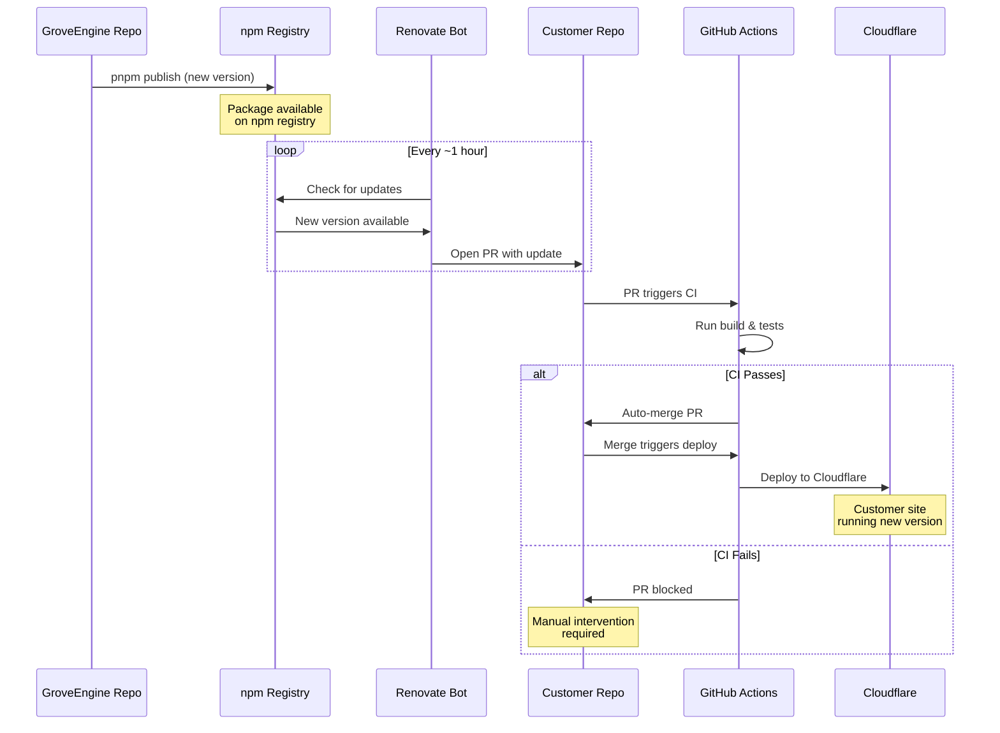

# GroveEngine - Versioning Specification

**Package:** `@groveengine/core`
**Registry:** npmjs.com (public)
**Purpose:** Documents versioning strategy, publishing workflow, and update propagation

---

## Overview

GroveEngine follows [Semantic Versioning 2.0.0](https://semver.org/) for all releases. This document defines how versions are managed, how releases are published, and how updates propagate to customer repositories.

---

## Semantic Versioning Strategy

Version format: `MAJOR.MINOR.PATCH` (e.g., `1.2.3`)

### MAJOR Version Changes

Increment MAJOR when making **incompatible API changes** that require customer action:

- Breaking changes to component props or APIs
- Removal of exported functions, types, or components
- Database schema changes requiring migrations with data transformation
- Changes to required Cloudflare bindings
- Renamed exports without backwards compatibility

**Examples:**
- `PostCard` component removes required `post` prop
- `createSession()` function signature changes
- `users` table schema changes column names
- KV binding renamed from `KV` to `CACHE`

### MINOR Version Changes

Increment MINOR when adding **backwards-compatible functionality**:

- New components added to the library
- New optional props on existing components
- New utility functions or server helpers
- New database tables (non-breaking migrations)
- New features that don't affect existing APIs

**Examples:**
- New `Newsletter` component added
- `PostCard` gets optional `showTags` prop
- New `formatRelativeDate()` utility function
- New `subscriptions` table added

### PATCH Version Changes

Increment PATCH for **backwards-compatible bug fixes**:

- Bug fixes in existing components
- Security patches
- Performance improvements
- Style/CSS fixes
- Documentation corrections
- Dependency updates (non-breaking)

**Examples:**
- Fix XSS vulnerability in markdown renderer
- Fix mobile layout issue in `Header` component
- Improve database query performance
- Update Tailwind CSS peer dependency

---

## Pre-release Versions

### Development Phase (Current)

During initial development, versions are `0.x.x`:

```
0.1.0  - Initial alpha release
0.2.0  - Add admin components
0.3.0  - Add authentication system
...
0.9.0  - Feature complete for v1
1.0.0  - First stable release
```

In `0.x.x` versions, MINOR version bumps may include breaking changes. This is expected during initial development.

### Beta Releases

Use `-beta.x` suffix for testing before stable releases:

```
1.2.0-beta.1  - First beta of v1.2.0
1.2.0-beta.2  - Second beta with fixes
1.2.0-beta.3  - Release candidate
1.2.0         - Stable release
```

**When to use beta:**
- Major new features that need testing
- Database migrations that affect existing data
- Significant UI/UX changes
- Performance improvements needing validation

### Alpha Releases

Use `-alpha.x` suffix for early experimental features:

```
2.0.0-alpha.1  - Early preview of v2
```

---

## Publishing Workflow

### Standard Release Process

```bash
# 1. Ensure you're on main branch with clean working directory
git checkout main
git pull origin main
git status  # Should show clean

# 2. Run tests and build
pnpm test
pnpm build

# 3. Bump version (choose one)
pnpm version patch  # Bug fixes: 1.0.0 -> 1.0.1
pnpm version minor  # New features: 1.0.0 -> 1.1.0
pnpm version major  # Breaking changes: 1.0.0 -> 2.0.0

# 4. Publish to npm
pnpm publish --access public

# 5. Push version tag to GitHub
git push --follow-tags
```

### Pre-release Publishing

```bash
# Beta release
pnpm version prerelease --preid=beta  # 1.2.0 -> 1.2.1-beta.0
pnpm publish --tag beta --access public

# Customers can install beta:
# pnpm add @groveengine/core@beta
```

### Automated Publishing (CI/CD)

GitHub Actions workflow for automated publishing:

```yaml
# .github/workflows/publish.yml
name: Publish to npm

on:
  push:
    tags:
      - 'v*'

jobs:
  publish:
    runs-on: ubuntu-latest
    steps:
      - uses: actions/checkout@v4

      - uses: pnpm/action-setup@v2
        with:
          version: 9

      - uses: actions/setup-node@v4
        with:
          node-version: '20'
          registry-url: 'https://registry.npmjs.org'
          cache: 'pnpm'

      - run: pnpm install --frozen-lockfile
      - run: pnpm test
      - run: pnpm build

      - name: Publish to npm
        run: pnpm publish --access public --no-git-checks
        env:
          NODE_AUTH_TOKEN: ${{ secrets.NPM_TOKEN }}

      - name: Create GitHub Release
        uses: softprops/action-gh-release@v1
        with:
          generate_release_notes: true
```

---

## Version Constraints

### Customer package.json

Recommended version constraints for customer repositories:

```json
{
  "dependencies": {
    "@groveengine/core": "^1.0.0"
  }
}
```

**Caret (`^`) recommended:** Allows automatic updates for MINOR and PATCH versions while protecting against MAJOR changes.

**Version constraint meanings:**
- `^1.2.3` - Allows `>=1.2.3 <2.0.0` (recommended)
- `~1.2.3` - Allows `>=1.2.3 <1.3.0` (conservative)
- `1.2.3` - Exact version only (not recommended)
- `*` - Any version (dangerous, never use)

---

## Update Propagation

### Flow Diagram



### Timeline

Typical update propagation timeline:

| Event | Time |
|-------|------|
| Engine publishes new version | T+0 |
| npm registry indexes package | T+1 minute |
| Renovate detects update | T+1 hour (worst case) |
| PR opened on customer repo | T+1 hour |
| CI runs build & tests | T+1.5 hours |
| Auto-merge (if passing) | T+1.5 hours |
| Deploy to Cloudflare | T+2 hours |
| Customer site running new version | T+2 hours |

**Note:** Emergency security patches can be expedited by manually triggering Renovate or updating dependencies directly.

---

## Breaking Change Protocol

When a breaking change is necessary:

### 1. Document in CHANGELOG

```markdown
## [2.0.0] - 2025-12-01

### BREAKING CHANGES

- **PostCard**: Removed `post` prop, now uses `data` prop
  - Migration: Replace `<PostCard post={p}>` with `<PostCard data={p}>`

- **Database**: `users` table renamed `email` to `email_address`
  - Migration: Run `ALTER TABLE users RENAME COLUMN email TO email_address;`
```

### 2. Provide Migration Guide

Create a migration guide in the release notes:

```markdown
## Migrating to v2.0.0

### Step 1: Update component usage

Find and replace in your codebase:
- `<PostCard post=` → `<PostCard data=`
- `import { post }` → `import { data }`

### Step 2: Run database migration

```bash
wrangler d1 execute grove-blog --command "ALTER TABLE users RENAME COLUMN email TO email_address;"
```

### Step 3: Update and test

```bash
pnpm update @groveengine/core
pnpm build
pnpm test
```
```

### 3. Consider Deprecation Period

For non-critical changes, provide a deprecation period:

```typescript
// v1.9.0 - Deprecate old prop
/** @deprecated Use `data` prop instead. Will be removed in v2.0.0 */
export let post: Post;
export let data: Post = post; // Backwards compatible

// v2.0.0 - Remove deprecated prop
export let data: Post;
```

---

## Changelog Management

### CHANGELOG.md Format

Follow [Keep a Changelog](https://keepachangelog.com/) format:

```markdown
# Changelog

All notable changes to this project will be documented in this file.

The format is based on [Keep a Changelog](https://keepachangelog.com/en/1.0.0/),
and this project adheres to [Semantic Versioning](https://semver.org/spec/v2.0.0.html).

## [Unreleased]

### Added
- New feature being developed

## [1.1.0] - 2025-11-26

### Added
- `Newsletter` component for email signups
- `formatRelativeDate()` utility function

### Changed
- Improved mobile responsiveness in `Header`

### Fixed
- XSS vulnerability in markdown renderer
- Session cookie not persisting on Safari

## [1.0.0] - 2025-11-01

### Added
- Initial release with core blog functionality
- Post management (CRUD)
- Magic code authentication
- Media upload to R2
- Theme system
```

### Categories

Use these categories in the changelog:

- **Added** - New features
- **Changed** - Changes in existing functionality
- **Deprecated** - Soon-to-be removed features
- **Removed** - Now removed features
- **Fixed** - Bug fixes
- **Security** - Vulnerability fixes

---

## npm Organization Setup

### Initial Setup

1. Create npm organization at https://www.npmjs.com/org/create
   - Organization name: `groveengine`
   - This reserves the `@groveengine` scope

2. Configure package.json:
   ```json
   {
     "name": "@groveengine/core",
     "publishConfig": {
       "access": "public"
     }
   }
   ```

3. Add team members to the organization with appropriate roles

### Access Tokens

For CI/CD publishing, create an automation token:

1. Go to npmjs.com → Access Tokens → Generate New Token
2. Select "Automation" token type
3. Add to GitHub Secrets as `NPM_TOKEN`

---

## Version Query Commands

### Check Current Version

```bash
# Local package version
cat package.json | grep version

# Published version on npm
npm view @groveengine/core version

# All published versions
npm view @groveengine/core versions --json
```

### Check Customer Dependencies

```bash
# In customer repo
pnpm list @groveengine/core

# Check for outdated
pnpm outdated @groveengine/core
```

---

*Last Updated: November 2025*
