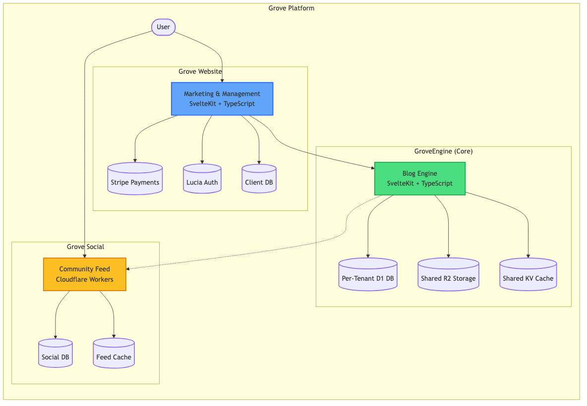
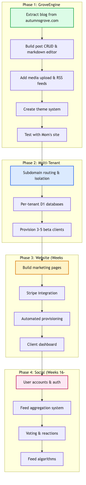
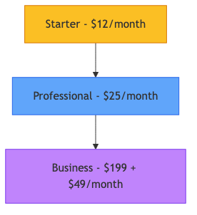
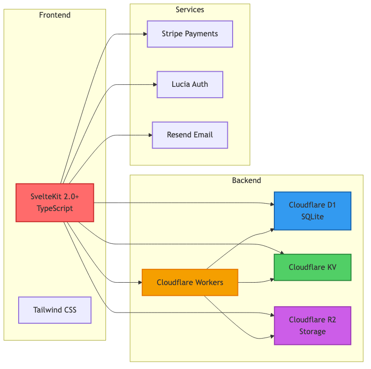
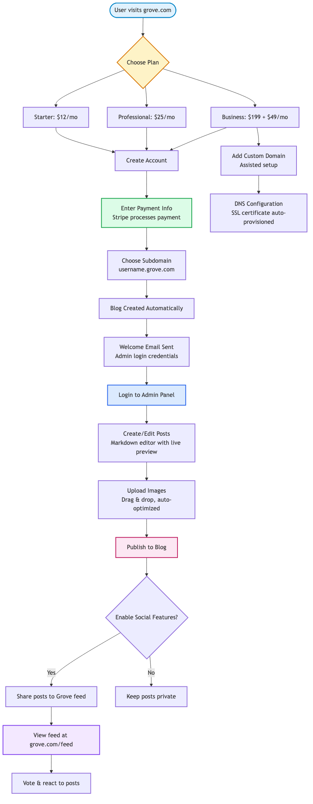

# Grove Platform - Visual Overview

This document contains visual diagrams and charts to help understand the Grove platform architecture, roadmap, and user flows.

## 📊 Table of Contents

1. [Platform Architecture](#1-platform-architecture)
2. [Development Roadmap](#2-development-roadmap)
3. [Pricing Structure](#3-pricing-structure)
4. [Technology Stack](#4-technology-stack)
5. [User Flow](#5-user-flow)
6. [Quick Project Summary](#6-quick-project-summary)

---

## 1. Platform Architecture

**Overview:** Shows the three main components of the Grove platform and how they interact.

**Key Components:**
- **Lattice:** Core blog engine (SvelteKit + TypeScript)
- **Grove Website:** Marketing, signup, billing, and client management
- **Meadow:** Community feed with voting and reactions

**Data Flow:**
1. Users interact with Website (signup) and Meadow (feed)
2. Website provisions blogs on Lattice
3. Lattice optionally shares posts to Meadow feed

---

## 2. Development Roadmap

**Overview:** 36-week development plan across 4 phases.

**Phase Breakdown:**

| Phase | Duration | Focus | Key Deliverables |
|-------|----------|-------|------------------|
| **Phase 1** | Weeks 1-4 | Lattice MVP | Post CRUD, media upload, themes, RSS |
| **Phase 2** | Weeks 5-9 | Multi-tenant | Subdomain routing, per-tenant DBs, 3-5 beta clients |
| **Phase 3** | Weeks 10-15 | Grove Website | Marketing pages, Stripe, automated provisioning |
| **Phase 4** | Weeks 16-25 | Meadow | User accounts, feed, voting, reactions |
| **Phase 5** | Weeks 26-36 | Polish & Scale | Comments, analytics, 20 paying clients |

**Milestones:**
- 10 clients by Month 3
- 20 clients by Month 6
- $500 MRR by Month 12

---

## 3. Pricing Structure

**Overview:** Five-tier pricing model with clear upgrade path, including a free tier for readers.

**Pricing Tiers:**

### Free - $0/month
- Meadow access (community feed)
- 20 public comments per week
- No blog publishing
- Community support

### Seedling - $8/month
- 50 blog posts
- 1GB storage for images and media
- Your blog at `username.grove.place`
- 3 themes + custom accent color
- Unlimited comments on other blogs
- Community support via documentation

### Sapling - $12/month
- 250 blog posts
- 5GB storage
- Your blog at `username.grove.place`
- 10 themes + custom accent color
- Email forwarding to `you@grove.place`
- Email support

### Oak - $25/month
- Unlimited blog posts
- 20GB storage
- Bring Your Own Domain (BYOD)
- Theme customizer (full control over colors, fonts, layout)
- Community themes (browse and import user-created themes)
- Full email: send and receive as `you@grove.place`
- Full analytics dashboard
- Priority email support

### Evergreen - $35/month
- Unlimited blog posts
- 100GB storage
- Custom domain included (we find and register it for you)
- Theme customizer + custom font uploads
- Community themes
- Full email: send and receive as `you@grove.place`
- Full analytics dashboard
- 8 hours of support included (first month)
- Priority support with faster response times

**Add-on Services:**
- Additional themes: $49/theme
- Custom theme design: $299
- Platform migration: $149
- Extra storage: $5/month per 10GB

---

## 4. Technology Stack

**Overview:** Cloudflare-native infrastructure with modern frontend framework.

**Frontend:**
- **SvelteKit 2.0+** - Full-stack framework
- **TypeScript** - Type safety
- **Tailwind CSS** - Utility-first styling

**Backend & Infrastructure:**
- **Cloudflare Workers** - Serverless compute
- **Cloudflare D1** - SQLite databases (per-tenant)
- **Cloudflare KV** - Key-value storage & caching
- **Cloudflare R2** - Object storage (zero egress fees)

**Services:**
- **Stripe** - Payment processing & subscriptions
- **Lucia Auth** - Authentication system
- **Resend** - Transactional emails

**Key Advantages:**
- Zero egress fees (major cost savings)
- Global edge deployment
- Automatic DDoS protection
- Scales to 1000+ clients at low cost

---

## 5. User Flow

**Overview:** Complete journey from first visit to active blog management.

**Signup Flow:**
1. Visit grove.place → Choose plan (Free to $35/month)
2. Create account → Enter payment (Stripe)
3. Choose subdomain (username.grove.place)
4. Blog created automatically → Welcome email

**Blog Management:**
1. Login to admin panel
2. Create/edit posts in Markdown editor
3. Upload images (drag & drop, auto-optimized)
4. Publish to blog

**Optional Social Features:**
1. Enable feed sharing in settings
2. Posts appear on grove.place/feed
3. Users can vote & react to posts

**Custom Domain Extras (Oak & Evergreen):**
1. Purchase custom domain (assisted) or domain included (Evergreen)
2. DNS configuration & SSL setup
3. Blog accessible on custom domain

---

## 6. Quick Project Summary

### What is Grove?
A multi-tenant blog platform where users get their own blogs on subdomains (username.grove.place). Built on Cloudflare infrastructure with SvelteKit, featuring an optional community feed where blogs can opt-in to share posts, vote, and react with emojis.

### Core Value Propositions
- **Simple & Affordable:** $0-35/month with transparent pricing
- **Community-Owned:** Decentralized platform away from big tech algorithms
- **Solarpunk-Aligned:** Community-focused, sustainable business model
- **Dream Funding:** Could help fund your tea cafe dream

### Current Status
- ✅ **Specifications Complete:** All 3 projects (Lattice, Website, Meadow) fully spec'd
- 🚧 **Ready to Build:** Lattice MVP development starting
- 📋 **36-Week Roadmap:** Clear path to $500 MRR

### Next Steps (Immediate)
1. **Domain Research:** Check availability for grove.place or alternatives
2. **Repository Setup:** Create `grove-engine` GitHub repository
3. **Code Extraction:** Extract blog functionality from autumnsgrove.place
4. **MVP Build:** Test with initial beta clients

### Key Metrics & Goals
| Timeline | Clients | MRR | Support Hours |
|----------|---------|-----|---------------|
| Month 3 | 10 | ~$150 | Track meticulously |
| Month 6 | 20 | ~$400 | < 15 hrs/week total |
| Month 12 | 50+ | $500+ | < 30 hrs/week total |

### Support Structure
- **Free:** Help Center only
- **Seedling:** Help Center & community support
- **Sapling:** Email support
- **Oak:** Priority email support
- **Evergreen:** 8 hours free (first month) + priority support
- **Additional hours:** $100/hour (Seedling-Sapling-Oak), $75/hour (Evergreen)

### Risk Mitigation
- **Start Small:** Prove concept with 3-5 beta clients first
- **Track Time:** Meticulously log all support to inform pricing
- **Soft Limits:** Archive posts instead of deleting (happier customers)
- **Boundaries:** Set clear support limits to prevent burnout

---

## 📁 Visual Assets Location

All generated diagrams are stored in `assets/visuals/`:

- `grove-architecture.png` - Platform architecture
- `grove-roadmap.png` - Development timeline
- `grove-userflow.png` - User journey
- `grove-techstack.png` - Technology stack
- `grove-pricing.png` - Pricing structure

---

**Document Version:** 1.0  
**Last Updated:** November 22, 2025  
**Next Review:** After Lattice MVP completion
