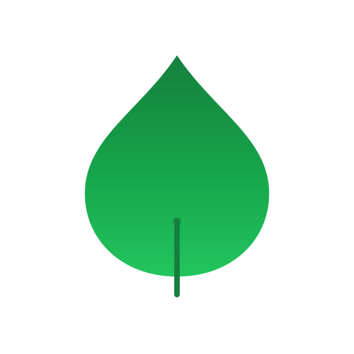
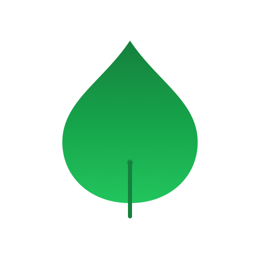

# Grove Stripe Branding Assets Showcase

> Temporary branding for Stripe integration - "The Growing Leaf"

---

## 🎨 Design Concept

A simplified single-leaf design that maintains Grove's warm, organic aesthetic while optimizing for scalability across Stripe dashboard, emails, and payment UI.

**Key Features:**
- Single teardrop/leaf shape with gradient (grove-700 → grove-500)
- Rounded stem accent for grounding
- Vitality circle at stem base
- Scales gracefully from 16px to 512px

---

## 📐 Master SVG Assets

### Icon (Square Format)

**File:** `stripe-icon.svg` (512x512)



```
Dimensions: 512x512
Format: SVG with gradient
Colors: #15803d → #16a34a → #22c55e
Use for: Stripe dashboard, favicons, app icons, small UI
```

---

### Logo (Horizontal Format)

**File:** `stripe-logo.svg` (240x72)


```
Dimensions: 240x72
Format: SVG with gradient icon + Georgia serif wordmark
Colors: Leaf gradient + #3d2914 (bark) text
Use for: Payment headers, email banners, invoices, large screens
```

---

### Logo (Monochrome Variant)

**File:** `stripe-logo-mono.svg` (240x72)


```
Dimensions: 240x72
Format: SVG solid color (no gradient)
Colors: #16a34a (grove-600) + #3d2914 (bark) text
Use for: Email templates, printing, high-contrast contexts
```

---

## 📏 Icon Size Variants

All icon PNG exports with transparent backgrounds:

### Extra Large (512px)

```
File: stripe-icon-512.png
Size: 512x512
Use: Stripe dashboard upload, showcase
```

### Large (256px)

```
File: stripe-icon-256.png
Size: 256x256
Use: Hero images, large displays
```

### Extra Large UI (128px)

```
File: stripe-icon-128.png
Size: 128x128
Use: Large UI elements, feature graphics
```

### Large UI (64px)

```
File: stripe-icon-64.png
Size: 64x64
Use: Standard large UI, payment badges
```

### Standard Medium (48px)

```
File: stripe-icon-48.png
Size: 48x48
Use: Standard UI elements, buttons
```

### Standard Small (32px)

```
File: stripe-icon-32.png
Size: 32x32
Use: Small UI, payment confirmations
```

### Small UI (24px)

```
File: stripe-icon-24.png
Size: 24x24
Use: Inline icons, "Powered by Stripe" badges
```

### Tiny (16px)

```
File: stripe-icon-16.png
Size: 16x16
Use: Favicons, very small UI
```

---

## 📊 Logo Size Variants

All logo PNG exports with transparent backgrounds:

### Retina/2x (480x144)

```
File: stripe-logo-480x144.png
Size: 480x144
Use: High DPI screens, retina displays, large desktop
```

### Large (240x72)

```
File: stripe-logo-240x72.png
Size: 240x72
Use: Standard headers, payment forms, large UI
```

### Medium (200x60)

```
File: stripe-logo-200x60.png
Size: 200x60
Use: Standard UI contexts, invoices
```

### Small (160x48)

```
File: stripe-logo-160x48.png
Size: 160x48
Use: Email headers, small banners, compact spaces
```

---

## 🎨 Color Palette

Colors used in these assets (from Grove Design System):

| Color | Hex | Usage |
|-------|-----|-------|
| **Grove 700** | `#15803d` | Gradient start, stem accent |
| **Grove 600** | `#16a34a` | Primary brand, gradient middle, monochrome |
| **Grove 500** | `#22c55e` | Gradient end, highlights |
| **Bark 900** | `#3d2914` | Wordmark text |

### Gradient Definition
```svg
<linearGradient id="leafGradient" x1="50%" y1="0%" x2="50%" y2="100%">
  <stop offset="0%" stop-color="#15803d" />
  <stop offset="50%" stop-color="#16a34a" />
  <stop offset="100%" stop-color="#22c55e" />
</linearGradient>
```

---

## 📱 Use Case Examples

### Stripe Dashboard
```
Icon: stripe-icon-512.png
Brand Color: #16a34a
Accent Color: #15803d
```

### Payment Form Header
```
Desktop: stripe-logo-480x144.png (retina) or stripe-logo-240x72.png
Mobile: stripe-logo-200x60.png or stripe-logo-160x48.png
```

### Email Templates
```
Header: stripe-logo-mono.svg (160x48 or 200x60 PNG)
Footer: stripe-icon-32.png or stripe-icon-48.png
Format: Prefer monochrome for email client compatibility
```

### Trust Badges
```
"Powered by Stripe": stripe-icon-24.png or stripe-icon-32.png
Inline with text, small UI contexts
```

### Favicons
```
Browser Tab: stripe-icon-32.png or stripe-icon-16.png
Solid color variant works best at tiny sizes
```

### Invoice/Receipt Headers
```
Header Logo: stripe-logo-200x60.png or stripe-logo-240x72.png
Company Icon: stripe-icon-48.png or stripe-icon-64.png
```

---

## 🔧 Technical Specifications

### SVG Attributes
- **Icon viewBox:** `0 0 512 512`
- **Logo viewBox:** `0 0 240 72`
- **Stroke width:** 8px (icon stem), 1px (logo stem)
- **Stroke linecap:** `round` (organic feel)

### Typography (Wordmark)
- **Font Family:** Georgia, Cambria, Times New Roman (serif)
- **Font Weight:** 600 (semibold)
- **Font Size:** 32px (at 240x72 base)
- **Letter Spacing:** -0.64px (-0.02em)

### PNG Export Settings
- **Background:** Transparent
- **Color Space:** sRGB
- **Format:** PNG-24 (with alpha channel)
- **Anti-aliasing:** High quality

---

## ✨ Design Philosophy

These assets embody Grove's core design principles:

1. **Breathe** - Generous negative space around the leaf
2. **Grow** - Upward-oriented leaf symbolizes growth and success
3. **Ground** - Stem provides visual anchoring
4. **Quiet** - Subtle gradient, not loud or overwhelming
5. **Invite** - Rounded shapes, warm colors, welcoming aesthetic

---

## 📦 Complete File Inventory

```
stripe/
├── README.md                          # Usage guidelines
├── SHOWCASE.md                        # This file
├── stripe-icon.svg                    # Master icon (512x512)
├── stripe-logo.svg                    # Master logo (240x72)
├── stripe-logo-mono.svg               # Monochrome variant
└── exports/
    ├── icon/
    │   ├── stripe-icon-16.png        # 487 bytes
    │   ├── stripe-icon-24.png        # 688 bytes
    │   ├── stripe-icon-32.png        # 913 bytes
    │   ├── stripe-icon-48.png        # 1.4 KB
    │   ├── stripe-icon-64.png        # 2.0 KB
    │   ├── stripe-icon-128.png       # 5.4 KB
    │   ├── stripe-icon-256.png       # 14 KB
    │   └── stripe-icon-512.png       # 37 KB
    └── logo/
        ├── stripe-logo-160x48.png    # 3.1 KB
        ├── stripe-logo-200x60.png    # 4.1 KB
        ├── stripe-logo-240x72.png    # 5.0 KB
        └── stripe-logo-480x144.png   # 12 KB
```

**Total:** 16 files (3 SVG + 12 PNG + 1 README)

---

## 🚀 Quick Start

### For Stripe Dashboard
1. Go to Settings > Branding
2. Upload `exports/icon/stripe-icon-512.png` as icon
3. Set brand color to `#16a34a`
4. Set accent color to `#15803d`

### For Grove Payment UI
```html
<!-- Payment form header -->


<!-- Trust badge -->

<span>Powered by Stripe</span>
```

### For Email Templates
```html
<!-- Use monochrome SVG or PNG for better compatibility -->

```

---

## 🔄 Future Replacement

These are **temporary assets**. When permanent branding is ready:

1. Replace SVG files (maintain same filenames)
2. Regenerate PNG exports using provided script
3. Update Stripe dashboard with new assets
4. Archive old assets to `stripe/archive-YYYY-MM-DD/`

See `README.md` for complete replacement instructions.

---

*Created: 2025-11-30*
*Design: "The Growing Leaf" - Simplified Grove aesthetic for Stripe*
*Status: Temporary branding - replace when permanent assets are ready*
