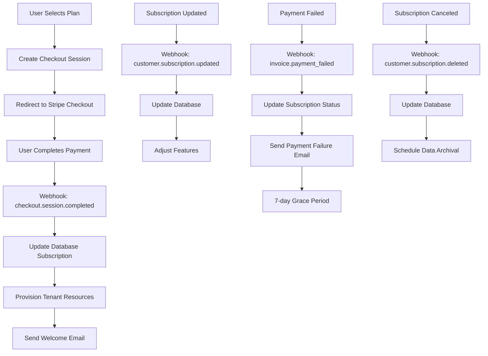

# Stripe Subscription Setup Plan for GroveEngine

## Overview
This document outlines the steps required to implement Stripe subscription billing for the GroveEngine multi-tenant blog platform. The implementation will support the four subscription tiers defined in the pricing model: Seedling, Sapling, Oak, and Evergreen.

## Current State Analysis
Based on code review, the following components are already in place:
- Stripe payment provider implementation with full API client
- Database schema for platform billing with tenant subscriptions
- Basic billing API endpoints for subscription management
- Webhook handling for subscription events
- Plan configuration with features and pricing

## Implementation Plan

### 1. Stripe Dashboard Configuration

#### Products and Prices
Create products and prices in the Stripe Dashboard for each plan tier:

| Plan | Monthly Price | Yearly Price | Features |
|------|---------------|--------------|----------|
| Seedling | $8/month | $82/year (15% discount) | 50 posts, 1GB Storage, 3 themes |
| Sapling | $12/month | $122/year (15% discount) | 250 posts, 5GB Storage, 10 themes |
| Oak | $25/month | $255/year (15% discount) | Unlimited posts, 20GB Storage, Customizer |
| Evergreen | $35/month | $357/year (15% discount) | Unlimited posts, 100GB Storage, Custom Fonts |

#### Webhook Endpoints
Configure webhook endpoints in Stripe Dashboard:
- URL: `https://yourdomain.com/api/shop/webhooks`
- Events to subscribe:
  - `customer.subscription.created`
  - `customer.subscription.updated`
  - `customer.subscription.deleted`
  - `invoice.payment_succeeded`
  - `invoice.payment_failed`
  - `customer.subscription.trial_will_end`

### 2. Environment Configuration

Add the following environment variables to Cloudflare Workers:
- `STRIPE_SECRET_KEY` - Secret key for API authentication
- `STRIPE_WEBHOOK_SECRET` - Webhook signing secret
- `STRIPE_PRICE_SEEDLING_MONTHLY` - Price ID for Seedling monthly
- `STRIPE_PRICE_SEEDLING_YEARLY` - Price ID for Seedling yearly
- `STRIPE_PRICE_SAPLING_MONTHLY` - Price ID for Sapling monthly
- `STRIPE_PRICE_SAPLING_YEARLY` - Price ID for Sapling yearly
- `STRIPE_PRICE_OAK_MONTHLY` - Price ID for Oak monthly
- `STRIPE_PRICE_OAK_YEARLY` - Price ID for Oak yearly
- `STRIPE_PRICE_EVERGREEN_MONTHLY` - Price ID for Evergreen monthly
- `STRIPE_PRICE_EVERGREEN_YEARLY` - Price ID for Evergreen yearly

### 3. Code Implementation

#### Billing API Enhancements
Update the existing billing API to:
1. Use pre-configured Stripe product/price IDs instead of inline prices
2. Implement proper error handling for Stripe API calls
3. Add validation for plan changes and cancellations
4. Implement trial period handling (7 days for new subscriptions)

#### Webhook Handler Improvements
Enhance the webhook handler to:
1. Process subscription events and update database records
2. Handle payment failures and send notifications
3. Manage subscription status changes (active, past_due, canceled)
4. Implement idempotency for webhook processing

#### Feature Gating Implementation
Create a system to check subscription status and:
1. Limit features based on plan tier
2. Display appropriate UI elements for each plan
3. Handle over-limit conditions gracefully
4. Provide upgrade prompts when users hit limits

### 4. Frontend Components

#### Subscription Management
Create UI components for:
1. Plan selection and checkout
2. Subscription status display
3. Plan upgrade/downgrade functionality
4. Cancellation flows with retention offers
5. Billing portal access for payment method management

#### Admin Dashboard
Develop admin tools for:
1. Subscription overview and analytics
2. Manual subscription management
3. Revenue reporting
4. Customer support tools for billing issues

### 5. Testing and Validation

#### Test Mode Implementation
1. Use Stripe test mode during development
2. Create test customers and subscriptions
3. Simulate various scenarios (payment failure, cancellation, upgrade)
4. Validate webhook handling with test events

#### Quality Assurance
1. Test all plan transitions (upgrade, downgrade, cancel)
2. Verify feature access matches plan entitlements
3. Confirm billing portal integration works correctly
4. Validate email notifications for subscription events

## Workflow Diagram



## Database Schema

The existing platform_billing table supports the required functionality:

```sql
CREATE TABLE IF NOT EXISTS platform_billing (
  id TEXT PRIMARY KEY,
  tenant_id TEXT NOT NULL UNIQUE,
  plan TEXT NOT NULL DEFAULT 'seedling',
  status TEXT NOT NULL DEFAULT 'active',
  provider_customer_id TEXT,
  provider_subscription_id TEXT,
  current_period_start INTEGER,
  current_period_end INTEGER,
  cancel_at_period_end INTEGER DEFAULT 0,
  trial_end INTEGER,
  payment_method_last4 TEXT,
  payment_method_brand TEXT,
  created_at INTEGER NOT NULL DEFAULT (unixepoch()),
  updated_at INTEGER NOT NULL DEFAULT (unixepoch()),
  FOREIGN KEY (tenant_id) REFERENCES tenants(id) ON DELETE CASCADE
);
```

## Security Considerations

1. Store Stripe keys securely in Cloudflare secrets
2. Validate all webhook signatures to prevent spoofing
3. Implement proper CSRF protection for billing actions
4. Use HTTPS for all billing-related communications
5. Sanitize and validate all user inputs

## Compliance and Legal

1. Implement proper data retention policies for canceled subscriptions
2. Provide clear cancellation and refund policies
3. Ensure PCI compliance through Stripe's PCI-DSS certification
4. Handle tax collection through Stripe Tax where applicable
5. Implement GDPR-compliant data handling for EU customers

## Rollout Strategy

1. Start with test accounts in development environment
2. Deploy to staging with internal team testing
3. Limited beta release to select users
4. Gradual rollout to all users with monitoring
5. Full production release after validation

## Monitoring and Maintenance

1. Set up logging for all billing operations
2. Implement alerts for payment failures and subscription issues
3. Regular audits of subscription data consistency
4. Monitor for unusual billing patterns or errors
5. Maintain updated documentation for billing processes